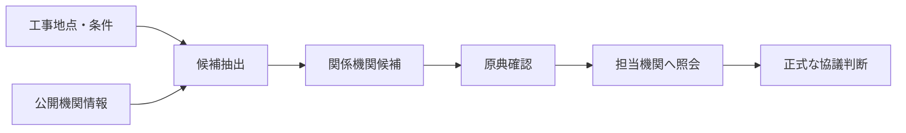
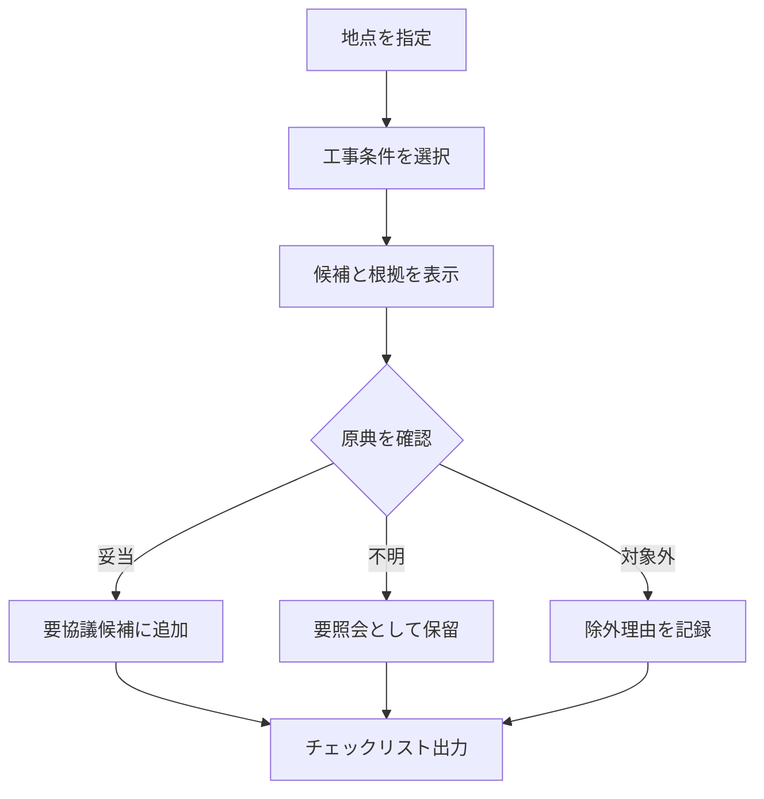
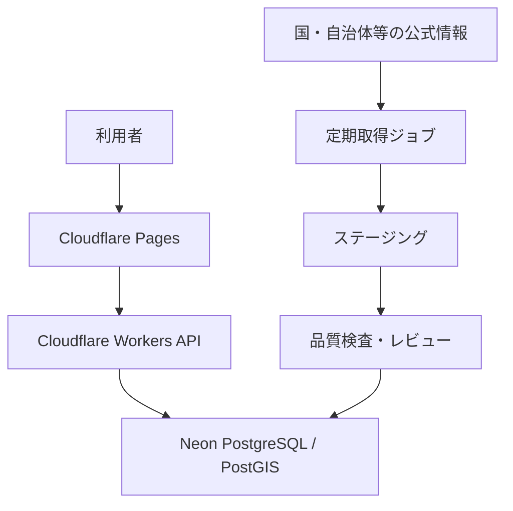

# Public Works Stakeholder Map 要件定義書

> 🗺️ **公共工事ステークホルダー整理マップ**  
> 指定地点・地域・工事条件から、事前協議の候補となる関係機関と確認事項を整理する公開情報ベースの調査支援システム

| 項目 | 内容 |
|---|---|
| 文書種別 | 要件定義書 |
| バージョン | 1.0.0 |
| 作成日 | 2026-07-18 |
| 日本語名 | 公共工事ステークホルダー整理マップ |
| 英語名 | Public Works Stakeholder Map |
| GitHub候補 | `Public-Works-Stakeholder-Map` |
| 開発・検証基盤 | Claude Code on Linux / GitHub / Cloudflare / Neon PostgreSQL |
| データ方針 | 公開データ・公開API・公開Web情報・検証用架空データのみ |
| 対象フェーズ | 企画・入札検討・施工計画初期・事前協議準備 |

---

## 1. プロジェクト概要

### 1.1 背景

公共工事では、工事場所や工種に応じて発注者だけでなく、道路管理者、河川管理者、港湾管理者、警察、都道府県、市区町村、ライフライン事業者等との事前確認が必要になる。ところが、所管区域、担当部署、申請名称、窓口情報は機関ごとに公開形式が異なり、改組や更新で変わるため、初期調査に時間がかかり、協議先の見落としも起こり得る。

本システムは公開情報を収集・正規化し、地図と条件入力から「確認すべき可能性がある機関」を候補表示する。正式な所管、許認可の要否、提出先を断定せず、原典確認と担当機関への照会を促す。

### 1.2 目的

- 🔎 事前協議候補の初期洗い出し時間を短縮する。
- 🧭 地域、管理対象、工種を横断して関係機関を見える化する。
- 📚 出典URL、取得日時、根拠、確認状態を一体管理する。
- ✅ 人による確認結果を残し、調査品質と引継ぎ性を高める。
- 🌐 会社資産を使わず、公開情報だけで価値を検証できるプロダクトを構築する。

### 1.3 システムの位置付け

本システムが扱うのは `候補抽出` と `確認支援` までであり、行政機関による判断、法的助言、申請受理、許可取得を代替しない。

### 1.4 成功指標（KPI）

| 指標 | MVP目標 | 測定方法 |
|---|---:|---|
| 代表ケースの候補再現率 | 90%以上 | 専門者が作成した正解候補集合との比較 |
| 重大な誤断定 | 0件 | 文言・画面・出力レビュー |
| 出典URL保有率 | 100% | 公開中レコードの自動監査 |
| 取得日時保有率 | 100% | DB制約・品質レポート |
| 期限超過レコードの識別率 | 100% | 鮮度判定バッチ |
| 初期調査時間 | 従来比30%以上短縮 | UATの同一ケース比較 |
| 検索応答時間 | p95 2秒以内 | APM・負荷試験 |

---

## 2. スコープ

### 2.1 MVP対象

1. 地図、住所、緯度経度、市区町村による地点指定
2. 工事条件の入力
3. 発注者、道路、河川、港湾、警察、自治体窓口の候補抽出
4. 候補の根拠、管轄概要、連絡先、出典、更新日、信頼度の表示
5. 原典サイトへの遷移
6. チェックリスト化と確認状態の更新
7. CSV・印刷用HTMLの出力
8. 公開情報の取込、正規化、重複排除、レビュー、公開
9. 変更・取得・確認に関する監査ログ

### 2.2 将来拡張

- 電気、ガス、上下水道、通信、鉄道、海上保安庁、消防、文化財、環境部門
- 道路占用・道路使用等の手続ナビゲーション
- 地域別テンプレート、比較表示、オフライン参照、PWA/iOS連携
- `Civil Open Data Intelligence Platform` とのデータカタログ/API連携
- `Road Occupation Permit Navigator` との協議事項連携
- 申請期限の計算支援。ただし正式期限は原典確認を必須とする。

### 2.3 対象外

- 許認可の要否、管轄、申請先、必要日数の法的・行政的な確定
- 電子申請の代理提出、行政機関との通信、許可状況の取得
- 実案件名、契約情報、個人情報、社内担当者、非公開図面の保存
- AD、Entra ID、HENNGE ONE、SharePoint、DirectCloud、FortiGate、DeskNet's NEO、社内ファイルサーバとの接続
- AIだけによる窓口データの自動公開
- 災害時の緊急連絡先案内

---

## 3. 利用者と権限

| ロール | 主な利用者 | 権限 |
|---|---|---|
| 閲覧者 | 現場技術者、施工管理者、営業、研究者 | 検索、閲覧、原典参照、CSV/印刷 |
| レビュアー | 土木技術者、公開情報調査担当 | 候補確認、差戻し、確認状態更新 |
| データ編集者 | データ整備担当 | 下書き作成、出典登録、境界編集、取込実行 |
| 管理者 | IT/DX運用者 | 公開承認、ユーザー・設定・監査・品質管理 |
| システム | 定期ジョブ | 取得、差分検知、鮮度判定、リンク確認 |

MVPの公開閲覧は匿名利用も可能とするが、編集・承認・監査画面はCloudflare Access等で保護する。実装時は検証環境の公開範囲を明示し、不要な個人識別情報を収集しない。

---

## 4. 業務要件

### 4.1 基本業務フロー

### 4.2 入力する工事条件

| 分類 | 代表項目 |
|---|---|
| 場所 | 住所、緯度経度、市区町村、地図クリック、検索半径 |
| 工事対象 | 道路、河川、港湾、海岸、公園、公共施設、その他 |
| 作業 | 掘削、占用、通行規制、車線規制、特殊車両、仮設、搬入、排水、伐採 |
| 周辺影響 | 水域使用、交通影響、騒音・振動、夜間、歩行者動線、近接施工 |
| 調査目的 | 入札前、現地調査前、施工計画、協議準備 |

入力は事前協議候補抽出のヒントであり、案件の正式記録として扱わない。

### 4.3 候補状態

| 状態 | 意味 |
|---|---|
| 未確認 | システムが提示した初期状態 |
| 原典確認済 | 利用者が公式ページを確認した |
| 要照会 | 管轄・手続・担当部署が不明 |
| 協議候補 | 連絡・協議の候補として採用 |
| 対象外 | 当該条件では対象外と利用者が判断 |
| 期限超過 | 鮮度基準を超過し、再確認が必要 |

---

## 5. 機能要件

### 5.1 機能一覧

| ID | 機能 | 必須度 | 受入条件 |
|---|---|---:|---|
| FR-001 | 地点検索 | Must | 住所・座標・地図クリックのいずれかで地点を設定できる |
| FR-002 | 条件入力 | Must | 工事対象・作業・周辺影響を複数選択できる |
| FR-003 | 地図表示 | Must | 行政界、候補機関、根拠となる管理区域をレイヤー表示できる |
| FR-004 | 候補抽出 | Must | 空間一致とルール一致を統合し、候補と理由を返す |
| FR-005 | 候補詳細 | Must | 機関名、部署、役割、管轄概要、連絡先、公式URL、確認日を表示する |
| FR-006 | 根拠表示 | Must | 候補ごとに一致条件と出典を説明する |
| FR-007 | 注意表示 | Must | 非断定・要原典確認・緊急用途不可を常時表示する |
| FR-008 | 絞り込み | Must | 種別、地域、確認状態、鮮度、信頼度で絞り込める |
| FR-009 | チェックリスト | Must | 候補の採否・確認状態・確認メモを一時保持できる |
| FR-010 | 出力 | Must | 出典・取得日時・免責を含むCSVと印刷用HTMLを出力できる |
| FR-011 | データ取込 | Must | CSV/GeoJSON/JSON/API/HTML由来データをステージングへ登録できる |
| FR-012 | クレンジング | Must | 文字正規化、住所正規化、重複候補、URL検査、必須項目検査を行う |
| FR-013 | レビュー承認 | Must | 下書き→レビュー中→公開→廃止の状態遷移を管理できる |
| FR-014 | 鮮度管理 | Must | 種別別TTLにより要再確認レコードを抽出できる |
| FR-015 | 差分検知 | Should | 公式ページの消失・題名変更・内容ハッシュ変更を検知できる |
| FR-016 | 監査 | Must | 取込、編集、承認、出力、設定変更を追跡できる |
| FR-017 | フィードバック | Should | 誤り・不足・リンク切れを出典付きで報告できる |
| FR-018 | データ品質画面 | Must | 欠損、重複、期限超過、リンク異常を集計表示できる |

### 5.2 候補抽出ルール

候補は次の順序で生成する。

1. 指定点を行政区域へ空間結合する。
2. 指定点または検索範囲と公開済み管轄区域を空間照合する。
3. 工事条件と機関種別・協議タグのルールを照合する。
4. 出典の権威性、鮮度、空間精度、レビュー状態から信頼度を算出する。
5. 重複候補を同一機関単位に集約し、複数の根拠を保持する。
6. 不確実な候補を除外せず「要照会」として表示する。

### 5.3 信頼度

信頼度は「正しいことの保証」ではなく、データ確認優先度を示す。

| 表示 | 条件例 |
|---|---|
| A・高 | 公式一次情報、期限内、管轄区域が明示、レビュー済 |
| B・中 | 公式一次情報、期限内、区域が行政単位等で概略 |
| C・要確認 | 推定区域、更新日不明、抽出変換あり、レビュー待ち |
| D・期限超過 | TTL超過、リンク異常、廃止・改組の可能性 |

---

## 6. データ要件

### 6.1 主要データ

| エンティティ | 内容 | 必須の来歴情報 |
|---|---|---|
| 機関 | 国、都道府県、市区町村、警察、港湾管理者等 | 出典、取得日時、確認日時 |
| 部署・窓口 | 名称、役割、電話、所在地、受付案内 | 公式URL、公開状態、確認者 |
| 管轄区域 | 行政区域、路線・河川・港湾、推定/確定区分 | 原典、測地系、精度、作成年 |
| 協議タグ | 工事条件と関係機関を結ぶ分類 | ルール版、根拠、承認状態 |
| データソース | 配布元、形式、ライセンス、更新頻度 | 利用条件、最終成功日時 |
| スナップショット | 取得結果と差分情報 | ハッシュ、HTTP状態、取得ジョブ |
| 確認記録 | 利用者の採否・要照会・メモ | 記録日時、対象データ版 |

### 6.2 データ品質ルール

- 公開レコードは `公式URL`、`取得日時`、`公開元`、`確認状態` を必須とする。
- URLはHTTPSを優先し、許可ドメイン、HTTP状態、リダイレクト先を検査する。
- 電話番号は表示用と正規化値を分離する。内線、代表、受付時間を別項目にする。
- Unicode NFKC、全半角空白、法人・組織表記、都道府県名を正規化する。
- 同一機関判定は名称だけに依存せず、公式URL、住所、電話、行政コードを併用する。
- 推定した管轄区域は `estimated=true` とし、確定データと同じ表示にしない。
- 原典に更新日がない場合、取得日で代用せず `source_published_at=null` とする。
- スクレイピング結果を無レビューで公開しない。
- 原典に誤り・注意事項がある場合は、その注意事項を継承表示する。

### 6.3 公式情報源の優先順位

1. 国・都道府県・市区町村・警察・管理者の公式ページ/API
2. 国土交通省の国土数値情報、地方整備局、各事務所の公開情報
3. 政府データカタログ等で配布元が明確なデータ
4. 補助的なオープンデータ（一次情報との突合が条件）

民間まとめサイト、検索結果要約、生成AIの回答は正本にしない。

### 6.4 代表的な公式ソース

| 対象 | 公式ソース | 利用上の注意 |
|---|---|---|
| 行政区域・河川・港湾・公共施設 | [国土数値情報](https://nlftp.mlit.go.jp/ksj/) | データ作成年、精度、修正情報を記録する |
| 港湾管理者 | [国土交通省 港湾関係情報・データ](https://www.mlit.go.jp/statistics/details/port_list.html) | 一覧の公表日と個別管理者ページを突合する |
| 都道府県警察 | [警察庁 都道府県警察本部リンク](https://www.npa.go.jp/link/prefectural.html) | 実際の警察署・交通規制窓口は各警察の原典で確認する |
| 警察署区域 | [国土数値情報 警察署データ](https://nlftp.mlit.go.jp/ksj/gml/datalist/KsjTmplt-P18.html) | 一部区域が推定であり、正確な情報は警察署へ照会が必要 |
| 河川情報 | [国土交通省 川の防災情報](https://www.river.go.jp/) | 防災情報と許認可窓口を混同しない |

---

## 7. 画面要件

| 画面ID | 画面名 | 主な内容 |
|---|---|---|
| SCR-01 | ホーム | 目的、免責、検索開始、データ鮮度サマリー |
| SCR-02 | 地図・条件検索 | 地点、レイヤー、工事条件、検索半径 |
| SCR-03 | 候補一覧 | 種別別候補、信頼度、確認状態、根拠要約 |
| SCR-04 | 候補詳細 | 組織・窓口・管轄・出典・履歴・公式リンク |
| SCR-05 | 協議チェックリスト | 採否、要照会、確認メモ、出力 |
| SCR-06 | データソース管理 | 取得方式、利用条件、最終取得、エラー |
| SCR-07 | データ編集・レビュー | 差分、重複候補、承認、差戻し |
| SCR-08 | 品質ダッシュボード | 欠損、期限超過、リンク切れ、重複、地域カバレッジ |
| SCR-09 | 監査ログ | 操作、対象、時刻、結果、相関ID |

### 7.1 レスポンシブ方針

- PC：地図と候補一覧の2ペインを基本とする。
- タブレット：地図、条件、候補をタブ切替する。
- スマートフォン：候補確認と原典参照を優先し、編集機能は制限する。
- 色だけに依存せず、アイコン、文字、パターンで状態を示す。

---

## 8. 非機能要件

| 分類 | 要件 |
|---|---|
| 性能 | 通常検索p95 2秒以内、候補詳細p95 1秒以内。外部サイト応答を検索同期処理に含めない |
| 可用性 | MVP月間99.5%目標。公式サイト停止時も最後に承認済みのデータを注意表示付きで閲覧可能 |
| 拡張性 | 都道府県、機関種別、データソースを設定・プラグイン方式で追加可能 |
| セキュリティ | 最小権限、編集系認証、入力検証、SQLi/XSS/SSRF/CSV Injection対策、秘密情報のSecret管理 |
| プライバシー | 個人情報を収集しない。IP等アクセスログは必要最小限・期限付き |
| アクセシビリティ | WCAG 2.2 AAを目標。キーボード操作、フォーカス、代替テキスト、十分なコントラスト |
| 監査 | データ変更、承認、設定変更、エクスポートを改ざん検知可能な形で記録 |
| バックアップ | Neonのバックアップ機能と定期エクスポートを組み合わせ、四半期に復元試験 |
| 保守性 | TypeScript型検査、Lint、単体/結合/E2E、DBマイグレーション、ADRをCIで検証 |
| 国際化 | MVPは日本語・日本国内。文字コードUTF-8、日時ISO 8601、タイムゾーンAsia/Tokyo |
| 地理情報 | 保存座標系EPSG:4326、距離・面積計算は適切な投影またはPostGIS geographyを使用 |

---

## 9. セキュリティ・法務・免責

### 9.1 必須表示

> 本サービスは公開情報に基づく初期調査支援です。表示内容は正式な所管、許認可の要否、申請先、必要手続を保証しません。必ずリンク先の公式情報を確認し、該当機関へ照会してください。緊急連絡には使用しないでください。

### 9.2 主な脅威と対策

| 脅威 | 対策 |
|---|---|
| 古い窓口の表示 | TTL、リンク監視、改組差分、期限超過の強調、公開停止 |
| 偽サイト・外部誘導 | 公式ドメイン審査、URL許可リスト、外部リンク表示 |
| SSRF | 取得先許可リスト、DNS/IP再検証、プライベートIP拒否、サイズ・時間制限 |
| CSV数式注入 | `= + - @` 始まりのセルを無害化し、UTF-8 BOM方針を固定 |
| XSS | HTMLサニタイズ、CSP、出力エスケープ、Markdownの危険HTML禁止 |
| 権限逸脱 | RBAC、管理系ルート保護、サーバ側認可、監査ログ |
| データ汚染 | ステージング分離、スキーマ検証、二者レビュー、ロールバック |

### 9.3 利用条件

各データソースの利用規約、著作権、出典表示、再配布条件、アクセス頻度制限をソース台帳に記録する。利用条件が不明な場合、データ本体を複製せず公式ページへのリンクと最小限の索引情報に限定する。

---

## 10. システム構成要件

- GitHub：ソースコード、設計書、README、マイグレーションの正本
- Cloudflare：Pages、Workers、Access、Secrets、必要に応じてQueues/Cron
- Neon：PostgreSQL正本。地理空間機能は利用環境でPostGIS対応を確認して採用
- Linuxローカル：一時開発、ビルド、テストのみ。正本データを置かない
- `.env` はGit管理せず、`.env.example` のみ管理する

---

## 11. 受入基準

### 11.1 機能受入

- 代表10地域×6機関種別の試験データで候補抽出できる。
- 全候補に根拠、公式URL、取得日時、確認状態が表示される。
- 推定区域、更新日不明、期限超過が明確に識別される。
- CSVと印刷出力に免責、出典、データ版、出力日時が含まれる。
- 誤った候補を非表示にせず、除外理由とデータ改善につなげられる。

### 11.2 品質受入

- Must機能の自動テストが合格する。
- Critical/High脆弱性が0件である。
- WCAG 2.2 AA主要項目の手動確認が完了する。
- バックアップから検証DBへの復元試験に成功する。
- 非エンジニア、現場管理者、土木技術者、IT/DX担当によるUAT承認を得る。

---

## 12. 段階導入

| 段階 | 範囲 | 完了条件 |
|---|---|---|
| Phase 0 | データソース台帳・用語・分類 | 6機関種別、代表3地域、利用条件確認 |
| Phase 1 | MVP検索・地図・候補詳細 | 代表10地域、基本チェックリスト、出力 |
| Phase 2 | 取込・レビュー・品質管理 | 差分、TTL、監査、リンク確認、復元試験 |
| Phase 3 | 全国拡張 | 都道府県カバレッジ指標、運用SLA、UAT |
| Phase 4 | 関連システム連携 | 公開API、共通データカタログ、iOS/PWA検討 |

全国展開は一括投入せず、地域別の品質ゲートを通す。

---

## 13. リスクと対応

| リスク | 影響 | 対応 |
|---|---|---|
| 管轄データが非構造・未公開 | 高 | 手動登録、行政単位の概略候補、要照会表示 |
| 改組・電話番号変更 | 高 | TTL、差分検知、公式URL優先、期限超過停止 |
| 同名部署・広域機関 | 中 | 組織階層、行政コード、親機関、管轄種別で識別 |
| スクレイピング制限 | 中 | 利用規約確認、低頻度、キャッシュ、手動更新へ切替 |
| 利用者が確定情報と誤認 | 高 | 文言レビュー、常時免責、信頼度説明、出力にも注記 |
| 地図境界の誤差 | 高 | 精度メタデータ、縮尺制限、推定表示、公式照会導線 |

---

## 14. 用語

| 用語 | 定義 |
|---|---|
| ステークホルダー | 工事計画・施工・許認可・交通・水域等に関係する可能性がある機関 |
| 候補 | 条件に基づき確認対象として提示された機関。正式な協議先を意味しない |
| 管轄区域 | 機関が所管するとされる地理範囲または対象物。推定を含む場合がある |
| 原典 | 国・自治体・警察・管理者等が公開した一次情報 |
| TTL | データを再確認すべき期限を判定するための有効期間 |
| データ来歴 | 情報の出典、取得、変換、レビュー、公開までの履歴 |

---

## 15. 変更管理

要件変更はGitHub Issueまたは決定記録で理由、影響範囲、承認者、適用版を残す。特に「確定判定」「申請代行」「会社資産連携」を追加する変更は、本MVPの責任境界を変えるため、別途法務・セキュリティ・運用審査を必須とする。
