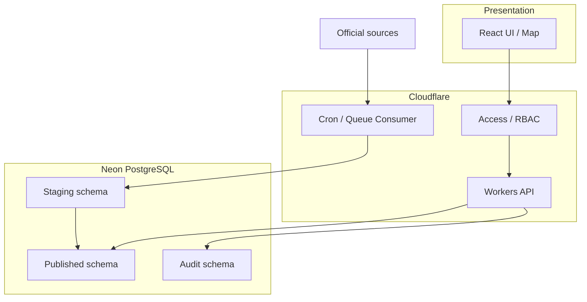
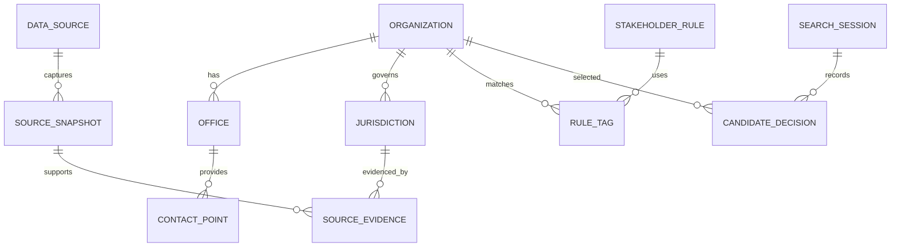
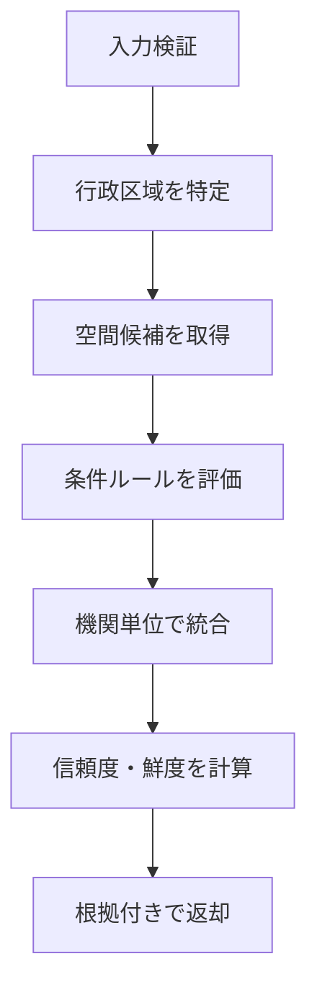
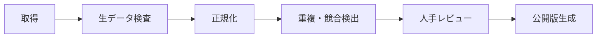
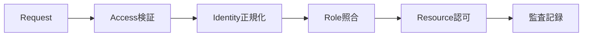
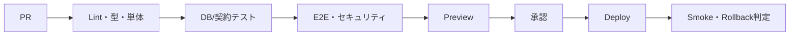

# Public Works Stakeholder Map 詳細設計仕様書

> 🧩 **実装対象**：公開情報の収集、品質管理、地理空間検索、候補説明、確認チェックリスト

| 項目 | 内容 |
|---|---|
| 文書種別 | 詳細設計仕様書 |
| バージョン | 1.0.0 |
| 作成日 | 2026-07-18 |
| 対象リポジトリ | `Public-Works-Stakeholder-Map` |
| 前提文書 | Public Works Stakeholder Map 要件定義書 v1.0.0 |

---

## 1. 設計原則

1. **候補提示に限定する**：所管や許認可を断定するロジックを実装しない。
2. **根拠を先にする**：候補には必ず出典、取得日、一致理由、精度を返す。
3. **自動取得と公開を分離する**：取得データはステージングへ置き、検査・レビュー後に公開する。
4. **不確実性を保存する**：推定、欠損、競合、期限超過をnullや削除で隠さない。
5. **再現可能にする**：クエリ条件、ルール版、データ版を出力・監査に記録する。
6. **正本を分離する**：コードはGitHub、アプリデータはNeon、秘密はCloudflare Secret、ローカルは一時領域とする。

---

## 2. 論理アーキテクチャ



### 2.1 コンポーネント

| コンポーネント | 推奨技術 | 責務 |
|---|---|---|
| Web | TypeScript / React / Vite | 検索、地図、候補、チェックリスト、管理画面 |
| Map | MapLibre GL JS | ベースマップ、GeoJSON/vector tile、選択・ハイライト |
| API | Cloudflare Workers / TypeScript | 認証、入力検証、候補検索、出力、管理操作 |
| DB | Neon PostgreSQL | 正規化データ、PostGIS空間検索、レビュー、監査 |
| Importer | WorkersまたはCIジョブ | 取得、解析、ステージング登録、差分生成 |
| Quality worker | Queue/Cron | リンク検査、TTL、重複、品質スコア |
| CI/CD | GitHub Actions | 型検査、テスト、マイグレーション検証、デプロイ |

具体的なライブラリのメジャーバージョンは実装開始時に公式ドキュメントとサポート状況を確認し、lockfileで固定する。

---

## 3. リポジトリ構成

```text
Public-Works-Stakeholder-Map/
├─ apps/
│  ├─ web/
│  │  ├─ src/components/
│  │  ├─ src/features/map/
│  │  ├─ src/features/search/
│  │  ├─ src/features/checklist/
│  │  └─ src/routes/
│  └─ api/
│     ├─ src/routes/
│     ├─ src/services/
│     ├─ src/repositories/
│     ├─ src/jobs/
│     └─ src/middleware/
├─ packages/
│  ├─ contracts/
│  ├─ domain/
│  ├─ data-quality/
│  └─ ui/
├─ db/
│  ├─ migrations/
│  ├─ seeds/demo/
│  └─ sql/quality/
├─ data/
│  ├─ source-registry/
│  ├─ schemas/
│  └─ fixtures/
├─ docs/
│  ├─ adr/
│  ├─ operations/
│  └─ security/
├─ .env.example
├─ wrangler.toml
└─ README.md
```

`data/fixtures` には架空または再配布可能な小規模データのみ置き、取得した全国データや連絡先の正本をGitへ入れない。

---

## 4. ドメインモデル



### 4.1 列挙型

```text
organization_type = issuer | road_admin | river_admin | port_admin |
                    police | prefecture | municipality | other

record_status      = draft | in_review | published | suspended | retired
verification_state = unverified | source_checked | needs_inquiry |
                     candidate | excluded | expired
boundary_precision = official | administrative_unit | interpreted | estimated
source_authority   = primary_official | official_catalog | secondary_open
```

---

## 5. データベース設計

### 5.1 スキーマ分離

| スキーマ | 内容 | API公開 |
|---|---|---|
| `core` | 公開承認済みの機関、窓口、管轄、ルール | 読取可 |
| `staging` | 取込直後、変換中、レビュー待ち | 管理者のみ |
| `provenance` | ソース、取得スナップショット、根拠 | 一部読取可 |
| `workflow` | レビュー、コメント、公開操作 | 編集者以上 |
| `audit` | 監査イベント | 管理者のみ |

### 5.2 主要テーブル

#### `core.organizations`

| 列 | 型 | 制約・説明 |
|---|---|---|
| `id` | uuid | PK |
| `canonical_name` | text | NOT NULL |
| `normalized_name` | text | NOT NULL、検索用 |
| `organization_type` | enum | NOT NULL |
| `parent_id` | uuid | FK self、NULL可 |
| `government_code` | varchar(10) | 行政コード等、NULL可 |
| `official_url` | text | HTTPS推奨 |
| `status` | enum | published等 |
| `valid_from` / `valid_to` | date | 組織改編の有効期間 |
| `source_checked_at` | timestamptz | 原典最終確認 |
| `freshness_due_at` | timestamptz | 次回確認期限 |
| `created_at` / `updated_at` | timestamptz | 監査列 |

#### `core.offices`

| 列 | 型 | 説明 |
|---|---|---|
| `id` | uuid | PK |
| `organization_id` | uuid | FK |
| `name` | text | 部署・事務所名 |
| `role_summary` | text | 確認対象の概要。断定表現禁止 |
| `postal_code` | varchar(8) | NULL可 |
| `address_raw` | text | 原典表記 |
| `address_normalized` | text | 検索表記 |
| `location` | geography(Point,4326) | NULL可 |
| `reception_note` | text | 受付時間等 |
| `status` | enum | 公開状態 |

#### `core.contact_points`

| 列 | 型 | 説明 |
|---|---|---|
| `id` | uuid | PK |
| `office_id` | uuid | FK |
| `contact_type` | enum | phone / web / email / counter |
| `label` | text | 代表、道路占用担当等 |
| `display_value` | text | 原典表示 |
| `normalized_value` | text | 検索・重複判定用 |
| `extension` | text | 内線 |
| `is_emergency` | boolean | trueは一般検索で非表示 |
| `source_checked_at` | timestamptz | 最終確認 |

個人名・個人メールアドレスは原則登録しない。

#### `core.jurisdictions`

| 列 | 型 | 説明 |
|---|---|---|
| `id` | uuid | PK |
| `organization_id` | uuid | FK |
| `office_id` | uuid | NULL可 |
| `asset_type` | enum | administrative / road / river / port / police |
| `asset_name` | text | 路線・河川・港湾等 |
| `geometry` | geometry(MultiPolygon,4326) | 区域。線・点原典は別テーブルで保持可 |
| `precision` | enum | official等 |
| `estimated` | boolean | NOT NULL DEFAULT false |
| `scale_note` | text | 使用可能縮尺・誤差 |
| `valid_from` / `valid_to` | date | 有効期間 |
| `evidence_id` | uuid | 根拠 |

GiSTインデックスを`geometry`へ設定する。複雑な全国ポリゴンは簡略化表示用と検索用を分離し、原形を失わない。

#### `provenance.data_sources`

| 列 | 型 | 説明 |
|---|---|---|
| `id` | uuid | PK |
| `name` | text | ソース名 |
| `publisher` | text | 公開主体 |
| `base_url` | text | 公式URL |
| `authority` | enum | 権威性 |
| `format` | text | HTML/CSV/JSON/GeoJSON/PDF等 |
| `license_text` | text | 利用条件 |
| `license_url` | text | 利用規約 |
| `fetch_mode` | enum | manual / scheduled / api |
| `ttl_days` | integer | 再確認周期 |
| `allowed_host` | text | 取得許可ホスト |
| `active` | boolean | 稼働状態 |

#### `provenance.source_snapshots`

`id`, `source_id`, `fetched_at`, `http_status`, `content_type`, `content_length`, `sha256`, `etag`, `last_modified`, `parser_version`, `storage_reference`, `result`, `error_code`, `correlation_id` を保持する。著作権・再配布条件により原文保存不可の場合、ハッシュと抽出メタデータだけを保持する。

#### `core.stakeholder_rules`

| 列 | 型 | 説明 |
|---|---|---|
| `id` | uuid | PK |
| `rule_code` | text | 一意 |
| `version` | integer | ルール版 |
| `condition_json` | jsonb | JSON Logic相当の宣言的条件 |
| `target_types` | enum[] | 提示する機関種別 |
| `reason_template` | text | 画面説明テンプレート |
| `priority` | integer | 評価順 |
| `status` | enum | draft/published |
| `effective_from/to` | timestamptz | 適用期間 |
| `approved_by/at` | text/timestamptz | 承認情報 |

#### `workflow.search_sessions` と `candidate_decisions`

検索セッションはランダムな`session_token_hash`、一般化した地点（必要な精度のみ）、条件JSON、ルール版、データ版、作成日時、期限を保持する。実案件名や個人情報は持たない。匿名セッションは短期TTLで削除する。

### 5.3 整合性制約

- `published` の機関・管轄は有効な`evidence_id`と`source_checked_at`を必須とする。
- `estimated=true` の場合、`precision`を`official`にできない。
- `valid_to < valid_from` を禁止する。
- 緊急連絡先は一般検索結果へ出さない。
- 同一ソース、同一外部ID、同一有効期間の重複を一意制約で防ぐ。
- 削除は論理削除を基本とし、参照中データは物理削除しない。

---

## 6. API設計

### 6.1 共通仕様

- Base path：`/api/v1`
- JSON：UTF-8、`application/json`
- 日時：ISO 8601 UTC。画面でAsia/Tokyoへ変換
- 座標：経度`lon`、緯度`lat`、EPSG:4326
- 認証：閲覧APIは構成により匿名可。管理APIはAccess identity + RBAC
- 入力検証：共有スキーマをWeb/APIで利用し、サーバ側を正とする
- エラー：RFC 9457 Problem Details互換
- 相関ID：`X-Request-ID`。受信値は形式検査し、不正なら再発行
- ページング：cursor方式、上限100件

### 6.2 公開API

| Method | Path | 内容 |
|---|---|---|
| GET | `/health/live` | プロセス生存確認 |
| GET | `/health/ready` | DB等の準備状態。秘密情報は返さない |
| GET | `/metadata` | データ版、ルール版、最終更新、免責 |
| POST | `/stakeholders/search` | 地点・工事条件から候補を検索 |
| GET | `/organizations/:id` | 機関・窓口・管轄・根拠詳細 |
| GET | `/map/jurisdictions` | 表示範囲内の簡略化管轄GeoJSON |
| POST | `/checklists` | 一時チェックリスト作成 |
| PATCH | `/checklists/:token/items/:id` | 状態・メモ更新 |
| GET | `/checklists/:token/export.csv` | CSV出力 |
| GET | `/checklists/:token/print` | 印刷用HTML |
| POST | `/feedback` | 誤り・不足の報告 |

### 6.3 管理API

| Method | Path | 権限 | 内容 |
|---|---|---|---|
| GET | `/admin/imports` | editor | 取込履歴 |
| POST | `/admin/imports` | editor | 許可済みソースの取得開始 |
| GET | `/admin/reviews` | reviewer | レビュー待ち一覧 |
| POST | `/admin/reviews/:id/approve` | admin | 公開承認 |
| POST | `/admin/reviews/:id/reject` | reviewer | 理由付き差戻し |
| GET | `/admin/quality` | reviewer | 品質指標 |
| POST | `/admin/sources` | admin | ソース登録 |
| PATCH | `/admin/sources/:id` | admin | ソース設定更新 |
| GET | `/admin/audit-events` | admin | 監査検索 |

### 6.4 検索リクエスト例

```json
{
  "location": { "lat": 35.681236, "lon": 139.767125 },
  "radiusMeters": 500,
  "workTypes": ["excavation", "traffic_restriction"],
  "assetTypes": ["road", "river"],
  "purpose": "pre_consultation"
}
```

### 6.5 検索レスポンス例

```json
{
  "queryId": "01J...",
  "datasetVersion": "2026-07-18.1",
  "ruleVersion": 3,
  "disclaimerRequired": true,
  "candidates": [
    {
      "organizationId": "uuid",
      "name": "〇〇道路管理機関（デモ）",
      "type": "road_admin",
      "confidence": "B",
      "verificationState": "unverified",
      "reasons": ["指定地点が公開管轄区域と重なります", "通行規制条件が選択されています"],
      "precision": "administrative_unit",
      "estimated": false,
      "sourceCheckedAt": "2026-07-01T00:00:00Z",
      "freshnessDueAt": "2026-10-01T00:00:00Z",
      "evidence": [{"title": "公式管理区域", "url": "https://example.go.jp/official"}]
    }
  ]
}
```

本番コード・fixtureでは`example.go.jp`を実在機関の根拠として扱わない。

### 6.6 エラー例

```json
{
  "type": "https://public-works-map.example/errors/validation",
  "title": "入力内容を確認してください",
  "status": 400,
  "code": "INVALID_COORDINATE",
  "detail": "緯度は-90から90の範囲で指定してください",
  "requestId": "01J..."
}
```

---

## 7. 候補抽出アルゴリズム



### 7.1 擬似コード

```ts
const area = await findAdministrativeArea(point);
const spatial = await findJurisdictions(point, radiusMeters);
const ruleMatches = evaluateRules(input, activeRuleSet);
const merged = mergeByOrganization(spatial, ruleMatches, area);

return merged.map(candidate => ({
  ...candidate,
  confidence: calculateConfidence(candidate),
  verificationState: isExpired(candidate) ? "expired" : "unverified",
  reasons: buildReasons(candidate),
  evidence: candidate.evidence
}));
```

### 7.2 空間検索

- 点一致：`ST_Covers(geometry, point)` を使用し、境界上の点も候補に含める。
- 周辺検索：`ST_DWithin(geometry::geography, point::geography, radius)`。
- 複数区域一致：全候補を返し、行政階層・資産種別で優先順位を付ける。
- 検索半径は0〜5,000mに制限する。
- 位置精度が低い住所は、結果画面へ「概略位置」を表示する。

### 7.3 信頼度計算

内部スコアは説明可能な加減点とし、機械学習を使わない。

```text
score = authority(0..35)
      + freshness(0..25)
      + boundary_precision(0..25)
      + review_state(0..15)
      - conflicting_sources(0..25)
      - link_failure(0..30)

A: 85..100 / B: 65..84 / C: 40..64 / D: 0..39 または期限超過
```

スコアと内訳をAPIで返し、UIでは簡潔な理由を表示する。Aであっても正式確認を省略できない。

---

## 8. 取込・データクレンジング設計

### 8.1 パイプライン



### 8.2 取得制御

- ソース台帳に登録済みのHTTPSホストのみ接続する。
- robots.txt、利用規約、配布条件、アクセス間隔を確認する。
- リダイレクトごとにホストとIPを再検証し、loopback/link-local/private IPを拒否する。
- 応答サイズ、時間、リダイレクト回数、MIME typeを制限する。
- PDF/OCR抽出は候補生成にとどめ、公開前に原典画像と突合する。
- 失敗時は指数バックオフし、4xxを無制限再試行しない。

### 8.3 正規化

| 対象 | 処理 |
|---|---|
| 文字列 | UTF-8、NFKC、制御文字除去、連続空白統合、原文も保存 |
| 組織名 | 接頭辞・地方名を分離しつつ正式名称を保持 |
| 住所 | 都道府県、市区町村、町域、番地へ可能な範囲で分割。推測補完を明示 |
| 電話 | 数字正規化、国番号/市外局番、内線分離。表示用原文保持 |
| URL | HTTPS優先、fragment除去、追跡パラメータ除去、canonical URL保持 |
| 座標 | 元CRS記録後にEPSG:4326へ変換。軸順と範囲を検証 |
| 日付 | 原典日、取得日、確認日を混同せず別列に保存 |

### 8.4 重複検出

確定一致は外部ID・公式URL・行政コードで判定する。候補一致は正規化名称、住所、電話、親組織の重み付きスコアで提示し、自動マージしない。統合時は旧IDをaliasとして残す。

### 8.5 品質ゲート

| Gate | 条件 | 不合格時 |
|---|---|---|
| G1 Schema | 必須列、型、列挙、座標範囲 | 隔離 |
| G2 Provenance | 公式URL、取得時刻、ソースID | 公開不可 |
| G3 Integrity | FK、期間、重複、geometry妥当性 | 修正待ち |
| G4 Link | URL許可、HTTP状態、コンテンツ整合 | 要確認 |
| G5 Review | 二者確認、差分説明、利用条件 | 差戻し |
| G6 Publish | 影響件数、ロールバック版、承認 | 公開中止 |

---

## 9. 画面詳細

### 9.1 地図・条件検索 `SCR-02`

```text
┌────────────────────────────────────────────────────┐
│ 🔎 住所・座標検索   [検索]     データ版 / 更新状況 │
├───────────────┬────────────────────────────────────┤
│ 工事対象      │                                    │
│ □ 道路        │               地図                 │
│ □ 河川        │        地点・管轄レイヤー           │
│ □ 港湾        │                                    │
│ 作業条件      │                                    │
│ □ 掘削        │                                    │
│ □ 通行規制    │                                    │
│ [候補を検索]  │                                    │
└───────────────┴────────────────────────────────────┘
```

地図は視覚補助であり、候補一覧をDOM上に保持してキーボード・スクリーンリーダーでも操作可能にする。

### 9.2 候補カード

表示順：機関種別 → 信頼度 → 距離/行政階層 → 名称。カードには次を含める。

- アイコンと機関種別
- 機関・部署名
- `候補です／正式確認が必要` ラベル
- 一致理由（最大3件、展開可）
- 信頼度とデータ精度
- 原典確認日・期限
- 公式情報を開くボタン
- `協議候補`、`要照会`、`対象外` の状態操作

### 9.3 管理レビュー

左右差分で原値、正規化値、現行公開値を表示する。公開承認時に変更理由、影響件数、データ版を必須入力する。承認者は自分が作成した変更を単独承認できない設定を推奨する。

---

## 10. フロントエンド状態設計

| 状態 | 保存先 | 保持期間 |
|---|---|---|
| 検索条件 | URL query + memory | セッション |
| 地図viewport | URL query | セッション/共有可能 |
| 匿名チェックリスト | サーバの短期tokenまたはlocal storage | 24時間〜7日 |
| 認証ユーザー設定 | DB | ユーザーが削除するまで |
| 免責確認 | session storage | ブラウザセッション |

URLには実案件名、個人名、自由記述メモを含めない。local storageの内容は端末共有を考慮して最小化する。

---

## 11. 認証・認可



- ヘッダーを無条件に信頼せず、Cloudflare Accessの署名・audienceを検証する。
- RBACはAPI側で強制し、UI非表示だけに依存しない。
- `viewer < reviewer < editor < admin` の単純包含を避け、操作権限を明示的に割り当てる。
- 公開承認、ソース許可、ロール変更はadminのみ。
- CSRF対策としてSameSite Cookie、Origin検査、状態変更APIのtokenを用いる。

---

## 12. セキュリティ設計

### 12.1 HTTP

- CSPは`default-src 'self'`を起点に、地図タイル等を許可リスト化する。
- `frame-ancestors 'none'`、`object-src 'none'`、`base-uri 'self'`を設定する。
- HSTS、Referrer-Policy、Permissions-Policy、nosniffを設定する。
- 外部リンクはホスト名を表示し、`noopener noreferrer`を付与する。

### 12.2 API・DB

- パラメータ化SQLのみ使用する。
- body 64KB、CSV行数、GeoJSON頂点数等の上限を設ける。
- レート制限は匿名検索、feedback、export、管理操作ごとに分ける。
- DBユーザーをruntime/read、runtime/write、migration、jobで分離する。
- 監査ログへ認証トークン、Cookie、電話番号全文、自由記述本文を残さない。

### 12.3 CSV出力

先頭が`=`, `+`, `-`, `@`, tab, CR/LFのセルは先頭にアポストロフィを付け、改行・引用符をRFC 4180に沿ってエスケープする。出力にはデータ版、出力時刻、免責、公式URLを含める。

---

## 13. キャッシュ設計

| 対象 | 方針 |
|---|---|
| 静的アセット | content hash、長期immutable |
| メタデータ | 5分、stale-while-revalidate |
| 公開機関詳細 | 1時間。公開版更新時にpurge |
| 地図境界 | データ版をURLへ含め長期cache |
| 検索結果 | 精度を落とした地点キーで短期。個人メモはcacheしない |
| 管理API | `no-store` |

外部公式サイトへのアクセスを利用者リクエストに同期させない。

---

## 14. 監査・ログ・監視

### 14.1 構造化ログ

```json
{
  "timestamp": "2026-07-18T00:00:00Z",
  "level": "info",
  "event": "stakeholder.search.completed",
  "requestId": "01J...",
  "durationMs": 184,
  "candidateCount": 6,
  "datasetVersion": "2026-07-18.1"
}
```

### 14.2 SLI/SLO

| SLI | 目標 |
|---|---:|
| 検索成功率 | 99.5%/月 |
| 検索p95 | 2秒以内 |
| 管理ジョブ成功率 | 98%以上（ソース別に監視） |
| 公開レコード出典保有率 | 100% |
| 期限超過の未表示化 | 0件。期限超過として必ず識別 |

アラートは5xx急増、DB接続失敗、取込連続失敗、期限超過増加、公式URL大量失敗、公開処理失敗に設定する。

---

## 15. バックアップ・復旧

- Neon側の復旧機能・保持期間を契約プランで確認する。
- 公開版、ルール、ソース台帳を定期的に論理エクスポートする。
- エクスポートは暗号化し、アプリDBと異なる保管先・保持ポリシーを使用する。
- 四半期ごとに隔離DBへ復元し、件数、FK、geometry、サンプル検索を検証する。
- RPO目標24時間、RTO目標8時間（MVP）。
- 公開データ更新は版単位で切替え、直前版へロールバック可能にする。

---

## 16. CI/CD



### 16.1 必須ゲート

- lockfile固定、依存関係監査、secret scan
- マイグレーションup/downまたはforward recovery検証
- OpenAPI/スキーマの破壊的変更検知
- 単体、結合、E2E、アクセシビリティの合格
- Previewへ実データ・秘密情報を投入しない
- 本番デプロイ前にDBバックアップ/復旧点とロールバック手順を確認

### 16.2 環境

| 環境 | データ | アクセス |
|---|---|---|
| local | 架空fixture | 開発端末のみ |
| preview | 合成・再配布可能な最小データ | Access保護 |
| staging | 公開情報の検証コピー | Access保護、編集者 |
| production | 承認済み公開情報 | 閲覧公開可、管理系保護 |

---

## 17. テスト設計

### 17.1 テスト層

| 層 | 主な観点 |
|---|---|
| Unit | 正規化、ルール評価、信頼度、CSV無害化、TTL |
| Property | 座標境界、Unicode、電話、URL、CSV特殊文字 |
| Integration | PostGIS、トランザクション、権限、取込、ロールバック |
| Contract | API request/response、Problem Details、データ版 |
| E2E | 地点指定→候補→原典→状態→出力 |
| Accessibility | キーボード、読み上げ、コントラスト、地図代替一覧 |
| Security | SQLi、XSS、SSRF、CSRF、IDOR、rate limit、CSV Injection |
| Data quality | 欠損、重複、競合、期限超過、geometry、リンク |
| Performance | 通常/密集地域/大規模polygon、同時利用、cold start |

### 17.2 重要ケース

1. 境界線上で複数機関候補が返り、片方を隠さない。
2. 警察管轄が推定の場合、`estimated`と照会注意が表示される。
3. 期限超過候補は検索結果に残るが最上部に警告される。
4. 同名の事務所を親機関・行政コードで分離できる。
5. 公式URLが別ドメインへ転送された場合、自動更新せずレビュー対象になる。
6. CSVに`=HYPERLINK(...)`を含むメモを入れても数式実行されない。
7. 外部取得URLに`127.0.0.1`やprivate IPを指定しても拒否する。
8. 古いデータ版で作成したチェックリストに版差異警告が出る。

### 17.3 UATシナリオ

- 国道沿いの掘削・交通規制
- 都道府県道での占用候補調査
- 一級河川付近の仮設・排水
- 港湾区域付近の搬入・水域使用
- 市道と県道の境界付近
- 管轄不明・更新日不明のケース

専門者が事前に作成した期待候補と比較し、漏れ、過剰候補、説明理解度を記録する。

---

## 18. 運用設計

### 18.1 定期処理

| 頻度 | 処理 |
|---|---|
| 日次 | 取得失敗再確認、期限超過判定、品質集計 |
| 週次 | 公式URLリンク検査、変更ハッシュ検知 |
| 月次 | 重点ソース差分レビュー、重複候補、地域カバレッジ |
| 四半期 | 復元試験、権限棚卸し、免責・手順レビュー |
| 年次 | 全ソース利用条件、ルール、データ保持、廃止候補の棚卸し |

### 18.2 変更公開

`draft → in_review → approved → published` の順に進め、公開版IDを原子的に切り替える。公開後のsmoke testに失敗した場合は直前の版IDへ戻し、原因と影響を監査へ記録する。

### 18.3 インシデント

- 誤窓口・重大な誤管轄：対象レコードを`suspended`、警告表示、影響検索の特定、訂正、再公開
- 公式サイト改ざん疑い：取得停止、直前承認版維持、管理者確認
- 情報漏えい疑い：トークン失効、ログ保全、影響範囲確認、所定の連絡手順
- DB障害：read-only/メンテナンス表示、復旧手順、データ整合確認

---

## 19. 実装順序

1. 共通契約、DBマイグレーション、架空fixture
2. ソース台帳と手動CSV取込
3. 地点・行政区域・機関検索API
4. 地図、候補一覧、詳細、免責
5. チェックリスト、CSV、印刷
6. レビュー、品質ダッシュボード、監査
7. 自動取得、差分、TTL、リンク検査
8. セキュリティ、負荷、復元、UAT
9. 段階リリースと運用移管

自動スクレイピングより先に、手動取込とレビューを完成させる。これにより、取得方式が変わっても品質ゲートは再利用できる。

---

## 20. Definition of Done

- 要件定義のMust項目と受入基準を満たす。
- データ来歴、推定表示、期限超過、免責が全経路で確認できる。
- 全マイグレーション、テスト、脆弱性検査、アクセシビリティ検査が合格する。
- 運用手順、バックアップ・復元、ロールバック、インシデント手順がレビュー済みである。
- README、API仕様、データ辞書、ADR、リリースノートが現行実装と一致する。
- UAT承認後も、正式な所管・許認可判断を行わない責任境界が維持されている。
