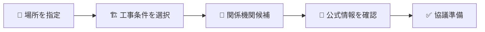
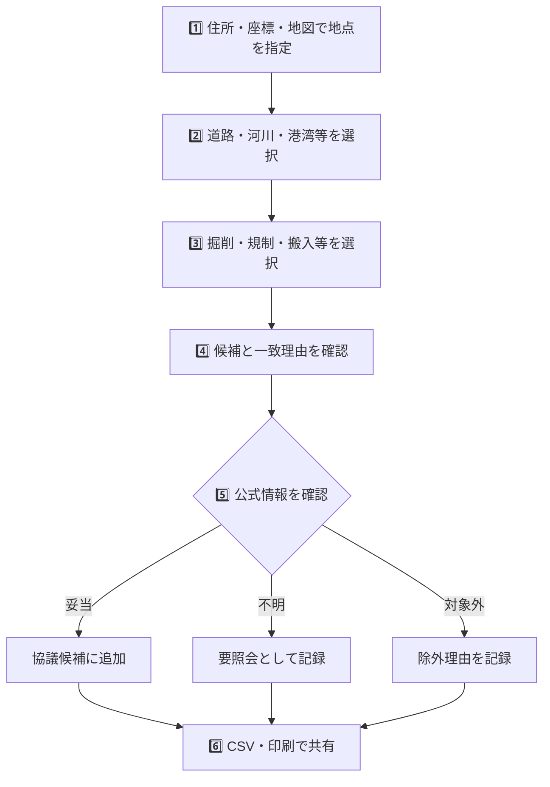
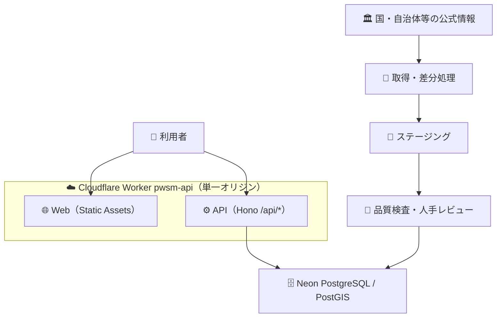
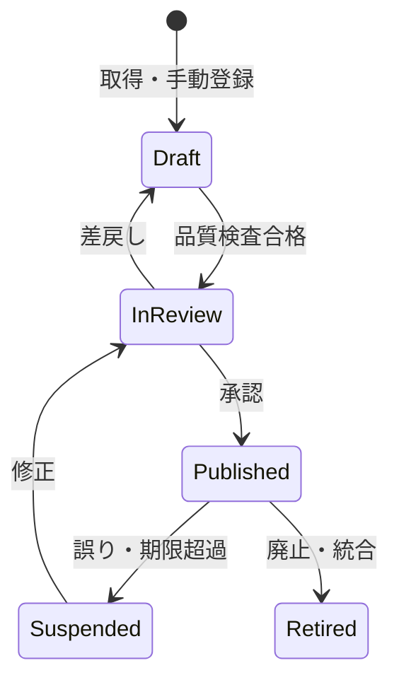
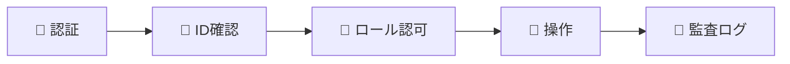
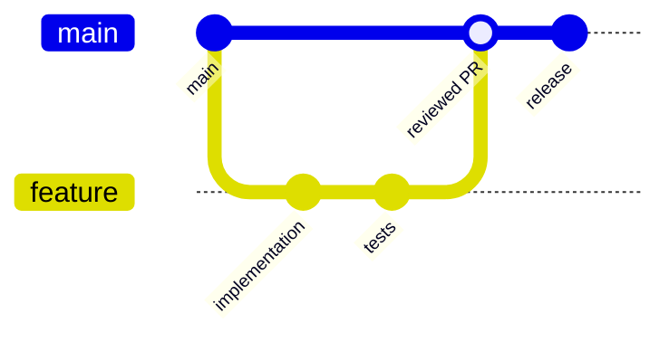
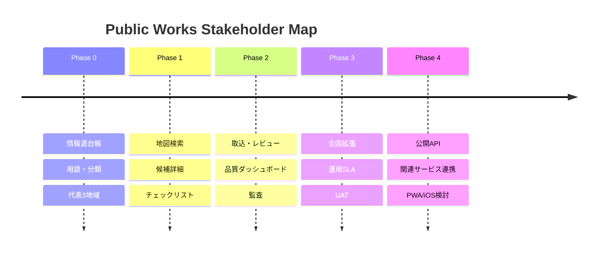
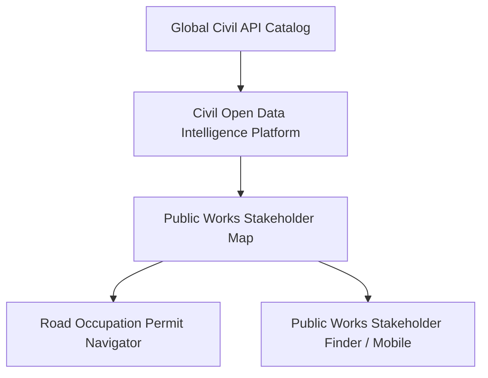

# 🗺️ Public Works Stakeholder Map

> **公共工事ステークホルダー整理マップ**  
> 工事場所と作業条件から、事前に確認したほうがよい関係機関を公開情報ベースで整理します。

[-22c55e)](#️-開発状況)
[](#-データ方針)
[](#%EF%B8%8F-重要な注意)
[](#-ライセンス)

---

## ✨ 何ができるシステムですか？

公共工事では、工事場所や内容により、発注者だけでなく道路管理者、河川管理者、港湾管理者、警察、自治体窓口などへの確認が必要になります。

このシステムは、地図で場所を指定して工事条件を選ぶと、**事前協議先になり得る機関を候補として一覧化**し、公式情報へのリンク、根拠、データ確認日を表示します。



### 主な対象

| アイコン | 区分 | 例 |
|---:|---|---|
| 🏛️ | 発注者 | 国、都道府県、市区町村等 |
| 🛣️ | 道路管理者 | 国道事務所、都道府県、市区町村等 |
| 🌊 | 河川管理者 | 国、都道府県、市区町村等 |
| ⚓ | 港湾管理者 | 都道府県、市、港務局等 |
| 🚓 | 警察 | 都道府県警察、警察署等 |
| 🏢 | 自治体窓口 | 道路、河川、都市計画、環境等の担当部署 |

---

## ⚠️ 重要な注意

> **本システムは初期調査の支援ツールです。**  
> 表示された機関は「確認候補」であり、正式な所管、許認可の要否、申請先、必要書類、協議期間を保証しません。必ずリンク先の公式情報を確認し、該当機関へ直接照会してください。緊急連絡には使用できません。

特に警察署の管轄や境界データには推定が含まれる場合があります。「地図に線があるから確定」という扱いはしません。地図は賢い付箋であって、許可証ではありません。

---

## 👥 誰に役立ちますか？

| 利用者 | 使い方 |
|---|---|
| 👷 現場管理者 | 着手前に確認候補を一覧化する |
| 📐 土木技術者 | 施工条件と関係機関の見落としを減らす |
| 💼 営業・積算 | 入札前・見積前の初期調査に使う |
| 🔬 研究・企画 | 地域ごとの行政・管理主体を比較する |
| 🧑‍💻 IT/DX部門 | 公開データ活用の基盤として運用する |
| 🧑‍⚖️ 経営層 | 調査の標準化、手戻り低減を確認する |

---

## 🧭 利用イメージ



### 画面で確認できること

- 🗺️ 地図上の地点、行政区域、管轄候補
- 🏢 機関名、部署、役割、所在地、公式連絡先
- 💡 なぜ候補になったかという一致理由
- 📏 管轄データが公式・概略・解釈・推定のどれか
- 📅 原典の取得日、確認日、次回確認期限
- 🔗 公式ページへの直接リンク
- ✅ 未確認、要照会、協議候補、対象外、期限超過の状態
- 🔎 種別・信頼度・確認状態・期限超過・推定区域での絞り込みと並び替え
- 🗺️ 検索結果の候補機関が持つ管轄区域の地図ハイライト

---

## 🧩 主な機能

### 🔎 探す

- 住所・緯度経度・地図クリックによる地点指定
- 工事対象、作業内容、周辺影響による条件検索
- 機関種別、地域、信頼度、鮮度での絞り込み

### 🗺️ 見る

- 行政界、道路、河川、港湾、警察等のレイヤー
- 候補機関、窓口、管轄概要、根拠の詳細
- 推定区域や期限超過を通常データと分けて表示

### ✅ 整理する

- 協議候補、要照会、対象外のチェック
- 確認メモと原典確認状態
- 出典・データ版・免責を含むCSVと印刷・PDF用出力
- チェックリストの JSON 出力・復元（端末間のバックアップ）

### ⚙️ 設定・記録

- 住所検索（国土地理院 住所検索API・出典表示付き）による地点指定
- システム設定（既定検索半径、チェックリスト全消去、データ版・環境情報の確認）
- 監査ログ（検索・住所検索の実行記録。座標・住所・検索条件は記録しない）
- 検索条件の URL 共有（緯度経度・半径・工事条件を URL で引き継ぐ）

### 💬 報告する

- 情報の誤り、リンク切れ、不足している機関・窓口を出典付きで報告（FR-017）
- 報告は本文・URL を監査ログへ残さず、個人識別情報を収集しない設計

### 🧹 品質を守る

- 文字・住所・電話・URL・座標の正規化
- 重複候補と情報競合の検出
- リンク切れ、データ期限、改組・変更の検知
- 下書き、レビュー、承認、公開のワークフロー

### 🗂️ データを整備する（管理機能・SCR-06〜08）

- データソース管理: 公式情報源の台帳（取得方式・利用条件・最終取得・エラー表示）と手動取込
- 取込レビュー: ステージングの確認・承認・差戻し・隔離（無レビュー公開禁止の状態機械）
- 品質ダッシュボード: 期限超過・出典保有率・利用条件未記録・推定境界・取込状態の常時監視
- 管理機能は本番では認証導入まで無効化（Cloudflare Access + API 403 の 2 層保護）

---

## 🏗️ 全体構成



| 場所 | 役割 |
|---|---|
| 🐧 Claude Code on Linux | 開発、一時ビルド、テスト |
| 🐙 GitHub | ソースコード、設計書、READMEの正本 |
| ☁️ Cloudflare | Web、API、入口制御、定期処理、Secrets |
| 🐘 Neon | PostgreSQLデータの正本 |

Linuxローカル、Docker volume、SQLiteを正本にはしません。`.env`はGitへ登録せず、`.env.example`だけを管理します。

---

## 🧱 データが公開されるまで



自動取得できた情報を、そのまま利用者へ見せません。公開前に以下を確認します。

1. 公開主体が明確な公式情報か
2. 利用条件・出典表示・再配布条件に問題がないか
3. 組織名、住所、電話、URL、座標が正規化されているか
4. 重複、競合、推定、欠損が識別されているか
5. 原典と突合し、人が承認したか

---

## 📚 データ方針

### 使用するもの

- ✅ 国、都道府県、市区町村、警察、管理者の公式Web情報
- ✅ 国土交通省等が公開するGIS・一覧データ
- ✅ 政府・自治体の公開データと公開API
- ✅ 利用条件を確認したオープンデータ
- ✅ 開発・テスト用の架空データ

### 使用しないもの

- ❌ 実案件名、契約情報、非公開図面、社内担当者情報
- ❌ AD / Entra ID / HENNGE ONE / SharePoint / DirectCloud
- ❌ FortiGate / DeskNet's NEO / 社内ファイルサーバのデータ
- ❌ 出典不明のまとめ情報や、生成AIだけで作られた連絡先
- ❌ 個人名・個人メールアドレスを含む担当者台帳

### 代表的な公式情報源

| 分類 | 参照先 |
|---|---|
| 🗾 行政区域・河川・港湾・公共施設 | [国土交通省 国土数値情報](https://nlftp.mlit.go.jp/ksj/) |
| ⚓ 港湾管理者 | [国土交通省 港湾関係情報・データ](https://www.mlit.go.jp/statistics/details/port_list.html) |
| 🚓 都道府県警察 | [警察庁 都道府県警察本部リンク](https://www.npa.go.jp/link/prefectural.html) |
| 🚓 警察署区域の注意事項 | [国土数値情報 警察署データ](https://nlftp.mlit.go.jp/ksj/gml/datalist/KsjTmplt-P18.html) |
| 🌊 河川防災情報 | [国土交通省 川の防災情報](https://www.river.go.jp/) |

情報源ごとに出典、利用条件、作成年、取得日時、確認日時、次回確認期限を管理します。

---

## 🔐 セキュリティ

- 管理画面はCloudflare Access等で保護
- ロール別認可とサーバ側の権限検査
- SQL Injection、XSS、CSRF、SSRF、CSV Injection対策
- 取得先ホストの許可リストと応答サイズ・時間制限
- 秘密情報はCloudflare Secretで管理
- データ変更、承認、設定、出力の監査ログ
- 定期バックアップと四半期ごとの復元試験



---

## 🚀 開発を始める

### 前提

- Node.js 22 以上（CI は Node 24）
- npm（workspaces 使用、lockfile 固定）
- CloudflareアカウントとCLI（デプロイ時のみ）
- Neon PostgreSQLプロジェクト（DB 接続導入後）

### セットアップ

```bash
git clone https://github.com/Kensan196948G/Public-Works-Stakeholder-Map.git
cd Public-Works-Stakeholder-Map
cp .env.example .env.local
npm ci
npm test
```

`.env.local`に本番秘密情報をコピーしないでください。開発環境は架空fixtureと専用DBを使用します。

### コマンド

| コマンド | 用途 | 状態 |
|---|---|---|
| `npm run lint` | ESLint 静的検査 | ✅ 稼働 |
| `npm run typecheck` | TypeScript 型検査（project references） | ✅ 稼働 |
| `npm test` | 単体・統合テスト（vitest） | ✅ 稼働 |
| `npm run data:validate` | fixture の品質検査 | ✅ 稼働 |
| `npm run build` | 全ワークスペースのビルド | ✅ 稼働 |
| `npm run webui` | 🖥️ **検証用 WebUI 起動**（API + 画面を単一ポートで提供・空きポート自動選択） | ✅ 稼働 |
| `npm run seed:generate` | 架空デモデータの seed SQL 生成（fixture が単一の真実） | ✅ 稼働 |
| `npm run dev -w @pwsm/web` | Web UI 開発起動（vite、API へプロキシ） | ✅ 稼働 |
| `npm run dev -w @pwsm/api` | API 開発起動（wrangler dev）※ | ✅ 稼働 |
| `npm run test:e2e` | ブラウザ E2E テスト（Playwright・CI で実行） | ✅ CI 稼働（ローカルは要 Chromium・仮想メモリ制限環境では起動不可） |

> ※ 仮想メモリ制限のある環境では workerd が起動できない場合があります（ADR-0001 追記参照）。
> その場合は `npm run webui`（Node サーバー）を使用してください。

### 🖥️ 検証用 WebUI の起動と停止

```bash
npm run webui                 # fixture（架空データ）モード
# → http://localhost:<自動選択ポート>/ と LAN アドレスが表示されます

# DB モード（Neon 接続）。環境変数はシェルから明示的に渡す
# （.env ファイルは自動読込されない。値をコマンド履歴に残したくない場合は
#   `set -a && source .env.local && set +a && npm run webui` のように読み込む）
DATABASE_URL="<Neon接続文字列>" DATASET_VERSION="<データ版>" npm run webui

# 停止: Ctrl+C
```

### 🗄️ DB マイグレーションと seed

```bash
# Neon の dev ブランチで検証 → 人間承認後に main へ適用（詳細: docs/operations/）
psql "$DATABASE_URL" -v ON_ERROR_STOP=1 -f db/migrations/0001_initial_schema.sql
psql "$DATABASE_URL" -v ON_ERROR_STOP=1 -f db/seeds/demo/0001_demo_dataset.sql
```

### 📁 monorepo 構成

| パス | パッケージ | 責務 |
|---|---|---|
| `packages/contracts` | `@pwsm/contracts` | API 契約・列挙型の Zod スキーマ（単一の真実） |
| `packages/domain` | `@pwsm/domain` | 正規化・信頼度・CSV 無害化・ルール評価・鮮度判定 |
| `data/fixtures` | `@pwsm/fixtures` | 架空 3 地域の検証用データセット |
| `apps/api` | `@pwsm/api` | Workers API（health / metadata / 候補検索） |
| `apps/web` | `@pwsm/web` | Web UI（検索フォーム・候補一覧・免責・CSV 出力） |
| `db/migrations` | — | Neon PostgreSQL 初期スキーマ（5 スキーマ分離） |
| `db/seeds/demo` | — | 架空デモデータ seed（fixture から自動生成） |
| `docs/adr` | — | アーキテクチャ決定記録 |
| `docs/operations` | — | 📚 運用文書（リリース前チェックリスト・デプロイ手順・ロールバック・障害対応） |
| `docs/openapi.yaml` | — | 🔌 公開 API 仕様（OpenAPI 3.1・Issue #37） |

---

## 🌿 ブランチとレビュー



- `main`は常にデプロイ可能な状態を維持
- 小さなfeature branchとPull Requestを使用
- 機能変更にはテスト、データ変更には来歴と品質結果を添付
- DB変更はマイグレーションを必須化
- セキュリティ、責任境界、公開データ利用条件の変更は重点レビュー

---

## 🧪 テスト方針

| 種類 | 確認内容 |
|---|---|
| 🧩 Unit | 正規化、候補ルール、鮮度、信頼度、CSV安全化 |
| 🔗 Integration | DB、PostGIS、API、権限、取込、公開切替 |
| 🖥️ E2E | 地点指定から候補確認・出力まで |
| ♿ Accessibility | キーボード、読み上げ、色以外の状態表現 |
| 🛡️ Security | SQLi、XSS、SSRF、CSRF、IDOR、レート制限 |
| 🧹 Data Quality | 欠損、重複、競合、期限超過、境界、リンク |
| ⚡ Performance | 通常地域・密集地域・大規模境界 |

特に「境界上で複数候補が出る」「推定管轄を確定表示しない」「古いデータを警告する」を重点試験します。

---

## 📈 開発ロードマップ



### 🎯 MVPの完成条件

- 代表10地域で6機関種別を検索できる
- 全候補に公式URL、出典、取得日時、確認状態がある
- 推定・期限超過・更新日不明を明確に表示する
- CSV/印刷に免責、出典、データ版、出力日時を含める
- 非エンジニア、現場管理者、土木技術者、IT/DX担当のUATを通過する

---

## 🔄 関連プロジェクト



| プロジェクト | 連携イメージ |
|---|---|
| Global Civil API Catalog | 公開API・データソース台帳 |
| Civil Open Data Intelligence Platform | 共通データ取得、検索、来歴 |
| Road Occupation Permit Navigator | 道路関連の確認事項・手続案内 |
| Public Infrastructure Maintenance Map | インフラ管理主体への導線 |
| Public Works Stakeholder Finder | 将来のiPhone/iPad向け閲覧アプリ候補 |

機能を重複実装せず、本プロジェクトは「地域・工事条件から関係機関候補を組み立てる」責務に集中します。

---

## 📖 文書

| 文書 | 内容 |
|---|---|
| `Public-Works-Stakeholder-Map_要件定義書_20260718.md` | 何を、なぜ、どこまで実現するか |
| `Public-Works-Stakeholder-Map_詳細設計仕様書_20260718.md` | データ、API、処理、セキュリティ、テストの実装仕様 |
| `README.md` | 利用者・開発者向けの入口 |

---

## 🤝 貢献

Issueには次の情報を含めてください。

- 対象地域と機関種別
- 現在表示される内容
- 期待する内容
- 根拠となる公式URL
- 確認日
- スクリーンショット（個人情報・案件情報を除く）

連絡先だけを根拠なしに変更するPull Requestは受け入れません。データの正しさは、コードの正しさと同じくらい重要です。

---

## 📄 ライセンス

アプリケーションコードは **MIT License**（[LICENSE](LICENSE)）で公開しています。
**外部データにはそれぞれの公開元の利用条件が適用されます**（例: 国土数値情報・各自治体公式サイトの
著作権ポリシー）。リポジトリのライセンスが外部データへ自動的に適用されるわけではありません。
情報源ごとの利用条件は `data/source-registry/` と `docs/data-registry.md` で管理します。

---

## 🏷️ 開発状況

**Status: Phase 0 — Foundation Scaffold 構築済み**

| 日付 | 内容 |
|---|---|
| 2026-07-18 | 📐 要件定義書・詳細設計仕様書 v1.0.0 確定 |
| 2026-07-18 | 🏗️ monorepo scaffold（contracts / domain / fixtures / api）構築 |
| 2026-07-18 | 🗄️ DB 初期スキーマ（5 スキーマ分離 + 整合性 CHECK 制約）作成 |
| 2026-07-18 | ✅ テスト 86 件通過・lint / typecheck / CI 整備 |
| 2026-07-18 | 🖥️ Phase 1 着手: Web MVP（検索・候補一覧・免責・CSV 出力）実装・merge 済み |
| 2026-07-18 | 🐘 Neon プロジェクト作成・0001 スキーマを dev/main 両ブランチへ適用検証（制約拒否動作を実証） |
| 2026-07-18 | 🗺️ 地図（MapLibre + 地理院タイル）・PostGIS 実検索・チェックリスト・運用文書 4 種を実装 |
| 2026-07-18 | 🏠 住所検索（地理院 API）・システム設定・監査ログ画面・favicon を追加 |
| 2026-07-24 | 🚀 本番デプロイ構成を確定: Web を Worker Static Assets へ統合（単一オリジン）・preview 検証デプロイ + smoke test 通過・v0.1.0 リリース準備 |
| 2026-07-24 | 🎉 **v0.1.0 本番リリース（架空デモデータの検証公開）**: PR #21 merge・tag/Release 作成・Neon main seed 適用・Worker `pwsm-api` デプロイ・本番 smoke test 通過 |
| 2026-07-24 | 🔐 **v0.1.1**: 本番 URL を https://pwsm.mirai-dx-platform.com へ正式化・Cloudflare Access（Zero Trust）で関係者限定保護・workers.dev 経路廃止・Workers Logs 有効化 |
| 2026-07-24 | 🔎 **v0.2.0**: 住所検索オートコンプリート（都道府県入力で候補を自動表示・キーボード選択対応・ARIA combobox） |
| 2026-07-24 | 🗂️ **Phase 2 管理機能（SCR-06〜08）**: データソース台帳・取込レビュー（状態機械）・品質ダッシュボード + 実データ整備手順（docs/data-registry.md）を実装 |
| 2026-08-05 | 🚀 **v0.4.0 機能強化（PR 準備中）**: 候補絞り込み・並び替え（FR-008）、印刷/PDF出力（FR-010）、フィードバック（FR-017）、検索条件URL共有、管轄区域の地図ハイライト（FR-003拡張）、チェックリストJSON入出力、Origin検査・キャッシュヘッダー |
| 2026-08-05 | 🎉 **v0.4.0 本番リリース**: 検索UX・協働機能パックを本番デプロイ（migration 0002 適用済み・免責/プライバシー設計は維持） |
| 2026-08-05 | 🔐 **v0.4.1 リリース**: 認証・RBAC基盤（既定無効）・情報源台帳15機関のNeon登録・MITライセンス整備 |
| 2026-08-05 | ✅ **v0.4.2 リリース**: 認証・RBAC本番有効化（Access設定自動取得）・組織ステージング16件・N03取込ツール |

### 🚦 リリース状況（v0.1.0 公開済み・デモデータ）

| 領域 | 状態 |
|---|---|
| 🖥️ フロントエンド | ✅ 検索・地図・候補一覧・チェックリスト・CSV・免責 |
| ⚙️ バックエンド API | ✅ health / metadata / 検索（fixture ⇔ Neon 切替） |
| 🐘 データベース | ✅ スキーマ + 架空 seed 適用済み（Neon dev/main） |
| 🧪 テスト | ✅ 172 件（v0.4.0 時点・Neon 統合 4 件は環境変数ゲート） |
| 🔐 セキュリティ | ✅ CSV 注入対策・URL 検証・CSP 系ヘッダー・依存監査 0 件 |
| 📚 運用文書 | ✅ チェックリスト / デプロイ / ロールバック / 障害対応 |
| 🚀 本番デプロイ | ✅ **v0.1.1 公開済み**（2026-07-24・https://pwsm.mirai-dx-platform.com ・Cloudflare Access 保護・デモデータ。運用は `docs/operations/` 参照） |

### ✅ 実装済み（Phase 0 + Phase 1）

- 📜 API 契約と列挙型（Zod、Web/API 共有の単一の真実）
- 🧮 ドメインロジック: 正規化（NFKC・電話・URL）、信頼度スコア（説明可能な加減点方式）、CSV 数式注入対策、宣言的ルール評価、TTL 鮮度判定
- 🌐 Workers API: `/api/v1/health/*`、`/metadata`、`/stakeholders/search`（架空 fixture ⇔ Neon/PostGIS 切替、免責常時付与、RFC 9457 エラー）
- 🐘 Neon PostgreSQL: 初期スキーマ + 架空 seed 適用済み、ST_Covers/ST_DWithin 空間検索
- 🗺️ 地図（MapLibre + 地理院タイル）・チェックリスト（FR-009）・CSV 出力
- 🤖 GitHub Actions CI（lint / typecheck / test / build / 依存監査）
- 📚 運用文書（リリース前チェックリスト・デプロイ・ロールバック・障害対応）

### 🚧 次のゲート（Phase 2 後半）

**実データの投入**: SCR-06〜09 の仕組みは実装済みです。残るは人間決裁の 2 点 — 代表 3 地域の選定と各公式情報源の利用条件確定（Issue #28・`docs/data-registry.md`）。決裁後、台帳登録 → 手動取込 → 二者レビュー → データ版切替で実データ公開へ進みます。現時点の候補データは全て架空デモです。認証・アプリ内 RBAC は実データ公開の規模に応じて導入します。
