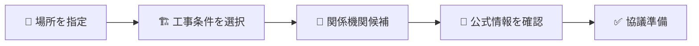
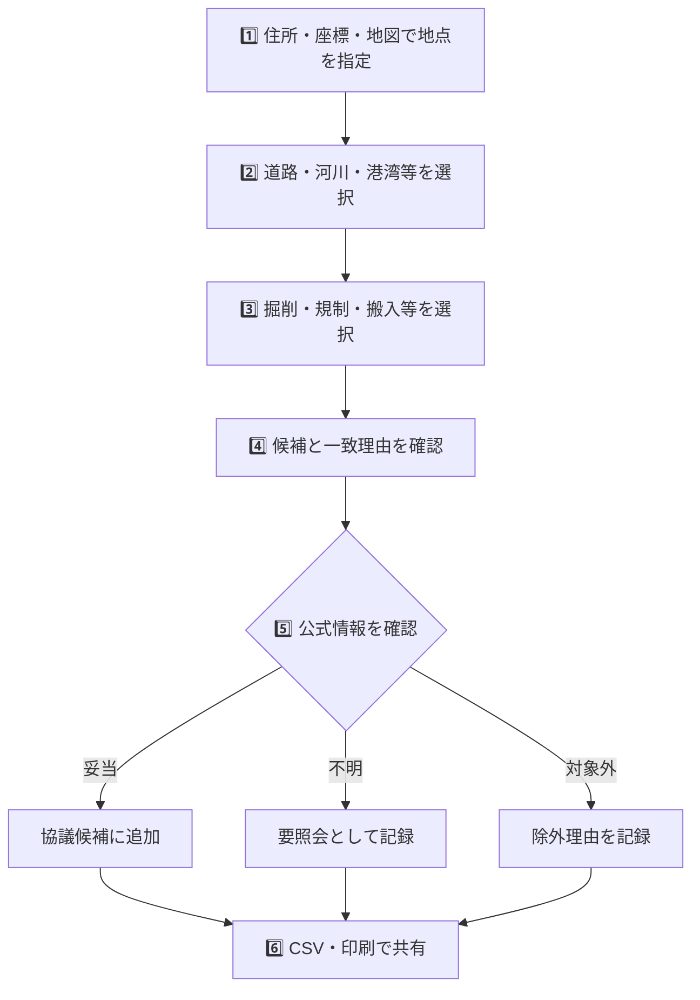
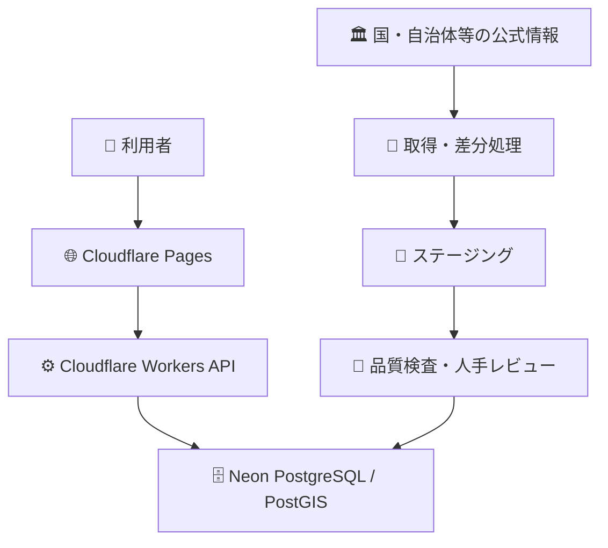
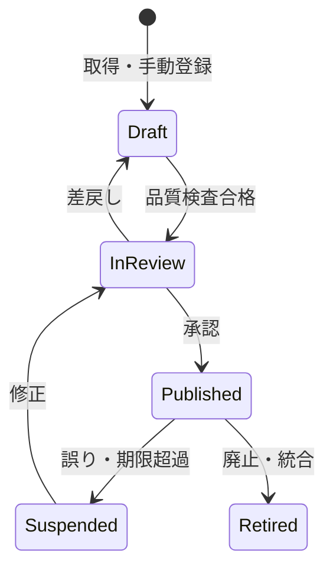
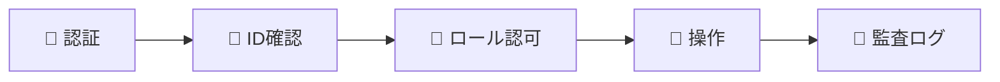
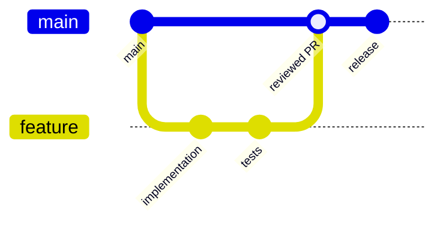
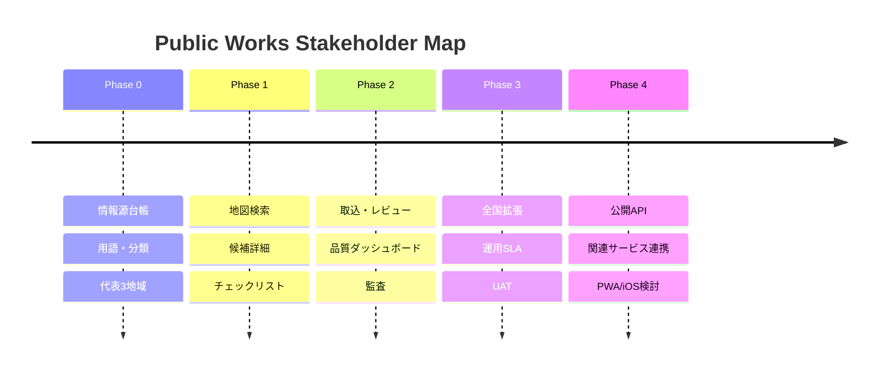
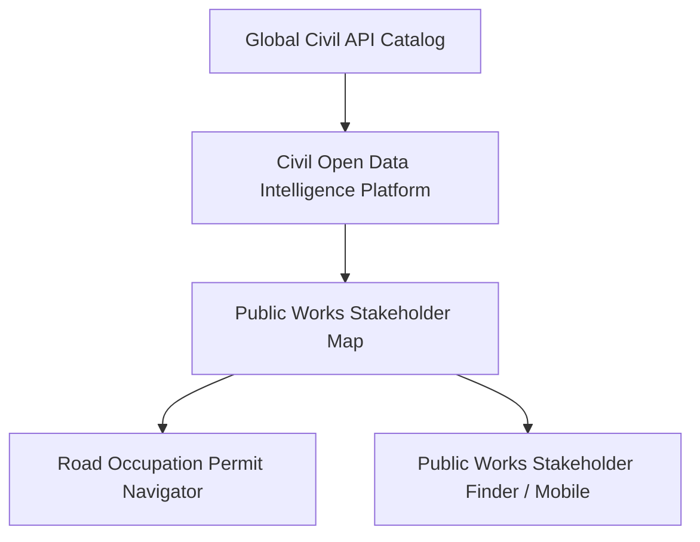

# 🗺️ Public Works Stakeholder Map

> **公共工事ステークホルダー整理マップ**  
> 工事場所と作業条件から、事前に確認したほうがよい関係機関を公開情報ベースで整理します。

[](#-開発状況)
[](#-データ方針)
[](#%EF%B8%8F-重要な注意)
[](#-ライセンス)

---

## ✨ 何ができるシステムですか？

公共工事では、工事場所や内容により、発注者だけでなく道路管理者、河川管理者、港湾管理者、警察、自治体窓口などへの確認が必要になります。

このシステムは、地図で場所を指定して工事条件を選ぶと、**事前協議先になり得る機関を候補として一覧化**し、公式情報へのリンク、根拠、データ確認日を表示します。



### 主な対象

| アイコン | 区分 | 例 |
|---:|---|---|
| 🏛️ | 発注者 | 国、都道府県、市区町村等 |
| 🛣️ | 道路管理者 | 国道事務所、都道府県、市区町村等 |
| 🌊 | 河川管理者 | 国、都道府県、市区町村等 |
| ⚓ | 港湾管理者 | 都道府県、市、港務局等 |
| 🚓 | 警察 | 都道府県警察、警察署等 |
| 🏢 | 自治体窓口 | 道路、河川、都市計画、環境等の担当部署 |

---

## ⚠️ 重要な注意

> **本システムは初期調査の支援ツールです。**  
> 表示された機関は「確認候補」であり、正式な所管、許認可の要否、申請先、必要書類、協議期間を保証しません。必ずリンク先の公式情報を確認し、該当機関へ直接照会してください。緊急連絡には使用できません。

特に警察署の管轄や境界データには推定が含まれる場合があります。「地図に線があるから確定」という扱いはしません。地図は賢い付箋であって、許可証ではありません。

---

## 👥 誰に役立ちますか？

| 利用者 | 使い方 |
|---|---|
| 👷 現場管理者 | 着手前に確認候補を一覧化する |
| 📐 土木技術者 | 施工条件と関係機関の見落としを減らす |
| 💼 営業・積算 | 入札前・見積前の初期調査に使う |
| 🔬 研究・企画 | 地域ごとの行政・管理主体を比較する |
| 🧑‍💻 IT/DX部門 | 公開データ活用の基盤として運用する |
| 🧑‍⚖️ 経営層 | 調査の標準化、手戻り低減を確認する |

---

## 🧭 利用イメージ



### 画面で確認できること

- 🗺️ 地図上の地点、行政区域、管轄候補
- 🏢 機関名、部署、役割、所在地、公式連絡先
- 💡 なぜ候補になったかという一致理由
- 📏 管轄データが公式・概略・解釈・推定のどれか
- 📅 原典の取得日、確認日、次回確認期限
- 🔗 公式ページへの直接リンク
- ✅ 未確認、要照会、協議候補、対象外、期限超過の状態

---

## 🧩 主な機能

### 🔎 探す

- 住所・緯度経度・地図クリックによる地点指定
- 工事対象、作業内容、周辺影響による条件検索
- 機関種別、地域、信頼度、鮮度での絞り込み

### 🗺️ 見る

- 行政界、道路、河川、港湾、警察等のレイヤー
- 候補機関、窓口、管轄概要、根拠の詳細
- 推定区域や期限超過を通常データと分けて表示

### ✅ 整理する

- 協議候補、要照会、対象外のチェック
- 確認メモと原典確認状態
- 出典・データ版・免責を含むCSVと印刷用出力

### 🧹 品質を守る

- 文字・住所・電話・URL・座標の正規化
- 重複候補と情報競合の検出
- リンク切れ、データ期限、改組・変更の検知
- 下書き、レビュー、承認、公開のワークフロー

---

## 🏗️ 全体構成



| 場所 | 役割 |
|---|---|
| 🐧 Claude Code on Linux | 開発、一時ビルド、テスト |
| 🐙 GitHub | ソースコード、設計書、READMEの正本 |
| ☁️ Cloudflare | Web、API、入口制御、定期処理、Secrets |
| 🐘 Neon | PostgreSQLデータの正本 |

Linuxローカル、Docker volume、SQLiteを正本にはしません。`.env`はGitへ登録せず、`.env.example`だけを管理します。

---

## 🧱 データが公開されるまで



自動取得できた情報を、そのまま利用者へ見せません。公開前に以下を確認します。

1. 公開主体が明確な公式情報か
2. 利用条件・出典表示・再配布条件に問題がないか
3. 組織名、住所、電話、URL、座標が正規化されているか
4. 重複、競合、推定、欠損が識別されているか
5. 原典と突合し、人が承認したか

---

## 📚 データ方針

### 使用するもの

- ✅ 国、都道府県、市区町村、警察、管理者の公式Web情報
- ✅ 国土交通省等が公開するGIS・一覧データ
- ✅ 政府・自治体の公開データと公開API
- ✅ 利用条件を確認したオープンデータ
- ✅ 開発・テスト用の架空データ

### 使用しないもの

- ❌ 実案件名、契約情報、非公開図面、社内担当者情報
- ❌ AD / Entra ID / HENNGE ONE / SharePoint / DirectCloud
- ❌ FortiGate / DeskNet's NEO / 社内ファイルサーバのデータ
- ❌ 出典不明のまとめ情報や、生成AIだけで作られた連絡先
- ❌ 個人名・個人メールアドレスを含む担当者台帳

### 代表的な公式情報源

| 分類 | 参照先 |
|---|---|
| 🗾 行政区域・河川・港湾・公共施設 | [国土交通省 国土数値情報](https://nlftp.mlit.go.jp/ksj/) |
| ⚓ 港湾管理者 | [国土交通省 港湾関係情報・データ](https://www.mlit.go.jp/statistics/details/port_list.html) |
| 🚓 都道府県警察 | [警察庁 都道府県警察本部リンク](https://www.npa.go.jp/link/prefectural.html) |
| 🚓 警察署区域の注意事項 | [国土数値情報 警察署データ](https://nlftp.mlit.go.jp/ksj/gml/datalist/KsjTmplt-P18.html) |
| 🌊 河川防災情報 | [国土交通省 川の防災情報](https://www.river.go.jp/) |

情報源ごとに出典、利用条件、作成年、取得日時、確認日時、次回確認期限を管理します。

---

## 🔐 セキュリティ

- 管理画面はCloudflare Access等で保護
- ロール別認可とサーバ側の権限検査
- SQL Injection、XSS、CSRF、SSRF、CSV Injection対策
- 取得先ホストの許可リストと応答サイズ・時間制限
- 秘密情報はCloudflare Secretで管理
- データ変更、承認、設定、出力の監査ログ
- 定期バックアップと四半期ごとの復元試験



---

## 🚀 開発を始める

> このREADMEは設計段階の基準です。実装開始後、実際のpackage scriptsとCloudflare/Neon構成に合わせてコマンドを確定してください。

### 前提

- Node.js：採用するLTS版
- package manager：プロジェクトで選定しlockfileを固定
- CloudflareアカウントとCLI
- Neon PostgreSQLプロジェクト
- GitHubリポジトリ

### 想定セットアップ

```bash
git clone https://github.com/<OWNER>/Public-Works-Stakeholder-Map.git
cd Public-Works-Stakeholder-Map
cp .env.example .env.local
npm ci
npm run db:migrate
npm run dev
```

`.env.local`に本番秘密情報をコピーしないでください。開発環境は架空fixtureと専用DBを使用します。

### 想定コマンド

| コマンド | 用途 |
|---|---|
| `npm run dev` | Web/API開発起動 |
| `npm run lint` | 静的検査 |
| `npm run typecheck` | TypeScript型検査 |
| `npm test` | 単体・結合テスト |
| `npm run test:e2e` | E2Eテスト |
| `npm run db:migrate` | DBマイグレーション |
| `npm run data:validate` | fixture・ソース台帳の品質検査 |
| `npm run build` | 本番ビルド |

---

## 🌿 ブランチとレビュー



- `main`は常にデプロイ可能な状態を維持
- 小さなfeature branchとPull Requestを使用
- 機能変更にはテスト、データ変更には来歴と品質結果を添付
- DB変更はマイグレーションを必須化
- セキュリティ、責任境界、公開データ利用条件の変更は重点レビュー

---

## 🧪 テスト方針

| 種類 | 確認内容 |
|---|---|
| 🧩 Unit | 正規化、候補ルール、鮮度、信頼度、CSV安全化 |
| 🔗 Integration | DB、PostGIS、API、権限、取込、公開切替 |
| 🖥️ E2E | 地点指定から候補確認・出力まで |
| ♿ Accessibility | キーボード、読み上げ、色以外の状態表現 |
| 🛡️ Security | SQLi、XSS、SSRF、CSRF、IDOR、レート制限 |
| 🧹 Data Quality | 欠損、重複、競合、期限超過、境界、リンク |
| ⚡ Performance | 通常地域・密集地域・大規模境界 |

特に「境界上で複数候補が出る」「推定管轄を確定表示しない」「古いデータを警告する」を重点試験します。

---

## 📈 開発ロードマップ



### 🎯 MVPの完成条件

- 代表10地域で6機関種別を検索できる
- 全候補に公式URL、出典、取得日時、確認状態がある
- 推定・期限超過・更新日不明を明確に表示する
- CSV/印刷に免責、出典、データ版、出力日時を含める
- 非エンジニア、現場管理者、土木技術者、IT/DX担当のUATを通過する

---

## 🔄 関連プロジェクト



| プロジェクト | 連携イメージ |
|---|---|
| Global Civil API Catalog | 公開API・データソース台帳 |
| Civil Open Data Intelligence Platform | 共通データ取得、検索、来歴 |
| Road Occupation Permit Navigator | 道路関連の確認事項・手続案内 |
| Public Infrastructure Maintenance Map | インフラ管理主体への導線 |
| Public Works Stakeholder Finder | 将来のiPhone/iPad向け閲覧アプリ候補 |

機能を重複実装せず、本プロジェクトは「地域・工事条件から関係機関候補を組み立てる」責務に集中します。

---

## 📖 文書

| 文書 | 内容 |
|---|---|
| `Public-Works-Stakeholder-Map_要件定義書_20260718.md` | 何を、なぜ、どこまで実現するか |
| `Public-Works-Stakeholder-Map_詳細設計仕様書_20260718.md` | データ、API、処理、セキュリティ、テストの実装仕様 |
| `README.md` | 利用者・開発者向けの入口 |

---

## 🤝 貢献

Issueには次の情報を含めてください。

- 対象地域と機関種別
- 現在表示される内容
- 期待する内容
- 根拠となる公式URL
- 確認日
- スクリーンショット（個人情報・案件情報を除く）

連絡先だけを根拠なしに変更するPull Requestは受け入れません。データの正しさは、コードの正しさと同じくらい重要です。

---

## 📄 ライセンス

アプリケーションコードのライセンスはリポジトリ作成時に決定します。外部データにはそれぞれの公開元の利用条件が適用されます。リポジトリのライセンスが外部データへ自動的に適用されるわけではありません。

---

## 🏷️ 開発状況

**Status: Planning / Requirements & Detailed Design**

次のゲートは、代表3地域の公式情報源台帳、利用条件、データ項目、手動取込fixtureを確定することです。全国を一度に埋めるより、少数地域を高品質に仕上げてから広げます。
