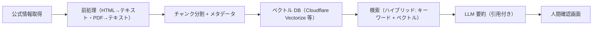

# AI 活用設計（Public Works Stakeholder Map）

| 項目 | 内容 |
|---|---|
| 文書種別 | 設計・方針文書（AI 機能は未実装。導入判断の基準と設計を定める） |
| 最終更新日 | 2026-08-12 |
| 対象読者 | 経営層・IT/DX 部門・データ管理者・開発者 |

## 1. 基本方針

本システムのコア判断（候補抽出・信頼度・鮮度）は**決定論的なルールと空間演算**で実装し、
現時点では AI を導入しません。理由は次のとおりです。

- 候補提示の誤りは協議先の見落とし・無駄な照会につながり、説明可能性と監査性が必須
- 現行のデータ量（代表 3 地域）では、ルール + 正規化 + 空間検索で同等以上の精度を低コストに達成できる
- 外部 LLM の利用は、公開情報の著作権・利用条件・個人情報・費用・遅延の管理が追加で必要になる

AI は「チャットを追加すること」を目的にせず、**時間削減・検索・判断支援・説明可能性・安全性・
費用対効果**のいずれかが実証できる領域に限定して段階導入します。

## 2. AI が必要な領域と不要な領域

| 領域 | 現行方式 | AI の要否 | 判断 |
|---|---|---|---|
| 候補抽出（空間 × ルール） | SQL + 宣言的ルール | 不要 | 決定論のまま維持。AI で置き換えない |
| 信頼度・鮮度判定 | 加減点スコア + TTL | 不要 | 説明可能な現行方式を維持 |
| 住所正規化・名寄せ | 正規化関数 + 重複ルール | 不要（当面） | 表記揺れが増えた段階で「構造化抽出」を比較 |
| 公式ページからの窓口抽出 | 手動取込 + 二者レビュー | **有用（優先度高）** | 原稿の下書き生成 → 人間承認。抽出は確定としない |
| 自由記述（フィードバック等）の分類・要約 | なし | 有用（低優先） | 分類タグ・要約の下書き |
| 関係機関の検索（自然言語） | 条件フォーム + URL 共有 | 有用（中優先） | RAG は「公式情報への導線」に限定。回答を断定しない |
| リンク切れ・改組・更新の検知 | ハッシュ・HTTP 検査 | 部分的に有用 | 通常は差分検知で十分。異常検知はデータ量が増えてから |
| 担当者・窓口の自動断定 | — | **禁止** | 誤判定リスクと責任問題のため実施しない |

## 3. 段階導入ロードマップ（AI）

### Step 1（3〜6か月）: 構造化抽出の下書き支援

- 対象: 公式ページ（HTML/PDF）からの機関名・窓口・電話・所在地・URL の抽出
- 方式: ルール + 軽量 LLM（プロンプト + JSON スキーマ出力）による下書き生成
- 出力先: `staging.import_records`（`pending`）。**無レビュー公開禁止は変更しない**
- 人間承認: 抽出元 URL の表示・差分表示・二者レビュー（取込者 ≠ 承認者）を必須化
- 検証: 既存 15 ソースを対象に、抽出項目の適合率・再現率・欠損率を四半期計測

### Step 2（6〜12か月）: 公式情報 RAG（検索支援）

- 対象: 「この工事では何の手続が要る？」「道路占用の窓口はどこ？」等の質問
- 方式: 公式ページの取得スナップショット → チャンク化 → ベクトル検索 + 引用付き回答
- 回答形式: 必ず出典 URL・取得日・信頼度を併記。**「要確認」を既定の答えにする**
- モデル: 公開情報のみを扱う（社内データ・非公開図面・担当者台帳は対象外）

### Step 3（将来）: 異常検知・予測

- 窓口変更・リンク大量障害・期限超過増加の異常検知
- 地域・工種別の確認件数統計（予測ではない。集計レポート）
- 予測（協議期間・件数の見込み）は導入しない。根拠が不確実な判断を支援しない

## 4. AI 導入時の技術設計（前提条件）

### 4.1 RAG 構成

- チャンクは 500〜1,000 文字 + 重複 100 文字程度。出典 URL・取得日時・ハッシュをメタデータに保持
- 検索結果はスコア閾値未満を返さない（閾値未達は「該当なし」と回答）
- 回答文には必ず引用番号を付け、引用元を画面で開ける

### 4.2 モデル構成・選択

- 原則: Cloudflare Workers AI / 外部 API のうち、データ保持契約・遅延・費用・日本語性能を比較して選定
- モデル固定とバージョン記録: 使用モデル・プロンプト版・評価結果を `docs/adr/` に記録
- プロンプトはリポジトリで管理し、変更は PR レビュー対象とする（プロンプトの監査）
- 入力は公開情報と利用者入力のみ。社内情報・個人情報は送信しない

### 4.3 根拠・引用・信頼度

- AI 回答には `evidence: [{title, url, fetchedAt, chunkHash}]` を必須で付与
- 信頼度は既存の `confidence`（A〜D）とは別に `aiConfidence`（high/medium/low）を返す
- `low` の回答は「参考情報」と表示し、正式確認への導線を出す

### 4.4 人間承認と権限制御

- 抽出・要約結果の公開には承認ワークフロー（既存 SCR-07）を再利用
- AI 利用権限: viewer は AI 検索結果の閲覧のみ。抽出・分類の実行は editor、承認は admin
- ロール判定は既存 RBAC（Cloudflare Access + API 側強制）と同一経路を使用

### 4.5 プロンプトインジェクション対策

- 取得した公式ページ本文は「データ」として扱い、システムプロンプトで命令権限を与えない
- 抽出結果に命令文が混入しやすいため、JSON スキーマ出力 + 出力検証（enum・長さ・URL 形式）を強制
- 利用者入力（フィードバック等）をプロンプトへ直接連結せず、役割を分離したサブプロンプト化
- 外部由来の URL・引用は許可ホスト検査（既存の SSRF 対策）を通過したもののみ表示

### 4.6 個人・機密情報保護

- 社内担当者台帳・AD/Entra ID・HENNGE ONE・SharePoint・非公開図面・案件名は対象外
- 抽出候補に個人名・個人メールが含まれた場合は自動フラグ（PII 検出）で公開前に隔離
- 利用者入力の保持は既存のプライバシー最小化方針（監査・ログへ本文を記録しない）を継承

### 4.7 監査

- モデル・プロンプト版・入力ハッシュ・出力ハッシュ・コスト・レイテンシ・承認結果を監査ログへ記録
- 監査項目は本文・座標・住所を含まない（既存 §12.2 と同一）
- AI 導入後は四半期に回答品質サンプル監査（誤引用・誤断定の割合）を実施

### 4.8 誤判定時の責任分界

- AI 出力は「調査支援の下書き・参考」であり、正式な所管・許認可判断を行わない免責を維持
- 誤判定の影響が大きい操作（公開承認・窓口断定）には AI を適用しない
- 誤り報告（FR-017）を AI 回答にも適用し、回答ログから追跡できるようにする

### 4.9 利用量・予算上限と停止手段

- 利用量は API キー単位の月間予算上限（例: 10,000 円/月）とリクエスト上限を設定
- 予算上限到達時は AI 機能を自動無効化（既存のレート制限・機能フラグを拡張）
- 停止手段: `AI_ENABLED=false` の環境変数で即時無効化。停止時は既存のルール検索へ完全フォールバック
- 停止手順・再開手順は `docs/operations/` に追加する

## 5. 評価指標

| 指標 | 目標 |
|---|---|
| 抽出の適合率 / 再現率 | 各 95% 以上（人間承認後） |
| 引用誤り率 | 0%（引用は取得スナップショットの URL に限定） |
| AI 回答の「要確認」明示率 | 100% |
| 月間 AI コスト | 予算上限内（初期 10,000 円/月） |
| AI 起因の誤窓口公開 | 0 件 |

## 6. 保留事項

- 本設計の実装は、費用対効果の実証（パイロット）後に決定する
- LLM ベンダーのデータ保持・モデル学習利用契約は導入前に法務確認する
- 公開情報の利用条件（各ソースの license）は AI 加工の可否をソース台帳に追記する
