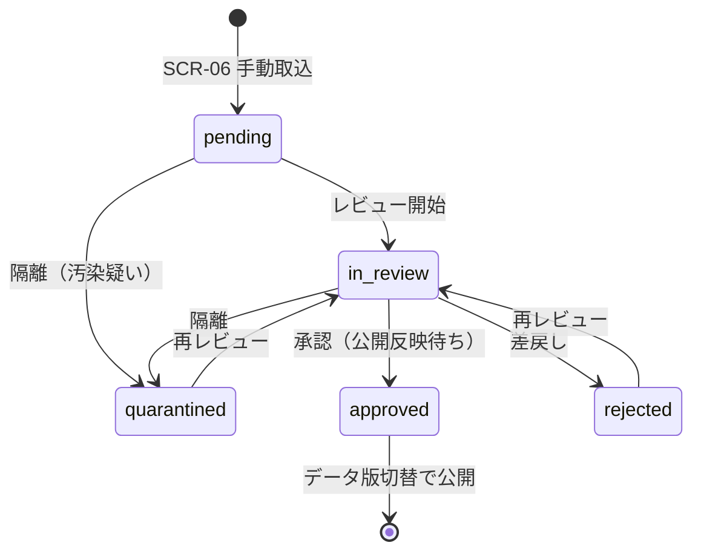

# 🗂️ 公式情報源台帳の整備・運用手順（Phase 2 実データ整備）

| 項目 | 内容 |
|---|---|
| 🎯 目的 | 実在の公式情報源を台帳化し、取込 → レビュー → 公開の品質ゲートを運用する |
| 👥 対象読者 | データ編集者・レビュアー・管理者 |
| 📅 最終更新日 | 2026-07-24 |

> ⚠️ 現在の公開データはすべて**架空デモ**です。実データの公開は、本手順による台帳確定・
> 利用条件確認・二者レビューの通過後に、データ版の切替として実施します。

---

## 1. 📌 実データ整備の進め方（少数地域を高品質に）

全国を一度に埋めず、**代表 3 地域**を選定して高品質に仕上げてから拡大します（README 方針）。

1. 代表 3 地域の選定（**人間決裁** — 対象 Issue 参照）
2. 地域ごとに公式情報源を調査し、台帳（`provenance.data_sources`）へ登録
3. **利用条件の確認・記録（人間決裁）** — §3 参照
4. SCR-06 から手動取込（ステージング `pending`）
5. SCR-07 でレビュー（二者レビュー原則: 取込者 ≠ 承認者）
6. 承認済みレコードをデータ版切替として公開反映（マージ判定 `Y` の範囲で実施）

## 2. 🗃️ 台帳への記録項目（`provenance.data_sources`）

| 列 | 記録内容 | 必須 |
|---|---|---|
| name / publisher | 情報源の名称・発行機関 | 🔴 |
| base_url / allowed_host | 公式 URL・許可ホスト（改ざん防止のためホスト固定） | 🔴 |
| authority | `primary_official`（一次）/ `official_catalog` / `secondary_open` | 🔴 |
| format / fetch_mode | HTML・PDF・CSV 等 / `manual`（当面は手動のみ） | 🔴 |
| ttl_days | 再確認期限（例: 窓口 90 日・管轄 180 日） | 🔴 |
| **license_text / license_url** | **利用規約・著作権・出典表示・再配布条件・アクセス頻度制限** | 🔴（§3） |

## 3. ⚖️ 利用条件の確認（要件 §9.3・人間決裁）

- 各情報源の利用規約・著作権・出典表示義務・再配布条件・アクセス頻度制限を確認し、
  `license_text`（要約）と `license_url`（原文リンク）へ記録する
- **利用条件が不明・未記録のソースは、データ本体を複製せず公式ページへのリンクと
  最小限の索引情報に限定する**（SCR-06 に ⚠️ 表示・SCR-08 で件数監視）
- 判断に迷う場合は公開せず Issue 化して管理者の決裁を仰ぐ

## 4. 🏛️ 公式情報源の優先順位（要件 §6.3）

1. 国・都道府県・市区町村・警察・管理者の公式ページ / API
2. 公式データカタログ（自治体オープンデータ等）
3. その他の二次公開情報（授権・出典明示があるもののみ）

## 5. 🔁 取込 → レビュー → 公開の状態機械

- `approved` は終端（承認済みの書き換え禁止。誤りは新規取込でやり直す）
- スクレイピング・抽出結果を**無レビューで公開しない**（要件 §6.2。API・UI 双方で強制）
- 全レビュー操作は監査ログへ記録される（操作・対象・遷移・相関 ID）

## 6. 📊 品質ゲート（SCR-08 で常時監視）

| 指標 | 目標 | 超過時の対応 |
|---|---|---|
| 出典保有率 | 100% | 欠損管轄の出典を補完するまで公開しない |
| 期限超過（TTL） | 0 件 | 信頼度 D 表示・再確認タスク化 |
| 利用条件未記録ソース | 0 件 | リンク+索引限定へ降格 |
| 隔離レコード | 滞留させない | 原因調査 → 再レビュー or 破棄判断 |
