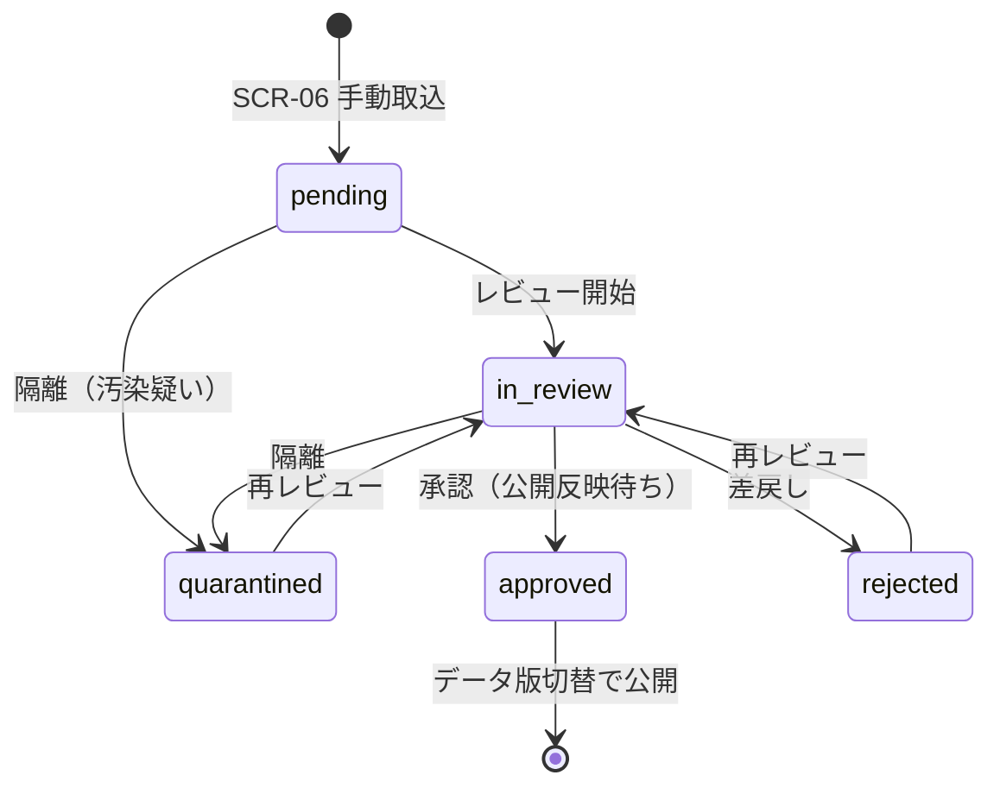

# 🗂️ 公式情報源台帳の整備・運用手順（Phase 2 実データ整備）

| 項目 | 内容 |
|---|---|
| 🎯 目的 | 実在の公式情報源を台帳化し、取込 → レビュー → 公開の品質ゲートを運用する |
| 👥 対象読者 | データ編集者・レビュアー・管理者 |
| 📅 最終更新日 | 2026-08-12 |

> ⚠️ 現在の公開データはすべて**架空デモ**です。実データの公開は、本手順による台帳確定・
> 利用条件確認・二者レビューの通過後に、データ版の切替として実施します。

---

## 1. 📌 実データ整備の進め方（少数地域を高品質に）

全国を一度に埋めず、**代表 3 地域**を選定して高品質に仕上げてから拡大します（README 方針）。

1. 代表 3 地域の選定（**人間決裁** — 対象 Issue 参照）
2. 地域ごとに公式情報源を調査し、台帳（`provenance.data_sources`）へ登録
3. **利用条件の確認・記録（人間決裁）** — §3 参照
4. SCR-06 から手動取込（ステージング `pending`）
5. SCR-07 でレビュー（二者レビュー原則: 取込者 ≠ 承認者）
6. 承認済みレコードをデータ版切替として公開反映（マージ判定 `Y` の範囲で実施）

## 1.5 🔁 台帳の Neon 登録（自動生成 seed・2026-08-05 実装）

台帳 JSON（`data/source-registry/sources/*.json`）から、`provenance.data_sources` 用の
冪等 seed SQL を自動生成します。

```bash
# 生成（出力: db/seeds/registry/0001_source_registry.sql）
node scripts/generate-source-registry-seed.mjs

# 標準出力で内容確認
node scripts/generate-source-registry-seed.mjs --stdout

# 適用（dev で検証後に main へ）
psql "$DATABASE_URL" -v ON_ERROR_STOP=1 -f db/seeds/registry/0001_source_registry.sql
```

- 決定的 UUID（`uuidFor("registry:<slug>")`）で同一台帳から何度でも再適用可能（`ON CONFLICT DO UPDATE`）
- `license.summary` / `license.url` は `license_text` / `license_url` へ格納し、
  「利用条件未記録」の品質監視（SCR-08）と連動する
- **適用済み（2026-08-05）**: Neon dev ブランチ + main（16 ソース = 代表 3 地域 15 + N03 1・全件 license 付き）
- テスト: `data/source-registry/test/seed.test.ts`（台帳 ↔ seed の対応・冪等性を CI で検証）

### 1.6 🧱 組織のステージング取込（Issue #32 第二段・2026-08-05）

台帳から、レビュー待ちの組織レコード（`staging.import_records`・`entity_kind=organization`）を生成します。

```bash
node scripts/generate-entity-imports.mjs            # → db/seeds/registry/0002_staging_org_imports.sql
node scripts/generate-entity-imports.mjs --stdout   # 内容確認
psql "$DATABASE_URL" -v ON_ERROR_STOP=1 -f db/seeds/registry/0002_staging_org_imports.sql
```

- 生成物は必ず `pending`（無レビュー公開禁止・§6.2）
- `raw_payload` に canonicalName / officialUrl / organizationType / sourceSlug を含み、
  SCR-07 のレビュー画面で確認できる
- **適用済み（2026-08-05）**: Neon dev + main（16 件 pending・台帳 16 ソース登録済み）
- テスト: `data/source-registry/test/entity-seed.test.ts`

### 1.7 🗺️ N03 行政区域の取込（Issue #32 第三段・ツール実装済み）

国土数値情報 行政区域（N03）を GeoJSON（EPSG:4326）へ変換後、管轄区域のステージング取込を生成します。

```bash
# 1) 国土数値情報ダウンロードサービスから N03 を取得（.gml/.shp・利用条件: 政府標準利用規約2.0）
# 2) ogr2ogr 等で EPSG:4326 の GeoJSON へ変換
ogr2ogr -f GeoJSON -t_srs EPSG:4326 n03-tokyo.geojson N03-20240101_13.shp

# 3) ステージング取込 SQL を生成（--stdout で確認）
node scripts/n03-geojson-to-imports.mjs --input n03-tokyo.geojson --pref-code 13 --stdout

# 4) ファイル出力して適用（dev で検証 → main）
node scripts/n03-geojson-to-imports.mjs --input n03-tokyo.geojson --pref-code 13 --output db/seeds/registry/0003_n03_jurisdiction_imports.sql
psql "$DATABASE_URL" -v ON_ERROR_STOP=1 -f db/seeds/registry/0003_n03_jurisdiction_imports.sql
```

- 生成物は `pending` + `quality_flags: ["geometry_pending_review"]`（境界の正確性はレビューで確認）
- 情報源は台帳の `mlit-ksj-n03`（`region: national`・利用条件確定済み）を参照
- 都道府県コード・市区町村フィルタ、Polygon/MultiPolygon → WKT 変換、座標範囲検証に対応
- **市町村単位への集約対応（2026-08-05）**: N03 は市町村が多数のポリゴン片に分割されているため、
  `N03_007`（市区町村コード）で MultiPolygon へ集約して 1 レコードとして登録する
- **所属未定地（N03_007 なし）**: 都道府県名からコードを解決して `13-unknown` 等で登録し、
  `city_unassigned` / `geometry_invalid` フラグでレビュー対象を明示する（実データで 1 件の自己交差を検出済み）
- テスト: `data/source-registry/test/n03-import.test.ts`

> 残作業: N03 実データの取得・変換・レビュー、公式ページからの窓口（office / contact_point）
> 情報の収集・正規化、承認後の `core.*` 反映とデータ版切替を、1 地域ずつ進めます。

#### 1.7.1 代表 3 地域を N03-20260101 へ更新（2026-08-13・dev 適用済み）

- 取得: `N03-20260101_13/14/27_GML.zip`（URL は `data/source-registry/imports/n03-20260101-manifest.json` 参照）
- 変換: ogr2ogr で EPSG:4326 の GeoJSON 化 → `scripts/n03-geojson-to-imports.mjs` で
  市町村単位（政令市は行政区単位）に集約し、ステージング取込 SQL を生成
- 適用: **Neon dev ブランチ**へ 193 件（東京 63・神奈川 58・大阪 72）を pending 適用（冪等）
- 品質フラグ: `geometry_pending_review`（境界はレビューで確認）
- ツール改善: N03-2026 の `N03_005`（行政区名）対応・`13000` 等の全ゼロ市区町村コードを
  `unknown` へ正規化（所属未定地の重複を防止）・配布ページ未掲載の最新版を HEAD プローブで検出

### 1.9 🏢 窓口・連絡先エンティティの収集（2026-08-13・代表3地域 16 窓口 / 33 連絡先）

- 収集元: `data/source-registry/entities/{tokyo,yokohama,osaka}/*.json`（公式ページから抽出した下書き。
  東京 6 窓口/12 連絡先・横浜 4/8・大阪 6/13）
- 生成: `scripts/generate-office-contact-imports.mjs` → `db/seeds/registry/0005_staging_office_contacts.sql`
- 適用: Neon dev ブランチへ pending + `contact_pending_review` で適用済み（冪等）
- レビュー: 原典の再確認・個人情報なし確認・二者レビュー後に `core.*` へ反映
- 検証: `data/source-registry/test/entity-office.test.ts`（スキーマ・台帳一致・電話形式・SQL 不変条件）

### 1.8 🔗 情報源リンクの生存確認（2026-08-12・FR-015 第一歩）

```bash
# 全ソースの baseUrl を HEAD（不可なら GET）で確認し、reports/link-check-YYYYMMDD.json を生成
npm run link:check

# 1 件でも失敗していたら exit 1（CI / cron 用）
npm run link:check -- --fail-on-error
```

- リダイレクト 3 回・タイムアウト 8 秒・HTTPS のみ・並列 4 で確認する
- 失敗は即公開停止とせず、SCR-08 の「リンク異常」候補としてレビュー対象にする
- 定期実行は Phase 1 で cron 化し、結果を品質ダッシュボードへ連携する
- **週次自動点検（2026-08-12 実装）**: `.github/workflows/ops-link-check.yml` が毎週月曜 23:00 JST に
  実行し、リンク切れ候補を Issue で通知する

## 2. 🗃️ 台帳への記録項目（`provenance.data_sources`）

| 列 | 記録内容 | 必須 |
|---|---|---|
| name / publisher | 情報源の名称・発行機関 | 🔴 |
| base_url / allowed_host | 公式 URL・許可ホスト（改ざん防止のためホスト固定） | 🔴 |
| authority | `primary_official`（一次）/ `official_catalog` / `secondary_open` | 🔴 |
| format / fetch_mode | HTML・PDF・CSV 等 / `manual`（当面は手動のみ） | 🔴 |
| ttl_days | 再確認期限（例: 窓口 90 日・管轄 180 日） | 🔴 |
| **license_text / license_url** | **利用規約・著作権・出典表示・再配布条件・アクセス頻度制限** | 🔴（§3） |

## 3. ⚖️ 利用条件の確認（要件 §9.3・人間決裁）

- 各情報源の利用規約・著作権・出典表示義務・再配布条件・アクセス頻度制限を確認し、
  `license_text`（要約）と `license_url`（原文リンク）へ記録する
- **利用条件が不明・未記録のソースは、データ本体を複製せず公式ページへのリンクと
  最小限の索引情報に限定する**（SCR-06 に ⚠️ 表示・SCR-08 で件数監視）
- 判断に迷う場合は公開せず Issue 化して管理者の決裁を仰ぐ

## 4. 🏛️ 公式情報源の優先順位（要件 §6.3）

1. 国・都道府県・市区町村・警察・管理者の公式ページ / API
2. 公式データカタログ（自治体オープンデータ等）
3. その他の二次公開情報（授権・出典明示があるもののみ）

## 5. 🔁 取込 → レビュー → 公開の状態機械



- `approved` は終端（承認済みの書き換え禁止。誤りは新規取込でやり直す）
- スクレイピング・抽出結果を**無レビューで公開しない**（要件 §6.2。API・UI 双方で強制）
- 全レビュー操作は監査ログへ記録される（操作・対象・遷移・相関 ID）

## 6. 📊 品質ゲート（SCR-08 で常時監視）

| 指標 | 目標 | 超過時の対応 |
|---|---|---|
| 出典保有率 | 100% | 欠損管轄の出典を補完するまで公開しない |
| 期限超過（TTL） | 0 件 | 信頼度 D 表示・再確認タスク化 |
| 利用条件未記録ソース | 0 件 | リンク+索引限定へ降格 |
| 隔離レコード | 滞留させない | 原因調査 → 再レビュー or 破棄判断 |
