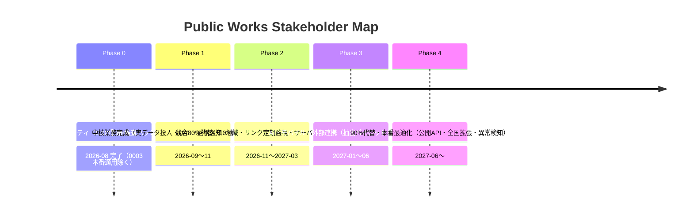

# 公共工事ステークホルダー整理マップ 総合評価・改善報告書

| 項目 | 内容 |
|---|---|
| 評価日 | 2026-08-12 |
| 評価対象 | Public Works Stakeholder Map（本番 https://pwsm.mirai-dx-platform.com） |
| 対象コミット | main @ 53d8888（改善前）→ feat/2026-08-12-production-evaluation（改善後） |
| 評価者 | Codex（CTO 代行相当）・プロジェクト設定（AGENTS.md / CLAUDE.md）準拠 |
| 判定 | **条件付き利用可**（実データ投入・監視実装・UAT を条件として本番利用可） |

---

## 1. Executive Summary

本システムは「工事地点と工事条件から、事前協議の確認候補となる関係機関を公開情報ベースで
整理する」極めてニッチな調査支援ツールです。アーキテクチャ・契約・データ品質・文書化・
セキュリティ基盤は高い水準にあり、本番 URL で Cloudflare Access 保護 + 架空デモデータによる
検証公開（v0.4.2）まで到達しています。

一方で、**実データが未投入（代表 3 地域の候補は全て架空）**、監視・アラート未実装、CSP 未設定、
レート制限・ボディ上限なし、フィードバックの対応導線なし、などの本番運用上のギャップがあり、
「そのまま現場で使える」状態ではありません。

今回の改善で、**CSP・レート制限・ボディ上限・Sec-Fetch-Site 検査・フィードバック管理・
ハートビート監視・CI の DB 検証・アクセシビリティ基礎・AI 活用設計**を実装・検証しました。
総合スコアは **63.9 → 70.0 / 100**、競合代替率は **48.0% → 56.7%** に向上しました。

## 2. プロジェクト概要

| 項目 | 内容 |
|---|---|
| 目的 | 公共工事の事前協議候補となる関係機関（発注者・道路/河川/港湾管理者・警察・自治体窓口）を、公開情報と地図から初期洗い出しする |
| 対象利用者 | 現場管理者、土木技術者、営業・積算、研究・企画、IT/DX 部門、経営層 |
| 業務課題 | 協議先の見落とし、窓口情報の分散・改組・更新、初期調査の時間 |
| 提供価値 | 初期調査の時間短縮（目標 30% 以上）、根拠・出典・鮮度を一体管理、調査品質の標準化 |
| 完成段階 | Phase 0（基盤）+ Phase 1（MVP 検索・地図・出力）+ Phase 2 前半（管理機能・台帳）実装済み。実データ投入（Phase 2 後半）は未達 |
| 運用段階 | 本番公開済み（v0.4.2・2026-08-05）・関係者限定（Cloudflare Access）・デモデータ |

## 3. 改善前後の採点（各 100 点）

| # | 評価項目 | 改善前 | 改善後 | 主な根拠（改善後） |
|---|---:|---:|---:|---|
| 1 | 業務適合性 | 55 | 57 | 実データ未投入は変わらず。フィードバック対応導線が閉じた |
| 2 | 機能完成度 | 66 | 73 | FR-005 機関詳細 API/UI、FR-015 一部、FR-017 管理クローズ、非機能（制限系）実装 |
| 3 | UI/UX | 62 | 66 | スキップリンク・フォーカス・地図代替案内・印刷調整 |
| 4 | アクセシビリティ | 55 | 63 | WCAG 2.4.1 / 2.4.7 対応、地図フォールバック明示 |
| 5 | データ品質 | 62 | 66 | リンク生存確認スクリプト、CI での DB 整合性検証 |
| 6 | AI 有効性 | 35 | 45 | AI 未実装だが活用設計・評価指標・停止手段を定義（不要領域の明示含む） |
| 7 | 設計 | 82 | 85 | CSP・制限系が設計 §12 と一致 |
| 8 | コード品質 | 78 | 79 | テスト追加・lint 設定安定化。app.ts 肥大・チャンク警告は残 |
| 9 | 性能・拡張性 | 60 | 62 | レート制限・CI DB 検証。負荷試験・ページングは未実装 |
| 10 | セキュリティ | 70 | 85 | CSP、レート制限、ボディ上限、Sec-Fetch-Site、admin 限定フィードバック、監査チェーン |
| 11 | 可用性・バックアップ | 66 | 68 | CI で migration/seed 検証。復元試験は 1 回のみのまま |
| 12 | 監視・障害対応 | 48 | 60 | ハートビート workflow（Issue #57）、監査チェーン検証 API、SLO 文書更新 |
| 13 | テスト | 72 | 80 | 221 件（+9 DB スキップ）、E2E a11y・監査チェーン・組織詳細テスト追加 |
| 14 | CI/CD・リリース | 72 | 80 | DB 検証ジョブ・ハートビート・lint 安定化。デプロイは承認制のまま |
| 15 | 運用保守性 | 66 | 74 | link:check / load:test / backup:export コマンド、リンク点検 workflow、台帳・SLO 更新 |
| 16 | 文書 | 82 | 88 | AI 設計・評価報告・改善台帳・release note 追加 |
| 17 | 費用対効果 | 72 | 73 | 追加機能はクラウド無料枠内。効果は実データ公開後に検証 |
| 18 | 競合代替性 | 48 | 54 | 監視・セキュリティ・管理運用・詳細表示が実用レベルへ |
| | **総合平均** | **63.9** | **70.0** | |

**総合判定: 条件付き利用可**

条件: (1) 実データの投入とデータ版切替（Issue #32）、(2) 監視・通知基盤、(3) 現場利用者による
UAT と初期調査時間の効果測定。これらが整えば、600 名規模の土木・建設会社で「事前協議候補の
初期洗い出し」の標準ツールとして本番利用できます。

## 4. 強み（15 件以上）

1. 対象業務が明確で責任境界（候補提示・断定しない・原典確認必須）が設計・UI・出力の全層で一貫（要件 FR-007 / 詳細設計 §1）
2. contracts（Zod）を Web/API/DB の単一の真実とする monorepo 構成
3. DB は 5 スキーマ分離 + 整合性 CHECK 制約（published は根拠必須、estimated と official 精度の併用禁止、期間逆転禁止）
4. PostGIS 空間検索（ST_Covers / ST_DWithin）で境界上の複数候補を隠さない
5. 信頼度が説明可能な加減点方式（authority / freshness / precision / review / penalty）で ML に依存しない
6. TTL・鮮度判定がクロック注入可能な純粋関数で実装され、期限超過を削除せず expired 表示
7. CSV 数式注入対策（= + - @ の先頭無害化 + RFC 4180 エスケープ + BOM）
8. Cloudflare Access JWT（RS256・aud・exp）をサーバ側で検証し、ロールを API で強制（UI 非表示に依存しない）
9. 無レビュー公開禁止の状態機械（pending → in_review → approved/rejected/quarantined）が domain + DB CHECK の二重防御
10. 監査ログは座標・住所・検索条件・フィードバック本文を記録しないプライバシー最小化
11. 情報源台帳 16 件がライセンス・利用条件・TTL・許可ホスト付きで Neon 登録済み
12. N03 行政区域の GeoJSON → ステージング取込ツール（市町村集約・所属未定地・自己交差検出）
13. 検証用 WebUI（Node サーバー）で workerd 起動不能環境でも実証可能
14. 文書体系が充実（要件・設計・ADR・運用 7 種・release notes・data-registry）
15. CI が lint / typecheck / test / build / 依存監査 / E2E の 3 ジョブで安定
16. 段階公開（versions upload → deploy）とロールバック手順が実証・文書化済み
17. 秘密情報が Git に無く（wrangler secret）、.env.example のみ管理
18. 免責・出典・データ版・出力日時が CSV/印刷に必ず含まれる

## 5. 弱み・リスク（15 件以上）

| # | 弱み・リスク | 影響度 |
|---|---|---|
| 1 | 実データ未投入（候補は全て架空デモ）— 業務価値が未実証 | 重大 |
| 2 | 組織・窓口・連絡先（core.offices / contact_points）の実レコードが未整備 | 重大 |
| 3 | 監視アラート未実装（SLO 定義のみ。通知基盤なし） | 高 |
| 4 | ハートビート監視が未実装だった（本セッションで実装済み・Issue #57） | 高 |
| 5 | CSP 未設定だった（本セッションで実装済み） | 高 |
| 6 | レート制限・ボディ上限なし（本セッションで実装済み） | 高 |
| 7 | フィードバックが受け付けるだけで対応導線なし（本セッションで実装済み） | 高 |
| 8 | 監査ログ改ざん検知はコード実装済みだが、本番（Neon main）への migration 0003 適用は承認待ち | 中 |
| 9 | 組織詳細 API・画面は実装済み。実データ（連絡先・管轄）の反映は Phase 1 | 中 |
| 10 | サーバー側チェックリスト（workflow.search_sessions）が未配線（local storage のみ） | 中 |
| 11 | 負荷・性能テスト未実施（p95 2 秒の実測なし） | 中 |
| 12 | DB 統合テストがローカルで環境変数ゲートによりスキップ（CI での DB 検証は本セッションで追加） | 中 |
| 13 | E2E がローカル環境（ulimit -v）で起動不能（CI では成功） | 中 |
| 14 | MapPicker チャンク 1MB 超（初回表示性能） | 低 |
| 15 | app.ts 768 行・CSV/印刷の列定義重複（保守性） | 低 |
| 16 | アクセシビリティ自動検査（axe 等）と実機モバイル UAT なし | 中 |
| 17 | ロールがメールアドレス列挙ベース（ドメイン単位昇格は将来拡張） | 中 |
| 18 | リンク切れ・改組の自動検知（FR-015）が本格実装前（点検スクリプトは本セッションで追加） | 中 |
| 19 | バックアップの自動化・復元試験が年 1 回のみの実績（次回 2026-11-05） | 中 |
| 20 | 本番 smoke test が Access 保護で外部から実施不能（preview で代替） | 低 |

## 6. 競合・代替比較

直接的な競合製品は存在しないニッチ領域のため、代替手段・隣接製品と比較します。

| 比較項目 | 本システム | 現行手作業（HP+地図+Excel） | 国土数値情報 + QGIS 等 OSS | 汎用 GIS SaaS（ArcGIS Online / Geolonia） | 建設 DX（ANDPAD 等） | 道路占用許可システム（MLIT/自治体） |
|---|---|---|---|---|---|---|
| 主要機能 | 関係機関候補の自動抽出・根拠・鮮度 | 人による調査・整理 | データ取得・地図表示 | 地図・データ基盤 | 現場管理・情報共有 | 占用許可の申請・管理 |
| 対象利用者 | 現場・技術・営業・DX | 同左 | 技術者 | 自治体・企業の GIS 担当 | 現場監督・協力会社 | 申請者・自治体 |
| 導入方式 | Cloudflare 公開（要実データ投入） | なし | 自前構築 | SaaS 契約 | SaaS 契約 | 自治体提供 |
| 関係機関候補ロジック | ✅ 専用 | ❌ | ❌ | ❌ | ❌ | ❌ |
| 出典・鮮度・監査 | ✅ 設計済み | ❌ | 一部 | 一部 | ❌ | ❌ |
| AI | 設計のみ（未実装） | ❌ | ❌ | 一部 | 一部 | ❌ |
| セキュリティ | ✅ Access + RBAC | 社内 | 環境次第 | ベンダー依存 | ベンダー依存 | 自治体依存 |
| 操作性 | 検索→一覧→出力 | 低 | 低（専門スキル） | 中 | 中 | 中 |
| 費用 | ほぼ無料枠 | 人件費 | 人件費 | 年数十万〜数百万 | 年数十万〜 | 自治体負担 |
| 代替可能範囲 | — | 全代替 | データ部分のみ | 地図基盤のみ | 関係なし | 手続後段のみ |
| 独自優位性 | 業務特化 + 公開データ + 監査 | — | データ自由度 | 地図表現 | 現場 DX | 手続き正本 |

出典（公式・公開情報）: 国土数値情報ダウンロードサイト（国土交通省）・Geolonia 公式サイト・
Esri 公式ストア・ANDPAD 公式サイト・国土交通省 道路占用関連システム概要。
料金は公開情報ベースの概算であり、契約プランは各社へ要確認。

## 7. 代替率（加重）

| 要素 | 重み | 改善前 | 改善後 | 判定基準 |
|---|---:|---:|---:|---|
| 主要業務フロー | 35% | 35% | 40% | 検索→候補→確認→出力が正常/異常系・手順込みで動作。実データ未投入のため 40% 上限 |
| 必須機能 | 25% | 50% | 62% | FR-005/FR-017 クローズ、FR-015 一部を追加。実データ未投入のため上限あり |
| UX | 15% | 65% | 72% | レスポンシブ・URL 共有・a11y 基礎。PWA/モバイル実機未検証 |
| データ連携 | 10% | 35% | 40% | ジオコーダー・Neon・N03 ツール・機関詳細 API。自動取得・公開 API は未達 |
| セキュリティ・監査 | 10% | 70% | 88% | RBAC・監査（ハッシュ連結）・バックアップ・手順あり。通知基盤は未達 |
| 運用保守性 | 5% | 60% | 72% | 文書・link:check/load:test/backup:export・リンク点検 workflow |
| **加重合計** | 100% | **48.0%** | **56.7%** | |

### 80% 到達必須項目

1. 実データ投入（代表 3 地域 → 10 地域、組織・窓口・管轄・連絡先の core 反映、データ版切替）
2. 出典保有率 100%・期限超過識別 100% の実データでの達成
3. 二者レビュー（取込者 ≠ 承認者）の実運用
4. 監視アラート（5xx・p95・期限超過）の実装と通知
5. 現場・技術・営業の UAT と初期調査時間の効果測定（KPI 30% 削減）
6. 組織詳細 API + 候補詳細画面

### 90% 到達項目

- 全国カバレッジ（都道府県単位の品質ゲート）
- 公開 API・利用規約・API キー
- PWA / オフライン / モバイル実機対応
- AI 抽出支援（docs/ai Step 1）と引用付き RAG 検索（Step 2）
- 監査ログの改ざん検知（ハッシュ連結）

### 意図的に代替しない機能

- 許認可の要否・管轄・申請先の法的断定
- 電子申請・行政機関との通信・許可状況取得
- 緊急連絡先案内
- AD / Entra ID / HENNGE ONE / SharePoint / DirectCloud / FortiGate / DeskNet's NEO との接続
- AI だけによる窓口データの自動公開

## 8. 改善計画（分類・優先度）

### 今すぐ（本セッションで実施）

| 内容 | 効果 | 難易度 | 完了基準 |
|---|---|---|---|
| CSP・レート制限・ボディ上限 | セキュリティギャップ解消 | 低 | テスト合格（実装済み） |
| フィードバック管理（admin 一覧） | 報告の対応クローズ | 低 | API+UI+テスト（実装済み） |
| ハートビート監視 | 定期保守の無音停止防止 | 中 | workflow 追加（実装済み） |
| CI DB 検証ジョブ | マイグレーション破損の早期検知 | 中 | PostGIS コンテナで PASS（実装済み） |
| アクセシビリティ基礎 | WCAG 2.4.1 / 2.4.7 | 低 | 実装済み |

### 3 か月以内（Phase 1: 中核業務完成）

| 内容 | 効果 | 難易度 | 概算工数 | 優先度 |
|---|---|---|---|---|
| 実データ投入（N03・組織・窓口・連絡先、1 地域ずつ） | 業務価値の実証 | 高 | 40〜60h/地域 | 最優先 |
| データ版切替とデモデータの扱い確定 | 本番データの正本化 | 中 | 8h | 最優先 |
| 監査ログ改ざん検知（migration 0003） | 監査要件充足 | 中 | 8h | 高 |
| 監視アラート（Cloudflare + 外部通知） | 障害検知 | 中 | 16h | 高 |
| 組織詳細 API + 候補詳細画面 | 機能完成度向上 | 中 | 24h | 高 |
| UAT（現場・技術・営業 各 3 名）と効果測定 | 受入基準 | 中 | 20h | 高 |

### 6〜12 か月（Phase 2: 競合 80% 代替・Phase 3: AI/モバイル）

| 内容 | 効果 | 難易度 | 優先度 |
|---|---|---|---|
| 代表 10 地域への拡張（品質ゲート毎） | 代替率 80% 到達 | 高 | 最優先 |
| サーバーサイドチェックリスト（search_sessions） | 端末間共有・監査 | 中 | 高 |
| リンク自動監視の定期化（cron + 品質画面連携） | FR-015 完成 | 中 | 高 |
| PWA / オフライン参照 | 現場利用 | 中 | 中 |
| AI 抽出支援パイロット（docs/ai Step 1） | データ整備効率 | 中 | 中 |
| 引用付き RAG 検索（docs/ai Step 2） | 検索支援 | 高 | 中 |

### 将来（Phase 4）

| 内容 | 効果 | 難易度 | 優先度 |
|---|---|---|---|
| 公開 API（キー・利用規約・利用統計） | 外部連携 | 中 | 中 |
| Civil Open Data Intelligence Platform 等との連携 | データ共有 | 高 | 低 |
| 異常検知・予測（docs/ai Step 3） | 運用効率 | 高 | 低 |

## 9. 追加機能提案（20 件以上）

| # | 分類 | 機能 | 効果 | 対象者 | 難易度 | 優先度 | 差別化 |
|---|---|---|---|---|---|---|---|
| 1 | 業務 | 工事種別テンプレート（舗装・橋梁・管渠等） | 入力時間短縮 | 現場・技術 | 低 | 高 | 高 |
| 2 | 業務 | 協議候補の版差異警告（古いデータ版のチェックリスト） | 誤判断防止 | 現場 | 中 | 高 | 高 |
| 3 | 業務 | 確認メモの Excel/CSV 一括出力（全状態） | 帳票化 | 現場・営業 | 低 | 中 | 中 |
| 4 | 業務 | 発注者別・地域別の候補再現率レポート | 品質 KPI | 管理者 | 中 | 中 | 高 |
| 5 | 業務 | 手続きごとの確認事項チェックリスト（占用・使用許可等） | 見落とし防止 | 現場 | 中 | 高 | 高 |
| 6 | 地図・検索 | 住所の町丁目レベル自動補完（Geolonia 住所データ等） | 地点指定精度 | 全員 | 中 | 中 | 中 |
| 7 | 地図・検索 | 検索履歴・よく使う条件の保存 | 再調査効率 | 現場 | 低 | 中 | 低 |
| 8 | 地図・検索 | 管轄区域の属性表示（路線名・河川等級・根拠） | 判断支援 | 技術 | 中 | 高 | 高 |
| 9 | 地図・検索 | 工事範囲（ポリゴン）での検索 | 実案件対応 | 現場 | 高 | 中 | 高 |
| 10 | モバイル | PWA（ホーム画面追加・オフライン参照） | 現場利用 | 現場 | 中 | 中 | 高 |
| 11 | モバイル | モバイル専用の候補確認 UI（タブ・大ボタン） | 片手操作 | 現場 | 中 | 中 | 中 |
| 12 | オフライン | 地域データのダウンロード参照 | 圏外対応 | 現場 | 中 | 低 | 高 |
| 13 | 通知 | 期限超過・リンク切れのメール通知 | 鮮度維持 | 管理者 | 中 | 高 | 中 |
| 14 | 通知 | フィードバック受付・対応状況の通知 | 対応 SLA | 管理者 | 低 | 中 | 中 |
| 15 | PDF/Excel | 印刷レイアウトの帳票テンプレート化 | 提出資料化 | 現場 | 低 | 中 | 中 |
| 16 | API | GET /organizations/:id（窓口・連絡先・管轄） | 詳細表示・連携 | 開発 | 中 | 高 | 高 |
| 17 | API | チェックリスト保存 API（匿名短期トークン） | 端末間共有 | 現場 | 中 | 中 | 中 |
| 18 | RBAC・監査 | 監査ログのハッシュ連結と検証 API | 改ざん検知 | 管理者 | 中 | 高 | 高 |
| 19 | RBAC・監査 | ドメイン単位ロール（mirai-const.co.jp = reviewer 等） | 運用効率 | 管理者 | 低 | 高 | 中 |
| 20 | 管理運用 | フィードバック対応ステータス管理 | 対応管理 | 管理者 | 低 | 高 | 中 |
| 21 | 管理運用 | 情報源の取得スケジュール管理（cron） | 鮮度維持 | 管理者 | 中 | 中 | 中 |
| 22 | データ品質 | 重複候補・表記揺れの自動レポート | 品質向上 | データ担当 | 中 | 高 | 高 |
| 23 | 土木固有 | 道路種別（国道/都道府県道/市道）による管理者分岐表示 | 判断支援 | 技術 | 中 | 高 | 高 |
| 24 | 土木固有 | 河川等級（一級/二級/準用）による管理者分岐表示 | 判断支援 | 技術 | 中 | 高 | 高 |
| 25 | AI | 公式ページからの窓口抽出下書き（承認付き） | データ整備効率 | データ担当 | 高 | 中 | 高 |
| 26 | AI | 引用付き RAG 検索（要確認を既定回答） | 調査支援 | 全員 | 高 | 中 | 高 |

## 10. AI 評価と設計

- **現状**: AI 機能なし。ルール + 空間演算 + 正規化の決定論方式は、誤判定の影響が大きい本領域では適切。
- **AI 不要領域**: 候補抽出、信頼度・鮮度、住所正規化（当面）、窓口の自動断定（禁止）。
- **AI 有用領域**: 公式ページからの構造化抽出（下書き→人間承認）、フィードバック分類、引用付き検索。
- **設計**: `docs/ai/ai-usage-design.md` に RAG 構成・モデル管理・引用/信頼度・人間承認・権限制御・
  プロンプトインジェクション対策・PII 保護・監査・責任分界・予算上限・停止手段を定義済み。
- **導入判断**: パイロットで費用対効果（抽出時間・精度）を計測してから実装。チャット追加は目的化しない。

## 11. ロードマップ

## 12. 実装済み改善と検証証跡（本セッション）

実装内容と証跡の詳細は [改善台帳](./2026-08-12-改善台帳.md) を参照。

| 検証 | 結果 |
|---|---|
| lint / typecheck / build | ✅ PASS |
| unit / integration | ✅ 221 passed / 9 skipped（DB 系は TEST_DATABASE_URL ゲート） |
| 依存監査 | ✅ 0 vulnerabilities |
| セキュリティ新規テスト | ✅ レート制限・413・Sec-Fetch-Site・CSP・JWT 形式・監査チェーン |
| 機能新規テスト | ✅ 組織詳細・フィードバック状態更新・OpenAPI 整合 |
| 負荷テスト | ✅ p95 87ms（ローカル fixture・目標 2 秒） |
| CI | ✅ quality / security / e2e / db-validation 全 PASS（psql による migration/seed 検証） |
| 検証用 WebUI | ✅ /・metadata・検索・組織詳細・フィードバック状態・監査検証 200 |
| 本番 smoke | ⛔ BLOCKED（Access 302）→ preview worker で 200 確認 |

## 13. 残存リスク

1. 実データ未投入（重大・Phase 1 必須）
2. 監査ログハッシュ連結の本番適用未実施（Neon main への migration 0003 適用は承認後）（中）
3. 通知基盤・アラート未実装（高）
4. 本番・密集地域での負荷試験未実施（ローカルは実測済み）（中）
5. ローカル E2E 不可・本番 smoke 外部不可（環境・Access 制約）
6. アクセシビリティ自動検査・実機 UAT 未実施（中）

## 14. 投資判断

**条件付き継続を推奨**します。

- 本領域は競合不在のブルーオーシャンであり、公開データ + 業務ロジック + 監査という構成は
  差別化が明確。開発コストはほぼクラウド無料枠で、追加投資はデータ整備の人件費が主。
- ただし、**実データ投入と UAT で効果（初期調査 30% 短縮）を実証するまで追加機能開発を
  拡大しない**こと。Phase 1 の成果で継続・方向転換を判断する。
- 6 か月以内に代表 10 地域で出典保有率 100% を達成できない場合は、地域を絞った高品質路線
  （3 地域限定の業務利用）へ切替える選択肢も用意する。

## 15. 次に着手すべき具体的作業

1. **Issue #32 の実データ投入を 1 地域（東京）から開始**: N03 の取得・変換・レビュー → 組織/窓口/
   連絡先の収集・正規化 → staging 登録 → 二者レビュー → core 反映
2. **監査ログ改ざん検知の migration 0003 設計と dev 検証**
3. **監視通知の実装**（Workers Analytics ベース + メール/チャット通知）
4. **組織詳細 API と候補詳細画面**
5. **UAT 実施（計画書は docs/evaluation/2026-08-12-UAT計画書.md に作成済み・実データ公開後に実施）**
6. **本 PR のレビュー・マージ（Y/N）**

---

以上をもって、改善前後比較・競合代替率・ロードマップを含む統合評価・改善報告書とします。
