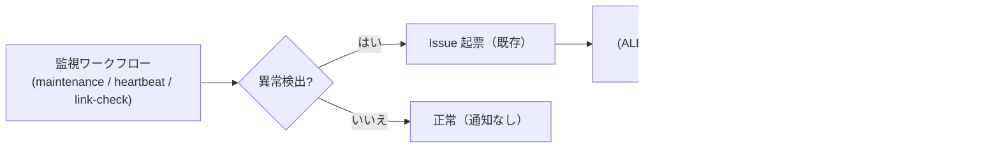

# 通知基盤（アラート）設計（MVP 版）

| 項目 | 内容 |
|---|---|
| 対象 | Public Works Stakeholder Map（pwsm） |
| 作成日 | 2026-08-15 |
| 状態 | 設計確定 + GitHub Actions 連携の雛形実装。Webhook（Slack / メール）は Secret 設定後に有効 |

## 1. 方針

- **GitHub を通知ハブとする**: 既存の監視系ワークフロー（ops-maintenance / ops-heartbeat / ops-link-check）は
  Issue 起票済み。これに**通知ステップ**を追加し、アラート発生をメール / Slack 等へ転送できるようにする。
- **Secrets 分離**: Webhook URL は `ALERT_WEBHOOK_URL` 等の Repository Secret で管理し、コードへ埋め込まない。
  未設定時は既存どおり Issue 起票のみ（フェイルセーフ）。
- **本番運用化の対象**: 通知先の実配信（メール / Slack）は本番運用の承認範囲で実施。
  MVP では設計 + 雛形 + テストまで。

## 2. 通知フロー



## 3. 通知ステップ（共通アクション）

各ワークフローの異常時ステップに、次の通知呼び出しを追加する（雛形）。

```yaml
- name: アラート通知（ALERT_WEBHOOK_URL 設定時のみ）
  if: failure()
  env:
    WEBHOOK_URL: ${{ secrets.ALERT_WEBHOOK_URL }}
    WORKFLOW_NAME: ${{ github.workflow }}
    RUN_URL: ${{ github.server_url }}/${{ github.repository }}/actions/runs/${{ github.run_id }}
  run: |
    if [ -z "$WEBHOOK_URL" ]; then
      echo "ALERT_WEBHOOK_URL 未設定のため通知スキップ（Issue 起票のみ）"
      exit 0
    fi
    curl -fsS -X POST "$WEBHOOK_URL" \
      -H 'Content-Type: application/json' \
      -d "{\"text\":\"⚠️ [pwsm] ${WORKFLOW_NAME} が失敗しました\n${RUN_URL}\"}"
```

## 4. アラート閾値（SLO 文書 §2 と整合）

| レベル | 条件 | 通知先 |
|---|---|---|
| 🔴 Critical | `/health/ready` 503 連続 3 回 / DB 接続失敗 / 5xx 率 5% 超 | 管理者メール + 電話 |
| 🟠 Warning | 5xx 率 1% 超 / p95 2 秒超 / 期限超過 10 件超 | 管理者メール |
| 🟡 Info | 依存脆弱性 high / 証明書 30 日以内 / 情報源取得失敗 | 管理者メール |

## 5. 実装状態

| 項目 | 状態 |
|---|---|
| 通知設計 | ✅ 本設計書 |
| GitHub Actions 雛形 | ✅ 本設計書 §3 |
| ALERT_WEBHOOK_URL Secret | ⏳ 本番運用時に設定（承認範囲） |
| Slack 受信 Webhook | ⏳ 本番運用時に設定 |
| メール配信基盤 | ⏳ 本番運用時に設定（SES / SendGrid 等） |
| 通知試験 | ⏳ 本番運用時にテスト通知を実施（SLO 文書 §4） |

## 6. 残課題（本番運用化）

1. 通知先（Slack チャンネル / メール）の決定と Secret 登録
2. 各監視ワークフローへの通知ステップ追加（§3 雛形を適用）
3. テスト通知の実施と確認（SLO 文書 §4）
4. Node サーバーのヘルスチェック連携（外部監視 SaaS または Cron での `/api/v1/health/ready` 監視）
