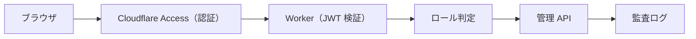

# 🔐 認証・RBAC 運用手順（Issue #34）

| 項目 | 内容 |
|---|---|
| 🎯 目的 | Cloudflare Access の認証結果を API 側で検証し、ロール別に管理機能を解禁する |
| 👥 対象読者 | 管理者・IT/DX 運用者 |
| 📅 最終更新日 | 2026-08-05 |

> ⚠️ 本機能はコード・テスト実装済みですが、**既定では無効**です（`AUTH_ENABLED=false`）。
> 有効化は Secrets / env の設定と本番 Access ポリシーの確認が必要です。

## 1. 動作概要

- Access が認証済みリクエストへ `CF-Access-JWT-Assertion` ヘッダーを注入します
- Worker は RS256 署名・audience・期限を検証し、`sub` / `email` / ロールを確定します
- ロールは `viewer < reviewer < editor < admin` の包含順ではなく、**操作ごとの最小ロール**で判定します

## 2. 設定項目

| 環境変数 | 内容 | 例 |
|---|---|---|
| `AUTH_ENABLED` | `true` で有効化 | `true` |
| `AUTH_AUDIENCE` | Access アプリの audience | `https://<team>.cloudflareaccess.com` |
| `AUTH_JWKS_URL` | Access の公開鍵（JWKS） | `https://<team>.cloudflareaccess.com/cdn-cgi/access/certs` |
| `AUTH_CERT_PEM` | 代替の公開鍵 PEM（Secret 管理推奨） | 複数行 PEM |
| `AUTH_ADMIN_EMAILS` | admin ロール（カンマ区切り） | `a@example.com,b@example.com` |
| `AUTH_REVIEWER_EMAILS` | reviewer ロール | `r@example.com` |
| `AUTH_EDITOR_EMAILS` | editor ロール | `e@example.com` |

## 3. ロールと操作

| 操作 | 最小ロール |
|---|---|
| 検索・閲覧・フィードバック | 認証不要（公開） |
| データソース台帳の閲覧 | editor |
| 手動取込の登録 | editor |
| 取込一覧・レビュー操作（差戻し/隔離/再レビュー） | reviewer |
| 公開承認（approve） | admin |
| 品質ダッシュボード | reviewer |
| 監査ログ閲覧 | admin |

## 4. 有効化手順

1. Access アプリ（`pwsm.mirai-dx-platform.com`）の audience を確認する
2. 本番 Worker の Secrets / vars へ上記を設定する（`AUTH_CERT_PEM` は `wrangler secret put` 推奨）
3. `AUTH_ENABLED=true` を設定してデプロイする
4. 管理画面（`/admin/*`）へ Access 経由でアクセスし、ロール別動作を確認する
5. 監査ログで `admin.access_denied` が記録されることを確認する

> 本番への反映はリリース PR に設定・影響・rollback を明記し、マージ判定 `Y` の範囲で実施します。

## 5. 無効化（rollback）

- `AUTH_ENABLED=false` に戻して再デプロイすれば、従来の「本番では管理 API 403」へ即時復旧します
- JWT 検証はステートレス（外部状態なし）のため、切り戻しの整合性問題はありません

## 6. セキュリティメモ

- `CF-Access-JWT-Assertion` ヘッダーを無条件に信頼しません（署名・audience・期限を必ず検証）
- Access を迂回した直接リクエストには JWT が無いため 401 になります
- ロールは UI 表示だけでなく API 側で強制します（設計 §11）
