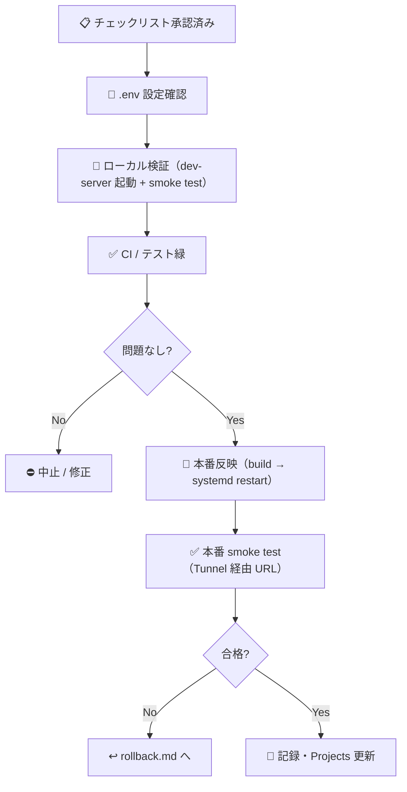

# 🚀 本番デプロイ手順書（Runbook）

| 項目 | 内容 |
|---|---|
| 🎯 目的 | Node サーバー（API + Web 静的配信）・ローカル PostgreSQL・Cloudflare Tunnel を本番へ安全に反映する手順を定める |
| 👥 対象読者 | デプロイを実行する人間（オペレーター）・DevOps・承認者 |
| 📅 最終更新日 | 2026-08-30（Neon 廃止・ローカル PostgreSQL / Node + Tunnel 構成へ全面移行） |

> 🚫 **本番デプロイ・本番公開・Secrets 登録は、人間の明示承認なしに実行しません。**
> 承認はリリース PR の「マージ判定 `Y`」へ集約します。`Y` は当該 PR に明記されたデプロイ・migration・Secrets 登録の**正確な範囲だけ**を一括承認したものであり、承認後の実作業は人間または CTO（Claude）が PR 記載の範囲内で実行できます。PR に記載のない本番操作は引き続き禁止です。
> 本手順は `docs/operations/release-checklist.md` の確認記録（PR 本文上の記録で代替可）が済んでいることを前提とします。

---

## 📌 前提

| 項目 | 値 / 条件 |
|---|---|
| デプロイ実行者 | 人間（承認済みオペレーター） |
| 前提条件 | リリース前チェックリスト全 🔴 充足・承認者サイン済み |
| API スタック | Node サーバー（`apps/api/src/dev-server.ts`・Hono・postgres.js）を `tsx` で実行 |
| Web スタック | Vite + React（`apps/web`）→ `apps/web/dist` を同一 Node サーバーが静的配信（SPA fallback 付き） |
| DB | ローカル PostgreSQL / PostGIS（本ホスト 127.0.0.1:5432・db `pwsm`・role `pwsm_app`。Neon は不使用） |
| 公開経路 | Cloudflare Tunnel（`/home/kensan/.cloudflared/pwsm-api-config.yml` 等）＋ Cloudflare Access（本番のみ） |
| 設定ファイル | `apps/api/.env`（本番）・`.env.mvp`（MVP）・`.env.preview`（preview）。Git 管理外 |
| systemd サービス | `pwsm-api`（18803・本番 DB モード）/ `pwsm-mvp`（18808・fixture）/ `pwsm-api-preview`（18809・fixture） |
| 必要ツール | Node.js（CI は 24 / ローカル 22+）・npm・psql・systemd |



---

## 1. 🔧 事前準備

```bash
# リポジトリ最新化（デプロイ対象コミットを明確化）
git fetch origin
git switch main
git log -1 --oneline   # デプロイ対象 SHA を控える

# 依存インストール（lockfile 固定）
npm ci

# ローカル最終確認（STABLE ゲート）
npm run lint
npm run typecheck
npm test
npm run build
```

- ✅ 上記がすべて success であること（失敗時はデプロイ中止）。
- ✅ 統合テストは `TEST_DATABASE_URL`（ローカル `pwsm_test`・migration/seed 適用済み）を設定して実行する。

---

## 2. 🔐 ローカル PostgreSQL 接続設定（.env）— 🚫 秘密情報は本文に記載しない

Neon は廃止済み（2026-08-30）。本番 DB は本ホストのローカル PostgreSQL です。

- 本番 `.env`（`/home/kensan/Projects/Mirai-DX-Project/Public-Works-Stakeholder-Map/apps/api/.env`、Git 管理外）に以下を設定する:
  - `DATABASE_URL`（ローカル PostgreSQL・`pwsm` db・`pwsm_app` role）
  - `APP_ENV=production`
  - `DATASET_VERSION`（公開データ版、例: `2026-08-13.real.1`）
  - `AUTH_ENABLED=false`（Cloudflare Access でエッジ保護。アプリ内 RBAC 有効化は systemd の outbound 許可とセットで行う）
- migration / seed の適用は CI（postgis コンテナ）とローカルで同一手順（§5 参照）。

| ✅ | 確認項目 |
|---|---|
| ☐ | `.env` が Git 管理外（`apps/api/.gitignore` に `.env*`） |
| ☐ | `DATABASE_URL` がローカル PostgreSQL を指す（Neon の URL でない） |
| ☐ | `DATASET_VERSION` が公開データ版と一致 |

> 🔴 **本番では `DATABASE_URL` を必ず設定します（この節は省略不可）。** 実装（`apps/api/src/app.ts`）は `DATABASE_URL` が設定されている場合のみ DB 到達を確認し、`SELECT 1` が失敗すると `/api/v1/health/ready` が **503 `{status:"unavailable"}`** を返します。
> `DATABASE_URL` 未設定は開発用の fixture モード（`/health/ready` は常に 200 `ok`）であり、本番構成では使いません。

---

## 3. 🧪 ローカル / preview 検証（本番前・推奨）

本番前にローカルで API + Web を起動し、smoke test を通してから本番に進みます。

```bash
# リポジトリルートで Web をビルド（apps/web/dist を最新化）
npm run build

# 本番相当（DB モード）をローカル起動
cd apps/api
PORT=18899 node --env-file=.env ../../node_modules/.bin/tsx src/dev-server.ts
# → http://localhost:18899/ で Web、/api/v1/* で API を確認

# fixture モード（MVP 相当）は --env-file=.env.mvp で同様に起動
```

- §6 の smoke test をローカル起動ポートに対して先に実施する。

---

## 3.5 🧪 MVP 環境（関係者レビュー用）

- **systemd サービス**: `pwsm-mvp`（ポート 18808・fixture モード・`apps/api/.env.mvp`）
- **公開 URL**: https://pwsm-mvp.mirai-dx-platform.com（Tunnel: `pwsm-mvp-config.yml`・一般アクセス可）
- **反映手順**: `npm run build` 後に `systemctl restart pwsm-mvp`（権限が必要な場合は承認者に依頼）
- **ロールバック**: `git checkout <直前SHA>` 相当で戻し、再度 restart（本番に影響なし）

---

## 4. 🚀 本番反映手順（Node サーバー + systemd）— 🚫 承認済み PR の範囲でのみ実行

本番は systemd サービス `pwsm-api`（ポート 18803・DB モード）です。**API と Web 資産は同一 Node サーバー**で配信されます。

```bash
# 事前: リポジトリルートで npm run build（apps/web/dist を最新化・tsc -b で apps/api/dist も更新）

# 本番反映（systemd サービス再起動で新コードを読み込む）
sudo systemctl restart pwsm-api
# または承認環境で kill <Main PID> → Restart=on-failure による自動再起動

# 起動ログ確認（モード表示: DB（ローカル PostgreSQL））
systemctl status pwsm-api --no-pager
```

| ✅ | 確認項目 |
|---|---|
| ☐ | `pwsm-api` が active (running)・ポート 18803 で LISTEN |
| ☐ | 起動ログに `モード: DB（ローカル PostgreSQL）` と表示される |
| ☐ | Tunnel（`pwsm-api-cloudflared.service`）が active で `localhost:18803` へ疎通 |

> ⚠️ **環境変数を変更するリリースでは `.env` の内容を必ず確認する**（`EnvironmentFile` は再起動時に読込まれるため、restart だけで反映される）。

---

## 5. 🗄️ DB マイグレーションと seed

ローカル PostgreSQL へ適用（CI の `db-validation` ジョブと同一手順）。

```bash
# 対象 DB の DATABASE_URL を設定（本番は pwsm・テストは pwsm_test）
psql "$DATABASE_URL" -v ON_ERROR_STOP=1 -f db/migrations/0001_initial_schema.sql
psql "$DATABASE_URL" -v ON_ERROR_STOP=1 -f db/migrations/0002_feedback.sql
psql "$DATABASE_URL" -v ON_ERROR_STOP=1 -f db/migrations/0003_audit_hash_chain.sql
psql "$DATABASE_URL" -v ON_ERROR_STOP=1 -f db/migrations/0004_jurisdiction_geography_index.sql

# seed（環境に応じて選択。本番の実データはダンプ復元または登録パイプラインで適用済み）
psql "$DATABASE_URL" -v ON_ERROR_STOP=1 -f db/seeds/demo/0001_demo_dataset.sql        # デモ
psql "$DATABASE_URL" -v ON_ERROR_STOP=1 -f db/seeds/registry/0001_source_registry.sql # 情報源台帳
```

- 統合テスト用の `pwsm_test` は「migration 4 本 + デモ seed」を適用して作成する（`TEST_DATABASE_URL` で参照）。
- `0004_jurisdiction_geography_index.sql` は候補検索の半径一致（`ST_DWithin`）をインデックス駆動にする geography 式 GiST インデックス。**適用前は本番検索が約 1.07 秒（Seq Scan）、適用後は約 8ms**（2026-08-30 実測）。PostgreSQL の `geometry::geography` は IMMUTABLE なので式インデックスとして安全。

---

## 6. ✅ デプロイ後 smoke test

本番（または MVP）URL に対して、最低限の健全性と設計原則（免責）を確認します。

```bash
# <BASE_URL> は対象環境の URL
#   本番: https://pwsm.mirai-dx-platform.com（Cloudflare Access 認証後）
#   MVP : https://pwsm-mvp.mirai-dx-platform.com

# 1) liveness: プロセス確認のみ。常に 200 {"status":"ok"}
curl -fsS "<BASE_URL>/api/v1/health/live"

# 2) readiness: 本番（DATABASE_URL 設定時）は DB 到達を確認。
#    到達可 → 200 {"status":"ok","datasetVersion":"..."}
#    到達不可 → 503 {"status":"unavailable","datasetVersion":"..."}
curl -fsS "<BASE_URL>/api/v1/health/ready"

# 3) metadata: disclaimer / datasetVersion / ruleVersion / appEnv を確認
curl -fsS "<BASE_URL>/api/v1/metadata"

# 4) Web トップ: SPA（index.html）が配信される
curl -fsS -o /dev/null -w "%{http_code} %{content_type}\n" "<BASE_URL>/"
```

| ✅ | 確認項目 | 期待 |
|---|---|---|
| ☐ | `/api/v1/health/live` | HTTP 200・`status: ok`（プロセス確認のみ・DB は見ない） |
| ☐ | `/api/v1/health/ready` | 本番は HTTP 200・`status: ok`・`datasetVersion` が想定版（DB 到達不可なら 503 `unavailable`＝デプロイ失敗として扱う） |
| ☐ | `/api/v1/metadata` | `disclaimer`（必須免責文）を含む・`appEnv` が `production` |
| ☐ | 検索 `POST /api/v1/stakeholders/search` | 候補応答に免責が常時付与される |
| ☐ | Web トップ `/` | HTTP 200・`text/html`・SPA（404 でないこと） |
| ☐ | エラー整形 | 異常系が RFC 9457（Problem Details）で返る |

> ⚠️ 本番（`DATABASE_URL` 設定時）に `/health/ready` が 503 `unavailable` を返す場合、DB 到達不可＝デプロイ未完了とみなし、公開しないこと（`§8 失敗時` / `rollback.md` へ）。`DATABASE_URL` 未設定の fixture モードは開発・MVP 専用です。

---

## 7. 📝 デプロイ完了後の記録

| ✅ | 作業 |
|---|---|
| ☐ | デプロイ対象 SHA・systemd restart 日時を記録 |
| ☐ | smoke test 結果を記録（合否・応答例） |
| ☐ | GitHub Projects の Status を `Deploy Gate` → `Done` に更新 |
| ☐ | `README.md` 開発状況にリリース行を追記 |
| ☐ | 残課題を Issue 化 |

---

## 8. ↩️ 失敗時

- smoke test 失敗・重大な誤表示・5xx 急増を検知した場合、**直ちに `docs/operations/rollback.md`** に従い直前の正常版へ戻す（`git checkout <直前SHA>` + systemd restart）。
- 誤窓口表示・情報漏えい疑い・DB 障害などは `docs/operations/incident-response.md` の初動に従う。
- Tunnel 不調時は `systemctl status pwsm-api-cloudflared` を確認し、再起動する。

> 🚫 本番へ影響する再デプロイ・ロールバックは、承認済み PR に記載された事前検証済み手順の範囲でのみ実行する（無制限な再デプロイは禁止）。範囲外の操作が必要になった場合は停止し、人間の判断を仰ぐ。
