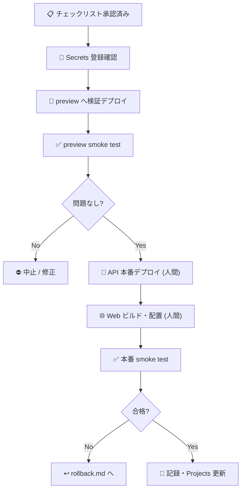

# 🚀 本番デプロイ手順書（Runbook）

| 項目 | 内容 |
|---|---|
| 🎯 目的 | API（Cloudflare Workers）・Web（Cloudflare Pages 相当）・Neon 接続を本番へ安全に反映する手順を定める |
| 👥 対象読者 | デプロイを実行する人間（オペレーター）・DevOps・承認者 |
| 📅 最終更新日 | 2026-07-18 |

> 🚫 **本番デプロイ・本番公開・Secrets 登録は、必ず人間が手動で実行します（自動デプロイ禁止）。**
> Claude / CTO は手順・判断材料の提示のみを行い、デプロイコマンドを自律実行しません。
> 本手順は `docs/operations/release-checklist.md` の承認記録欄が記入済みであることを前提とします。

---

## 📌 前提

| 項目 | 値 / 条件 |
|---|---|
| デプロイ実行者 | 人間（承認済みオペレーター） |
| 前提条件 | リリース前チェックリスト全 🔴 充足・承認者サイン済み |
| API スタック | Cloudflare Workers（`apps/api`・Hono・Worker 名 `pwsm-api`） |
| Web スタック | Vite + React（`apps/web`）→ 静的成果物を Cloudflare Pages 相当へ配置 |
| DB | Neon PostgreSQL / PostGIS（プロジェクト `tiny-river-77604173`） |
| 設定ファイル | `apps/api/wrangler.toml`（`[env.preview]` 分離済み・default env = 本番 `pwsm-api`） |
| Secrets | Cloudflare Secrets（`DATABASE_URL` 等）。実値は本書に記載しない |
| 必要ツール | Node.js（CI は 24 / ローカル 22+）・npm・`wrangler`（Cloudflare 認証済み） |



---

## 1. 🔧 事前準備

```bash
# リポジトリ最新化（デプロイ対象コミットを明確化）
git fetch origin
git switch main
git log -1 --oneline   # デプロイ対象 SHA を控える

# 依存インストール（lockfile 固定）
npm ci

# ローカル最終確認（STABLE ゲート）
npm run lint
npm run typecheck
npm test
npm run build
```

- ✅ 上記がすべて success であること（失敗時はデプロイ中止）。
- 🔐 `wrangler whoami` で Cloudflare 認証を確認する（未認証なら人間が対話ログインする）。

---

## 2. 🔐 Neon 接続文字列（Secrets）登録手順 — 🚫 人間承認・手動のみ

> 実際の接続文字列は Neon コンソール / `get_connection_string` から取得し、**本書・リポジトリには絶対に書きません**。以下はコマンド手順のみです。

```bash
# 作業ディレクトリ: apps/api
# <CONNECTION_STRING> は本番(main)ブランチの値をプレースホルダーとして扱う
#   例フォーマット: postgresql://<user>:<password>@<host>/<db>?sslmode=require

# 本番 (default env = pwsm-api) へ登録
wrangler secret put DATABASE_URL
# → プロンプトに接続文字列を貼り付け（履歴・画面共有に残さない）

# preview 環境は別値で登録（本番と分離）
wrangler secret put DATABASE_URL --env preview
```

| ✅ | 確認項目 |
|---|---|
| ☐ | 本番と preview の接続文字列が別ブランチ・別値である |
| ☐ | 登録値がシェル履歴・ログ・スクリーンショットに残っていない |
| ☐ | `.env` / `.env.local` を誤ってコミットしていない |

> ℹ️ 現段階（Phase 0）の API は fixture ベースで動作し、`DATABASE_URL` は Neon 接続導入（Phase 1）で必須になります。DB 未接続の版をデプロイする場合、この節はスキップ可（`/health/ready` は fixture 版を返す）。

---

## 3. 🧪 preview 環境への検証デプロイ（本番前・推奨）

本番前に preview へ上げ、smoke test を通してから本番に進みます。

```bash
# 作業ディレクトリ: apps/api
# preview 環境へバージョンをアップロード（本番トラフィックには影響しない）
npm run deploy:preview
#   = wrangler versions upload --env preview  →  Worker: pwsm-api-preview
```

- 出力される preview URL / version ID を控える。
- §5 の smoke test を **preview に対して** 先に実施する。

---

## 4. 🚀 API（Workers）本番デプロイ手順 — 🚫 人間が実行

本番は default env（Worker 名 `pwsm-api`）です。段階公開（versions upload → deploy）を推奨します。

```bash
# 作業ディレクトリ: apps/api

# 方式A（推奨・段階公開）: バージョンをアップロードしてから本番へ昇格
wrangler versions upload
#   → 生成された version ID を控える（rollback 時に使用）
wrangler versions deploy
#   → 昇格するバージョンとトラフィック割合を対話で指定（例: 新版 100%）

# 方式B（簡易・即時全量）: 直接デプロイ
# wrangler deploy
```

| ✅ | 確認項目 |
|---|---|
| ☐ | デプロイ先が本番 `pwsm-api`（preview ではない）である |
| ☐ | 昇格した version ID を記録した（`rollback.md` で使用） |
| ☐ | `compatibility_date`（`wrangler.toml`）が意図通り |

> 💡 段階公開（方式A）を使うと、`rollback.md` の「版ロールバック」で旧 version ID へ即時に戻せます。

---

## 5. 🌐 Web（Cloudflare Pages 相当）ビルド・配置手順 — 🚫 人間が実行

```bash
# 作業ディレクトリ: リポジトリルート
# Web を本番ビルド（成果物は apps/web/dist/）
npm run build -w @pwsm/web
#   = vite build

# 生成物確認
ls apps/web/dist
```

配置は運用中の Cloudflare Pages プロジェクト設定に従います（いずれも人間が実行）。

| 方式 | 概要 |
|---|---|
| GitHub 連携（推奨） | main への merge を契機に Pages が自動ビルド。**merge = 公開**になるため人間承認を要する |
| 直接アップロード | `wrangler pages deploy apps/web/dist --project-name <PAGES_PROJECT>` で `dist/` を配置 |

| ✅ | 確認項目 |
|---|---|
| ☐ | Web の API ベース URL が本番 API（`pwsm-api`）を指す設定である |
| ☐ | 免責表示・推定/鮮度表示がビルド成果物に含まれる |
| ☐ | 公開範囲（管理系は Cloudflare Access 保護）が設計通り |

---

## 6. ✅ デプロイ後 smoke test

本番（または preview）URL に対して、最低限の健全性と設計原則（免責）を確認します。

```bash
# <BASE_URL> は対象環境の URL（例: https://pwsm-api.<subdomain>.workers.dev）

# 1) liveness: {"status":"ok"}
curl -fsS "<BASE_URL>/api/v1/health/live"

# 2) readiness: {"status":"ok","datasetVersion":"..."}
curl -fsS "<BASE_URL>/api/v1/health/ready"

# 3) metadata: disclaimer / datasetVersion / ruleVersion / appEnv を確認
curl -fsS "<BASE_URL>/api/v1/metadata"
```

| ✅ | 確認項目 | 期待 |
|---|---|---|
| ☐ | `/api/v1/health/live` | HTTP 200・`status: ok` |
| ☐ | `/api/v1/health/ready` | HTTP 200・`datasetVersion` が想定版 |
| ☐ | `/api/v1/metadata` | `disclaimer`（必須免責文）を含む・`appEnv` が `production` |
| ☐ | 検索 `POST /api/v1/stakeholders/search` | 候補応答に免責が常時付与される |
| ☐ | Web トップ | 免責が常時表示・検索が API に到達する |
| ☐ | エラー整形 | 異常系が RFC 9457（Problem Details）で返る |

> ⚠️ `/health/ready` は現状 fixture リポジトリで常時 ready を返します。Neon 接続導入後は DB 到達確認を含める実装に更新すること（`apps/api/src/app.ts` 参照）。

---

## 7. 📝 デプロイ完了後の記録

| ✅ | 作業 |
|---|---|
| ☐ | デプロイ対象 SHA・API version ID・Web デプロイ ID を記録 |
| ☐ | smoke test 結果を記録（合否・応答例） |
| ☐ | GitHub Projects の Status を `Deploy Gate` → `Done` に更新 |
| ☐ | `README.md` 開発状況にリリース行を追記 |
| ☐ | 残課題を Issue 化 |

---

## 8. ↩️ 失敗時

- smoke test 失敗・重大な誤表示・5xx 急増を検知した場合、**直ちに `docs/operations/rollback.md`** に従い直前の正常版へ戻す。
- 誤窓口表示・情報漏えい疑い・DB 障害などは `docs/operations/incident-response.md` の初動に従う。

> 🚫 本番へ影響する再デプロイ・ロールバックの実行判断も人間が行う。CTO は手順と影響評価を提示する。
