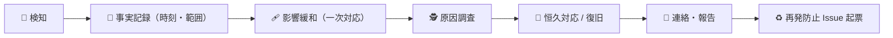

# 🚨 障害・インシデント対応手順

| 項目 | 内容 |
|---|---|
| 🎯 目的 | 誤表示・改ざん疑い・情報漏えい疑い・DB 障害・5xx 急増等の初動、連絡・記録、再発防止を定める |
| 👥 対象読者 | 運用担当・DevOps・Security・承認者（人間）・CTO（判断材料提示） |
| 📅 最終更新日 | 2026-07-18 |

> 🚫 **本番停止・取得停止・トークン失効・DB 変更・公開版切替は、いずれも影響が大きく、実行判断は人間が行います。**
> CTO / Claude は状況整理・影響評価・手順提示を担い、実操作を自律実行しません。
> 本システムは「候補提示に限定し所管を断定しない」設計です。**誤って所管を断定表示することは重大インシデント**として扱います。

---

## 📌 共通の初動フロー（全シナリオ）



| 段階 | やること |
|---|---|
| 🔎 検知 | 事象・発生時刻・影響範囲（対象地域 / 機関種別 / エンドポイント）を特定 |
| 📝 記録 | 監査（`audit` スキーマ）・ログ・スクリーンショットを時刻付きで保全（改ざんしない） |
| 🩹 緩和 | シナリオ別の一次対応（下記）。まず被害拡大を止める |
| 🕵️ 調査 | 原因を 1 仮説ずつ検証。同一原因の修復は 3 回まで（`CLAUDE.md §12`） |
| 🔧 復旧 | `rollback.md` / `deploy-runbook.md` に従う |
| 📣 連絡 | 承認者・関係者へ事実と対応状況を報告 |
| ♻️ 再発防止 | 恒久対策を Issue 化（§再発防止） |

---

## 1. 🏢 誤窓口・重大な誤管轄の表示（設計 §18.3）

**最も重大**: 誤った所管・窓口を候補として表示した疑い。本システムの設計原則（断定しない・免責）に直接反する。

| ✅ | 一次対応 |
|---|---|
| ☐ | 対象レコードを `suspended` に変更し、検索結果で警告表示にする（設計 §18.3） |
| ☐ | 同じ誤りが影響する検索条件・地域・機関種別を特定する |
| ☐ | 原典（公式情報）と突合し、正しい候補・根拠 URL・確認日を確認 |
| ☐ | 訂正レコードを `draft → in_review → approved → published` で再公開（二者レビュー） |
| ☐ | 免責・推定表示（`estimated`）・鮮度表示が正しく機能していたか点検 |
| ☐ | 監査（`audit`）へ訂正の経緯・影響範囲を記録 |

> 💡 「地図に線があるから確定」という扱いをしない。警察管轄など推定を含む区域は `estimated` と照会注意を必ず表示（設計 §17.2）。

---

## 2. 🕵️ 公式サイト改ざん・なりすまし疑い（設計 §18.3）

参照先の公式サイトが改ざん・別ドメインへ誘導されている疑い。

| ✅ | 一次対応 |
|---|---|
| ☐ | 該当ソースの自動取得を停止する |
| ☐ | 直前の承認版データを維持（不確かな新情報で上書きしない） |
| ☐ | 公式ドメイン審査・URL 許可リスト（要件 §9.2）で対象 URL を再確認 |
| ☐ | 転送・別ドメイン化は自動更新せずレビュー対象にする（設計 §17.2-5） |
| ☐ | 発行主体（管理者）へ確認し、事実確認できるまで公開停止も検討 |
| ☐ | 監査へ取得停止・判断根拠を記録 |

---

## 3. 🔐 情報漏えい疑い（設計 §18.3）

秘密情報（`DATABASE_URL` 等）・管理系アクセスの漏えい疑い。**最優先で被害拡大を止める。**

| ✅ | 一次対応（順序重視） |
|---|---|
| ☐ | 影響するトークン・API キー・Secrets を失効 / ローテーション（人間が実行） |
| ☐ | 関連ログを保全（改ざん・削除しない） |
| ☐ | 影響範囲（対象 Secret・アクセス経路・期間）を確認 |
| ☐ | 管理系ルートの認可（RBAC・Cloudflare Access）を点検 |
| ☐ | 所定の連絡手順で承認者・関係者へ報告 |
| ☐ | 漏えいした Secret を使うデプロイ版があれば `rollback.md` で切戻し・再登録 |

> 🚫 Secrets の失効・再登録は人間の明示承認が必須。実値はログ・本書・チャットに残さない。
> 💡 本システムは個人情報を収集しない設計（要件 §8）。個人情報を含むデータを発見した場合、それ自体を逸脱として扱い記録する。

---

## 4. 🗄️ DB 障害（設計 §18.3）

Neon（`tiny-river-77604173`）の接続不可・整合性異常・性能劣化。

| ✅ | 一次対応 |
|---|---|
| ☐ | read-only / メンテナンス表示に切替え、書込みを止める（設計 §18.3） |
| ☐ | 接続失敗か整合性異常かを切り分ける（§6 の Neon 接続失敗も参照） |
| ☐ | 復旧手順を実施（軽微: 再接続 / 重度: `rollback.md §3` の branch restore） |
| ☐ | 復旧後、件数・FK・geometry・サンプル検索でデータ整合を確認（設計 §15） |
| ☐ | RPO 24h / RTO 8h（MVP・設計 §15）に照らし復旧目標を管理 |

---

## 5. 📈 5xx 急増（Workers API）

`/api/v1/*` で 5xx が急増、または応答が返らない。

| ✅ | 初動 |
|---|---|
| ☐ | Cloudflare の Worker ログ・エラー率を確認し、直近デプロイとの相関を見る |
| ☐ | 直近デプロイが原因なら `rollback.md §1`（Workers 版ロールバック・無停止）を実施 |
| ☐ | `curl <BASE_URL>/api/v1/health/live` `/health/ready` で回復を確認 |
| ☐ | 外部サイト応答を検索同期処理に含めていないか点検（要件 §8: 外部応答を同期に含めない） |
| ☐ | DB 起因（§4）か切り分け、必要なら DB 障害手順へ移行 |

---

## 6. 🔌 Neon 接続失敗

API から Neon への接続が失敗する（Secrets 失効・ネットワーク・上限等）。

| ✅ | 初動 |
|---|---|
| ☐ | `DATABASE_URL`（Cloudflare Secret）の設定・失効を確認（実値は見ない・出さない） |
| ☐ | Neon プロジェクト / ブランチの稼働状態を確認 |
| ☐ | 一時的なら再試行、Secret 失効なら再登録（人間承認・§3 と連携） |
| ☐ | 回復まで `/health/ready` を DB 未接続でも安全に応答させる（現状 fixture 版が ready を返す） |
| ☐ | headless で MCP プラグインが 401/403 の場合は認証失効。ブロッカー化せず Issue 起票し他作業継続 |

---

## 📣 連絡・記録ルール

| 項目 | ルール |
|---|---|
| 記録先 | 監査（`audit` スキーマ）・運用ログ・インシデント記録（時刻・対応者・判断根拠を残す） |
| 改ざん禁止 | ログ・証跡は改ざん検知可能な形で保全（要件 §8 監査） |
| 秘密情報 | 接続文字列・トークン・個人情報を記録／連絡文へ書かない |
| 報告先 | 承認者（人間）へ事実・影響範囲・対応状況・残リスクを報告 |
| 判断境界 | 本番停止・取得停止・Secrets 失効・DB 変更・公開版切替は人間が判断・実行 |

### 記録テンプレート

```
- 発生時刻 / 検知時刻:
- シナリオ（§1〜§6）:
- 影響範囲（地域 / 機関種別 / エンドポイント / 利用者）:
- 一次対応（実施内容・実施者・時刻）:
- 原因（確定 / 仮説）:
- 復旧手順（rollback / deploy の参照節）:
- 恒久対策 Issue:
- 承認者への報告（日時 / 宛先）:
```

---

## ♻️ 再発防止

| ✅ | 項目 |
|---|---|
| ☐ | 原因・影響・恒久対策を Issue 化（優先度 P1: セキュリティ / データ影響） |
| ☐ | 検知の自動化（リンク監視・TTL・改組差分・エラー率監視）の不足を洗い出す（設計 §18.1） |
| ☐ | テスト（設計 §17.2 の重要ケース）に再発防止ケースを追加 |
| ☐ | 手順書（本書 / `rollback.md` / `deploy-runbook.md`）を更新 |
| ☐ | 四半期レビュー（設計 §18.1）で免責・手順・権限棚卸しを確認 |

> 💡 誤窓口・誤管轄の再発防止は、データ品質（出典必須・推定表示・鮮度）と表示ロジック（断定回避・免責常時表示）の両面で対策する。
