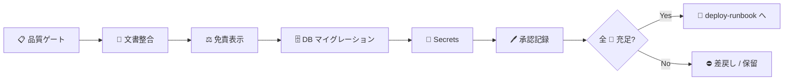

# ✅ リリース前チェックリスト

| 項目 | 内容 |
|---|---|
| 🎯 目的 | 本番リリース前に品質・文書整合・免責表示・DB・Secrets・承認を漏れなく確認する |
| 👥 対象読者 | ReleaseManager / DevOps / CTO（判断）・承認者（人間） |
| 📅 最終更新日 | 2026-07-18 |

> ⚠️ **本番デプロイ・本番公開・秘密情報（Secrets）の登録は、必ず人間の明示承認を得てから実施します。**
> Claude / CTO は判断材料と手順を提示するのみで、デプロイそのものは自動実行しません。

---

## 📌 このチェックリストの使い方

1. リリース候補ブランチの PR 上で、下記チェック項目を上から順に確認する。
2. すべての **必須（🔴）** 項目が満たされるまで merge / deploy しない（§9 STABLE 未達は merge 禁止）。
3. 判断できない項目は「不明」として残し、承認欄で保留理由を明記する。
4. 完了後、末尾の **承認記録欄** に記入してから次工程（`deploy-runbook.md`）へ進む。

---

## 1. 🧪 品質ゲート（STABLE 判定 / 🔴 全て必須）

`CLAUDE.md §9` の STABLE 条件（test / lint / build / CI / review / security / error 0）に対応します。

| ✅ | 区分 | 確認項目 | 確認方法 |
|---|---|---|---|
| ☐ | test | 単体・統合テストが全件 success | `npm test` が 0 失敗 |
| ☐ | data | fixture 品質検証が success | `npm run data:validate` |
| ☐ | lint | ESLint エラー 0 | `npm run lint` |
| ☐ | typecheck | 型検査エラー 0 | `npm run typecheck` |
| ☐ | build | 全ワークスペースのビルド success | `npm run build` |
| ☐ | CI | GitHub Actions `CI` が全ジョブ success | 対象 PR の Checks（`quality` / `security`） |
| ☐ | security | `npm audit --audit-level=high` が High 以上 0 件 | CI `security` ジョブ |
| ☐ | review | Codex / CodeRabbit の Critical / High 指摘が 0 | レビュー結果 |
| ☐ | error | 実行時エラー・未処理例外 0 | テスト・ローカル確認ログ |

> 💡 CI は Node 24、ローカル前提は Node 22 以上（`package.json` engines）。差異による失敗は CI を正とする。

---

## 2. 📖 文書整合（🔴 必須）

利用者が触る機能・セットアップ手順・アーキテクチャ・品質ゲートのいずれかが変わった場合、文書を更新済みであること。

| ✅ | 文書 | 確認項目 |
|---|---|---|
| ☐ | `README.md` | 開発状況・コマンド表・アーキテクチャ図が実装と一致 |
| ☐ | 要件定義書 / 詳細設計仕様書 | 受入基準（要件 §11）・運用設計（設計 §18）と実装の乖離がない |
| ☐ | `docs/adr/` | 技術選定・スキーマ方針の変更が ADR に反映済み |
| ☐ | `docs/operations/` | 本チェックリスト・runbook・rollback・incident-response が最新 |
| ☐ | API 契約 | `packages/contracts` の変更が Web/API 双方に反映（破壊的変更なし） |

---

## 3. ⚖️ 免責表示の確認（🔴 必須・本システムの設計原則）

> 本システムは「事前協議先候補を提示する調査支援」であり、**所管を断定しません**。免責の常時表示は設計上の必須要件です（要件 §9.1 / README「重要な注意」）。

| ✅ | 経路 | 確認項目 |
|---|---|---|
| ☐ | API `/api/v1/metadata` | `disclaimer` フィールドが必須免責文を返す |
| ☐ | API 検索応答 | 候補結果に免責が常時付与される（設計 §9.1） |
| ☐ | Web UI | 検索フォーム・候補一覧に免責が常時表示される |
| ☐ | 推定・鮮度表示 | `estimated`（推定管轄）・期限超過・更新日不明が確定表示と区別される（設計 §17.2） |
| ☐ | CSV / 印刷出力 | 免責・出典・データ版・出力日時を含む（要件 §11.1） |
| ☐ | 断定回避 | 「正式な所管・許認可の要否・申請先」を保証する文言がない |

---

## 4. 🗄️ DB マイグレーション適用確認（🔴 必須）

対象ローカル PostgreSQL（本番 `pwsm`・127.0.0.1:5432）、マイグレーション適用状況を確認します（実接続文字列は記載しない）。

| ✅ | 確認項目 | 補足 |
|---|---|---|
| ☐ | `db/migrations/0001_initial_schema.sql`〜`0004_jurisdiction_geography_index.sql` が本番 `pwsm` へ適用済み | 5 スキーマ（`core` / `staging` / `provenance` / `workflow` / `audit`）が存在 |
| ☐ | PostGIS 拡張が有効 | `CREATE EXTENSION postgis` 済み |
| ☐ | 整合性 CHECK 制約が有効 | published は根拠必須・`estimated` は `official` 精度不可・期間逆転禁止（設計 §5.3） |
| ☐ | `pwsm_test` で先行検証済み | 本番へ直接 DDL を流していない（隔離検証） |
| ☐ | 追加マイグレーションがある場合、番号連番・冪等性・ロールバック方針を確認 | `rollback.md` 参照 |
| ☐ | バックアップ / 復旧点を確認 | 適用直前の論理エクスポート（`reports/backups/pwsm-*.sql.gz`）を控える（`backup-restore.md` 参照） |

> 🚫 **本番 DB へのスキーマ変更適用は人間の明示承認が必須。** `pwsm_test` での検証までが CTO 自律範囲。

---

## 5. 🔐 Secrets 設定確認（🔴 必須）

秘密情報は本ホストの `apps/api/.env`（Git 管理外）で管理し、**本文書・リポジトリに実値を書きません**。

| ✅ | 対象 | 確認項目 |
|---|---|---|
| ☐ | `DATABASE_URL` | `apps/api/.env` にローカル PostgreSQL 接続文字列が設定済み（`chmod 600`・Git 追跡外） |
| ☐ | `.env` 非登録 | `.env` / `.env.mvp` / `.env.preview` が Git 追跡外（`.gitignore`）である |
| ☐ | secret scan | コミット差分に接続文字列・トークン・パスワードが含まれない |
| ☐ | 環境分離 | production（`pwsm-api`）・MVP（`pwsm-mvp`）・preview（`pwsm-api-preview`）で `.env` が分離されている |
| ☐ | `.env.example` | プレースホルダーのみで実値を含まない |

> 🚫 **Secrets の登録・変更・削除は人間の明示承認が必須。** CTO は手順提示のみ。

---

## 6. 📋 GitHub / Projects 状態（推奨）

| ✅ | 確認項目 |
|---|---|
| ☐ | main 直 push がない（PR 経由のみ） |
| ☐ | 対象 PR に「変更内容・テスト結果・影響範囲・残課題」が記載済み |
| ☐ | GitHub Projects の Status が `Verify` → `Deploy Gate` に更新済み |
| ☐ | 残課題が Issue 化されている |

---

## 🖊️ 承認記録欄

| 項目 | 記入 |
|---|---|
| リリース対象（PR / タグ / バージョン） | |
| 対象コミット SHA | |
| 品質ゲート（§1）結果 | ☐ 全 success / ☐ 未達（理由: ___） |
| 免責表示（§3）確認者 | |
| DB マイグレーション（§4）確認者 | |
| Secrets（§5）確認者 | |
| **本番デプロイ承認者（人間・必須）** | 氏名: ___ / 日時: ___ |
| 承認判定 | ☐ 承認（deploy-runbook へ） / ☐ 保留 / ☐ 差戻し |
| 備考・保留理由 | |

> ✅ 承認後は `docs/operations/deploy-runbook.md` に従ってデプロイし、失敗時は `docs/operations/rollback.md` を参照します。
