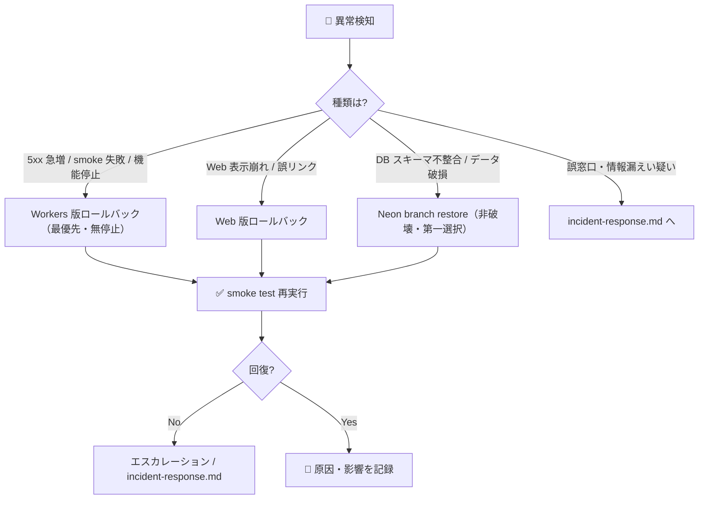

# ↩️ ロールバック手順

| 項目 | 内容 |
|---|---|
| 🎯 目的 | 本番リリース後に問題が発生した際、Workers・Web・Neon DB を安全に直前の正常状態へ戻す |
| 👥 対象読者 | ロールバックを実行する人間（オペレーター）・DevOps・承認者 |
| 📅 最終更新日 | 2026-07-18 |

> 🚫 **本番へのロールバック実行・DB スキーマ変更・データ削除は、必ず人間の明示承認が必須です。**
> CTO / Claude は手順・影響評価・推奨案の提示のみを行い、実行しません。

---

## 📌 判断基準（いつ戻すか）



| 状況 | 一次対応 | 参照節 |
|---|---|---|
| API の 5xx 急増・smoke test 失敗・機能停止 | Workers を直前 version へ戻す | §1 |
| Web の表示崩れ・誤った公式リンク | Web を直前ビルドへ戻す | §2 |
| DB スキーマ / データの不整合・破損 | Neon の branch restore で復旧 | §3 |
| 誤窓口表示・改ざん疑い・情報漏えい疑い | インシデント初動を優先 | `incident-response.md` |

> 💡 **原則: まず影響の小さい手段から。** Workers 版ロールバックは非破壊。Neon 復旧は **restore branch を作成して検証してから main へ反映**する（§3.1）。main への直接 in-place restore は現在のデータ状態を置換するため非破壊とは扱わない。DROP を伴う DB down（§3.2）は最終手段。

---

## 1. ⚙️ Workers（API）の版ロールバック — 無停止・第一選択

`deploy-runbook.md` の段階公開（`wrangler versions upload` → `versions deploy`）を使っていれば、旧 version へ即座に戻せます。

```bash
# 作業ディレクトリ: apps/api

# 現在・過去のバージョン一覧（version ID と作成時刻を確認）
wrangler versions list

# 方式A: 直前の正常 version へトラフィックを戻す（対話で version ID と割合を指定）
wrangler versions deploy
#   → 旧 version ID を 100% に指定して昇格

# 方式B: rollback サブコマンド（対象 version を指定して即時復帰）
wrangler rollback [<VERSION_ID>]
```

| ✅ | 確認項目 |
|---|---|
| ☐ | 戻す先が「直前の正常 version ID」である（`deploy-runbook.md §4` の記録を参照） |
| ☐ | ロールバック後に `curl <BASE_URL>/api/v1/health/ready` が 200 |
| ☐ | `/api/v1/metadata` の `disclaimer` が表示され、`datasetVersion` が想定版 |

> ⚠️ Secrets（`DATABASE_URL` 等）は version に紐づかない。接続先の切り戻しが必要な場合は §3・Secrets 再設定（人間承認）を併用する。

---

## 2. 🌐 Web の版ロールバック

| デプロイ方式 | ロールバック手順 |
|---|---|
| GitHub 連携（Cloudflare Pages） | Pages ダッシュボードで直前の成功デプロイを「Rollback / この版へ戻す」で再公開 |
| 直接アップロード | 直前の正常ビルド成果物（`apps/web/dist`）を再取得し `wrangler pages deploy <dist> --project-name <PAGES_PROJECT>` |

| ✅ | 確認項目 |
|---|---|
| ☐ | 戻した Web が本番 API を指す |
| ☐ | 免責・推定/鮮度表示が復帰後も常時表示される |

---

## 3. 🗄️ Neon PostgreSQL のロールバック

対象: プロジェクト `tiny-river-77604173`（main = 本番 / dev = `br-calm-forest-auo4xou3`）。
本番マイグレーションは `db/migrations/0001_initial_schema.sql`（単一トランザクション・**down 節なし**）。

### 3.1 restore branch 経由の復旧 — 第一選択 🟢

Neon の Point-in-Time restore を使い、**まず対象時刻の復元ブランチ（restore branch）を作成し、そこで検証してから main へ反映**します。
main へ直接 in-place restore すると現在のデータ状態を上書きするため、本手順では採らず、検証を挟む復元ブランチ方式を第一選択とします。

| ✅ | 手順（順序どおり） |
|---|---|
| ☐ | 復旧目標時刻（RPO 目標 24 時間・設計 §15）を決める |
| ☐ | 対象時刻の**復元ブランチ（restore branch）を作成**する（main へは直接適用しない） |
| ☐ | 復元ブランチ上で **件数・FK・geometry・サンプル検索**を検証（設計 §15 の復元試験に準拠） |
| ☐ | 検証合格後に、復元ブランチを本番へ反映（main への昇格、または接続先を復元ブランチへ切替） |
| ☐ | アプリの接続先変更（`DATABASE_URL`）に伴う Secrets 変更は人間承認 |

> 🚫 Neon **プロジェクトの削除・dev ブランチの削除・main への直接 restore（in-place）** は人間承認必須（データ状態を置換するため）。復元ブランチの作成・反映も人間が実行する。

### 3.2 スキーマ down（全削除）— 最終手段・破壊的 🔴

`0001` は down 節を持たないため、スキーマ単位の巻き戻しは以下の DROP で行います。
**これは 5 スキーマ配下の全テーブル・全データを削除します。** branch restore（§3.1）が使えない場合に限る最終手段です。

```sql
-- 🔴 破壊的操作: 実行は人間の明示承認が必須。事前に論理エクスポート/バックアップを取得すること。
-- 対象は本番(main)ではなく、まず dev ブランチ br-calm-forest-auo4xou3 で検証する。
BEGIN;
DROP SCHEMA IF EXISTS audit      CASCADE;
DROP SCHEMA IF EXISTS workflow   CASCADE;
DROP SCHEMA IF EXISTS provenance CASCADE;
DROP SCHEMA IF EXISTS staging    CASCADE;
DROP SCHEMA IF EXISTS core       CASCADE;
-- PostGIS 拡張は他で共有される可能性があるため、原則 DROP しない
-- DROP EXTENSION IF EXISTS postgis;  -- ← 影響を確認できる場合のみ
COMMIT;
```

| ✅ | 実行前チェック |
|---|---|
| ☐ | **branch restore（§3.1）で代替できないことを確認した** |
| ☐ | 対象データの論理エクスポート / バックアップ取得済み |
| ☐ | dev ブランチで DROP → 再適用（`0001`）を検証済み |
| ☐ | 本番（main）への適用について人間の明示承認を得た |
| ☐ | 実行後、`0001_initial_schema.sql` を再適用し 5 スキーマ・CHECK 制約を復元 |

> 🚫 **DROP SCHEMA … CASCADE はデータ削除・履歴改変に相当する。** CLAUDE.md の原則により無断実行禁止。

---

## 4. 🔁 公開データ版の切戻し

設計 §15 / §18.2 のとおり、公開データは版単位で切替え可能です。DB 全体を戻さずに済む場合はこちらを優先します。

| ✅ | 手順 |
|---|---|
| ☐ | 公開版 ID を直前の承認版へ原子的に切替える（設計 §18.2） |
| ☐ | 切替後に smoke test（`/api/v1/metadata` の `datasetVersion`）で版を確認 |
| ☐ | 版差異により作成済みチェックリストへ警告が出ることを確認（設計 §17.2-8） |

---

## 5. ✅ ロールバック後の検証と記録

| ✅ | 項目 |
|---|---|
| ☐ | `deploy-runbook.md §6` の smoke test を再実行し合格 |
| ☐ | 免責・推定/鮮度表示が復帰後も常時表示される |
| ☐ | 復旧に用いた version ID / restore 時刻 / 公開版 ID を記録 |
| ☐ | 原因・影響範囲・恒久対策を Issue 化（`incident-response.md` の再発防止と連携） |
| ☐ | GitHub Projects の Status を更新 |

---

## 📞 エスカレーション

- Workers 版ロールバック・Web 版ロールバック・branch restore のいずれでも回復しない場合、`docs/operations/incident-response.md` の該当シナリオへ移行する。
- 情報漏えい疑い・誤窓口の重大表示は、ロールバックより先にインシデント初動（取得停止・トークン失効・記録保全）を優先する。
