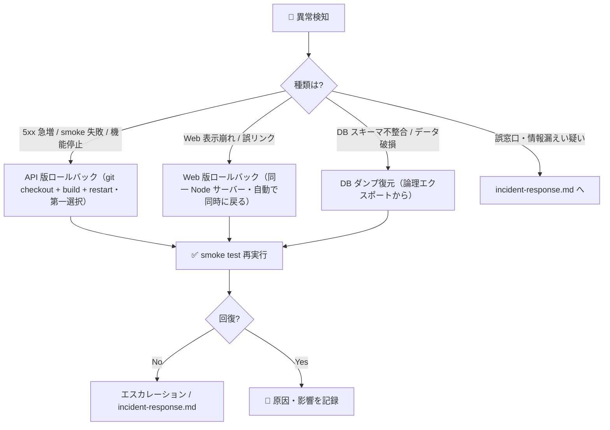

# ↩️ ロールバック手順

| 項目 | 内容 |
|---|---|
| 🎯 目的 | 本番リリース後に問題が発生した際、Node サーバー（API + Web）・ローカル PostgreSQL DB を安全に直前の正常状態へ戻す |
| 👥 対象読者 | ロールバックを実行する人間（オペレーター）・DevOps・承認者 |
| 📅 最終更新日 | 2026-08-30（Neon 廃止・ローカル PostgreSQL / Node + Tunnel 構成へ全面改訂） |

> 🚫 **本番へのロールバック実行・DB スキーマ変更・データ削除は、必ず人間の明示承認が必須です。**
> CTO / Claude は手順・影響評価・推奨案の提示のみを行い、実行しません。

---

## 📌 判断基準（いつ戻すか）



| 状況 | 一次対応 | 参照節 |
|---|---|---|
| API の 5xx 急増・smoke test 失敗・機能停止 | git checkout で直前 SHA へ戻し、build + restart | §1 |
| Web の表示崩れ・誤った公式リンク | Web 資産は API と同一 Node サーバーから配信されるため §1 で同時に戻る | §2 |
| DB スキーマ / データの不整合・破損 | 論理エクスポート（`reports/backups/pwsm-*.sql.gz`）から復元 | §3 |
| 誤窓口表示・改ざん疑い・情報漏えい疑い | インシデント初動を優先 | `incident-response.md` |

> 💡 **原則: まず影響の小さい手段から。** git ロールバックは非破壊（直前コミットへ戻すだけ）。DB 復旧は**復元先 DB で検証してから本番へ反映**する（§3.1）。DROP を伴う DB down（§3.2）は最終手段。

---

## 1. ⚙️ API / Web（Node サーバー）のロールバック — 第一選択

Node サーバー（systemd `pwsm-api`）は `apps/api/src`（API）とビルド済み `apps/web/dist`（Web UI）を直接参照します。
直前の正常コミットへ戻し、再ビルドして再起動します。

```bash
# 作業ディレクトリ: リポジトリルート

# 1) 直前の正常 SHA を確認（deploy-runbook.md §4 の記録を参照）
git log --oneline -5

# 2) 対象 SHA へ戻す（コード・設定・ドキュメントが巻き戻る）
git checkout <直前の正常SHA>

# 3) 再ビルド（apps/web/dist を最新化）
npm run build

# 4) systemd サービスを再起動（権限が必要な場合は承認者に依頼）
sudo systemctl restart pwsm-api
#   ※ MVP（fixture モード）は pwsm-mvp / preview は pwsm-api-preview
```

| ✅ | 確認項目 |
|---|---|
| ☐ | 戻す先が「直前の正常 SHA」である（`deploy-runbook.md §4` の記録を参照） |
| ☐ | ロールバック後に `curl <BASE_URL>/api/v1/health/ready` が 200 |
| ☐ | `/api/v1/metadata` の `disclaimer` が表示され、`datasetVersion` が想定版 |

> ⚠️ `.env`（`DATABASE_URL`・`AUTH_*` 等）は git 管理外（ローカル設定）のため、git checkout では変わらない。接続先の切り戻しが必要な場合は §3・Secrets 再設定（人間承認）を併用する。

---

## 2. 🌐 Web の版ロールバック

Web 資産は API と同一 Node サーバー（`apps/web/dist`）から配信されるため、**§1 の git checkout + build + restart で Web も同時に戻ります**（個別の Pages ロールバックは不要）。

| ✅ | 確認項目 |
|---|---|
| ☐ | 戻した状態で `/`（index.html）と `/api/v1/health/ready` の両方が正常応答する |
| ☐ | 免責・推定/鮮度表示が復帰後も常時表示される |

---

## 3. 🗄️ ローカル PostgreSQL のロールバック

対象: ローカル PostgreSQL `pwsm`（本番）。マイグレーションは `db/migrations/0001_initial_schema.sql` / `0002_feedback.sql` / `0003_audit_hash_chain.sql` / `0004_jurisdiction_geography_index.sql`（**down 節なし**）。

### 3.1 論理エクスポートからの復元 — 第一選択 🟢

`reports/backups/pwsm-*.sql.gz`（`npm run backup:export` の成果物）から復元します。**まず復元先 DB で検証してから本番へ反映**します（本番へ直接 in-place 復元は現在のデータ状態を上書きするため本手順では採らず、検証を挟む方式を第一選択とします）。

| ✅ | 手順（順序どおり） |
|---|---|
| ☐ | 復旧目標時刻（RPO 目標 24 時間・`backup-restore.md` 参照）を決める |
| ☐ | 復元先 DB（例: `pwsm_restore`）を作成し、対象ダンプを `pg_restore --no-owner --no-privileges` で復元 |
| ☐ | 復元 DB 上で **件数・FK・geometry・サンプル検索**を検証（`backup-restore.md` §4 に準拠） |
| ☐ | 検証合格後に、アプリの接続先（`apps/api/.env` の `DATABASE_URL`）を復元 DB へ切替え + `systemctl restart pwsm-api` |
| ☐ | アプリの接続先変更（`DATABASE_URL`）に伴う設定変更は人間承認 |

> 🚫 **DB の削除・本番への直接 in-place 復元（現在のデータ状態を置換）** は人間承認必須。復元 DB の作成・反映も人間が実行する。

### 3.2 スキーマ down（全削除）— 最終手段・破壊的 🔴

マイグレーションは down 節を持たないため、スキーマ単位の巻き戻しは以下の DROP で行います。
**これは 5 スキーマ配下の全テーブル・全データを削除します。** ダンプ復元（§3.1）が使えない場合に限る最終手段です。

```sql
-- 🔴 破壊的操作: 実行は人間の明示承認が必須。事前に論理エクスポート/バックアップを取得すること。
-- 対象は本番ではなく、まず pwsm_test で検証する。
BEGIN;
DROP SCHEMA IF EXISTS audit      CASCADE;
DROP SCHEMA IF EXISTS workflow   CASCADE;
DROP SCHEMA IF EXISTS provenance CASCADE;
DROP SCHEMA IF EXISTS staging    CASCADE;
DROP SCHEMA IF EXISTS core       CASCADE;
-- PostGIS 拡張は他で共有される可能性があるため、原則 DROP しない
-- DROP EXTENSION IF EXISTS postgis;  -- ← 影響を確認できる場合のみ
COMMIT;
```

| ✅ | 実行前チェック |
|---|---|
| ☐ | **ダンプ復元（§3.1）で代替できないことを確認した** |
| ☐ | 対象データの論理エクスポート / バックアップ取得済み |
| ☐ | `pwsm_test` で DROP → 再適用（`0001`〜`0004`）を検証済み |
| ☐ | 本番への適用について人間の明示承認を得た |
| ☐ | 実行後、`0001_initial_schema.sql`〜`0004_jurisdiction_geography_index.sql` を再適用し 5 スキーマ・CHECK 制約を復元 |

> 🚫 **DROP SCHEMA … CASCADE はデータ削除・履歴改変に相当する。** CLAUDE.md の原則により無断実行禁止。

---

## 4. 🔁 公開データ版の切戻し

設計 §15 / §18.2 のとおり、公開データは版単位で切替え可能です。DB 全体を戻さずに済む場合はこちらを優先します。

| ✅ | 手順 |
|---|---|
| ☐ | 公開版 ID を直前の承認版へ原子的に切替える（設計 §18.2・`apps/api/.env` の `DATASET_VERSION` 変更 + restart） |
| ☐ | 切替後に smoke test（`/api/v1/metadata` の `datasetVersion`）で版を確認 |
| ☐ | 版差異により作成済みチェックリストへ警告が出ることを確認（設計 §17.2-8） |

---

## 5. ✅ ロールバック後の検証と記録

| ✅ | 項目 |
|---|---|
| ☐ | `deploy-runbook.md §6` の smoke test を再実行し合格 |
| ☐ | 免責・推定/鮮度表示が復帰後も常時表示される |
| ☐ | 復旧に用いた SHA / 復元時刻 / 公開版 ID を記録 |
| ☐ | 原因・影響範囲・恒久対策を Issue 化（`incident-response.md` の再発防止と連携） |
| ☐ | GitHub Projects の Status を更新 |

## 5.1 ロールバック実地試験（2026-08-31・Deep Debug Round 4）

| 項目 | 内容 |
|---|---|
| 対象 | 直前の正常 SHA（`f2cf084`・Neon 廃止・ローカル PostgreSQL 移行時点） |
| 方法 | `git worktree add` で一時ツリーへ旧 SHA を展開 → `npm ci` → `npm run build` |
| 結果 | ✅ `npm ci`（0 vulnerabilities）・`npm run build`（6.76s・152 modules）成功。ロールバック手順（git checkout → build → restart）が実行可能であることを実証 |
| 補足 | 本番への実際の切戻しは人間の承認後、`systemctl restart pwsm-api` で反映（本試験では本番を変更していない） |

---

## 📞 エスカレーション

- git ロールバック・DB ダンプ復元のいずれでも回復しない場合、`docs/operations/incident-response.md` の該当シナリオへ移行する。
- 情報漏えい疑い・誤窓口の重大表示は、ロールバックより先にインシデント初動（取得停止・トークン失効・記録保全）を優先する。
